# Ajax技术-1 #
# 1. 案例---新用户注册时用户名冲突问题 #
##   1.1 传统模式解决方案 ##
1) 在注册页面中输入用户名和密码，点击“注册”时，要将表单数据提交给后台


2) 后台PHP页面，接收用户名和密码之后，要去验证用户名是否存在，如果存在则提示用户名存在，再跳转回注册页面，重新输入。

  当用户名存在时，提示用户名已被占用，再跳转回登录页


 当用户名不存在时，正常注册新用户


##   1.2 ajax解决方案 ##

当光标离开用户名文本框时，就已经验证了用户名是否存在，并给予提示了。

  用户名被占用： 


  用户名可用 :


##   1.3 两种模式对比 ##
 传统模式： 

  两个页面 ---  前端注册表单页（index.html）  和  后端数据验证页（index.php）

 

 Ajax模式 :

  两个页面 --- 前端注册表单页（index.html）  和  后端数据验证页（index.php）


  Ajax的优势：没有页面跳转，刷新页面内容，用户体验提升。

​    ajax就是在页面没有刷新或者没有跳转的情况下还能更新页面的某一部分数据


# 2.ajax快速入门 #
##    2.1 ajax概述  ##
- Ajax:  Asynchronous  javascript  and  xml (异步javascript和xml)。

- ==Ajax并不是一种新技术，而是已有技术的集合。JavaScript是核心载体==。
- Ajax优势：在不刷新页面的情况下，更新页面数据，提升用户体验。
- ==Ajax就像一个小秘书==，能够实现异步工作。


##    2.2 发送Ajax请求 ##

###      2.2.1 ajax核心对象 --- XMLHttpRequest对象 ###

  历史：
	1999年诞生，微软在IE5中集成了XMLHttpRequest对象，但是并没有受到人们重视。
	2005年，google在gtalk即时聊天工具中使用了该对象，从此之后Ajax技术开始受到人们的重视。

  创建XMLHTTPRequest对象要分为(低版本) IE和==非IE两种方式(主流)==：

   IE浏览器（IE7之前） :  

​                  var xhr = new ActiveXObject('Msxml2.XMLHTTP');

   非IE浏览器（chrome、firefox、safair、搜狗等，包括IE7+之后） (主流浏览器):

​		  var xhr = new XMLHttpRequest();


案例：创建XMLhttpRequest对象，兼容IE7之前和主流浏览器

```
//创建XMLHttpRequest对象，兼容低版本IE和非IE浏览器
function getXhr () {
    var xmlhttp;

    if (window.XMLHttpRequest) {
        //IE7+ 和 非IE 中都有 XMLHttpRequest对象
        xmlhttp = new XMLHttpRequest();
    } else {
        xmlhttp = new ActiveXObject('Msxml2.XMLHTTP');
    }

    return xmlhttp;
}

alert(getXhr());
```


chrome访问结果:


IE访问结果:


###    2.2.2 核心方法

   XMLHttpRequest对象有了，可以发送Ajax请求了。发送请求需要两个方法:

   open(var1, var2, var3): 准备Ajax请求
     var1: 请求方式  get/post
     var2: 请求的后端程序地址
     var3: 异步(true)/同步(false)，可选参数，默认为true

   示例: xhr.open(‘get’, ‘index.php’);   //准备以get方式请求后端的index.php文件

   send(var): 发送Ajax请求
     var: 分为两种情况。 如果是get请求，则填写null。 如果是post请求，则填写要发送到后端的数据。

   示例: xhr.send(null); 


###    2.2.3 发送请求案例

 在index.html页面上创建按钮，点击该按钮时使用get方式请求后端的index.php页面

 发送Ajax请求流程:

   1) 创建XMLHttpRequest对象

   2) 调用open方法准备ajax请求

   3) 调用send方法发送ajax请求


 代码实现

   1) 创建按钮，绑定点击事件

   2) 创建XMLHttpRequest对象

   3) 调用open方法准备ajax请求

​   4) 调用send方法发送ajax请求


  访问结果: --- 通过newwork来确定请求是否发出

点击"btn"时，又发送了请求，请求了 index.php文件，并且正常接收到结果

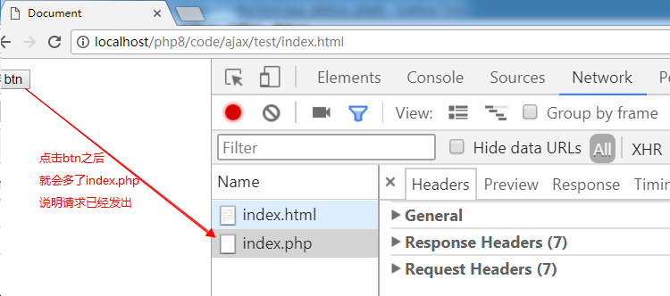


##    2.3 接收后端响应结果 ##

###      2.3.1 核心属性 --- readyState ###

   Ajax的整个过程有5个状态，对应readyState的5个值：0-4

​    《Pragmatic Ajax A Web 2.0 Primer 》 中对readyStae状态的介绍 

   0: (Uninitialized) the send( ) method has not yet been invoked.  

   1: (Loading) the send( ) method has been invoked, request in progress.  

   2: (Loaded) the send( ) method has completed, entire response received. 

   3: (Interactive) the response is being parsed. 

   4: (Completed) the response has been parsed, is ready for harvesting.  

   0 － （未初始化）还没有调用send()方法 

   1 － （载入）已调用send()方法，正在发送请求 

   2 － （载入完成）send()方法执行完成，已经接收到全部响应内容 

   3 － （交互）正在解析响应内容 

   4 － （完成）响应内容解析完成，可以在客户端调用了 


百度百科: 

  0 （未初始化） 	对象已建立，但是尚未初始化（尚未调用open方法）               
  1 （初始化）  	已调用send()方法，正在发送请求                      
  2 （发送数据） 	send方法调用完成，但是当前的状态及http头未知              
  3 （数据传送中）  已接收部分数据，因为响应及http头不全，这时通过responseBody和responseText获取部分数据会出现错误，
  4 （完成）   	数据接收完毕，此时可以通过通过responseBody和responseText获取完整的回应数据

 

**==最核心的重点：   4 ,  后端返回的数据已经可以在浏览器中使用了。==**


###      2.3.2  核心事件 --- onreadystatechange ###
​    onreadystatechange事件:  readyState的值每次发生变化都会触发该事件。
        0-->1    1-->2    2-->3    3-->4 总共触发4次


###     2.3.3  其他重要属性

​     responseText：以字符串形式接收后端程序的返回值。

​         以PHP为例: PHP程序最终会被解释程序一段字符串，responseText接收的就是这段字符串

​     responseXML：以XML格式接收后端程序返回值


###      2.3.4 响应案例 --- index.php ###
​     index.php：返回字符串“Hello Ajax”给前端 --- 就是  echo "Hello Ajax"

​     index.html： 将Hello Wrold 显示在页面的div中


 1) index.php 返回一个字符串（Hello Ajax！！）


  2) 在index.html中检测readyState的状态，当readyState状态等于4的时候，使用responseText来接收后端返回的数据

 


responseText本质是接收后端返回的字符串。


##   2.4 Ajax程序总结

  一般我们编写Ajax程序时需要两个页面，三大步骤:

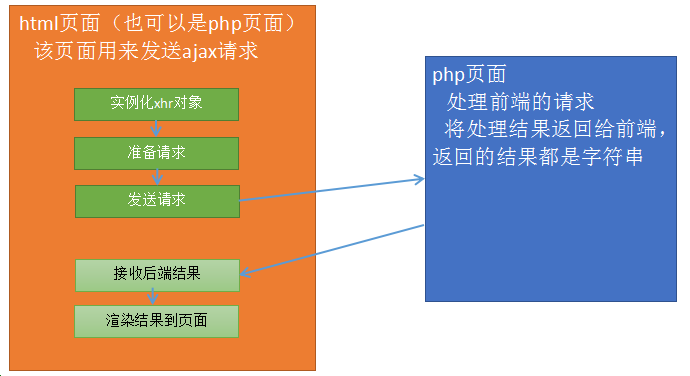

  两个页面:

   前端静态html页面 (php页面也行)，用来发送ajax请求，将结果渲染到页面上

   后端php页面 (jsp、asp也行)，用来接收前端请求，处理数据，并将结果返回给前端页面

 

  三大步骤:

  1) 前端静态页面发送ajax请求。

​       ① 创建 XMLHttpRequest 对象

​       ② 调用open方法准备ajax请求

​       ③ 调用send方法发送ajax请求

​       ④ 调用onreadystatechange事件，判断readyState=4时，使用responseText接收后端返回数据

  2) 后端php页面，处理请求并返回结果

  3) 前端页面接收结果，显示在网页指定位置


##   2.5 综合案例

 点击按钮，从student表中随机取出一条学生信息，显示在网页上。

 思路分析:
 1) 两个页面
   前端静态页面: student/index.html
   后端php页面: student/index.php

 

 

 2) 三大步骤
  ① index.html 页面设置一个按钮，用来触发ajax请求
  ② index.php 随机取出一条学生数据，并返回给index.html页面
	$sql = "select * from student order by rand() limit 0,1";
  ③ index.html 接收到后显示在页面上


 代码实现:

 第一步骤:  index.html页面发送ajax请求

 


第二步骤: 后端php页面


第三步骤： index.html -- 将接收到的数据渲染到页面


 关键点总结:

1) index.html 通过点击事件发送ajax请求
 ① 创建XMLHttpRequest对象
 ② 调用open方法准备ajax请求
 ③ 调用send方法发送ajax请求


**==此时不要着急将数据渲染到网页上==**。

 2) index.php 随机取出一条学生数据，并返回给index.html页面
  ① mysqli操作MySQL服务器的6步骤
  ② 核心SQL:  select * from student order by rand() limit 0,1 
  ③ 将结果拼接成字符串再输出，因为前端是以字符串形式接收的


 3) index.html接收到后显示在页面上
  ① 创建一个div标签，用来显示接收到数据
  ② 获取div对象，再将数据显示到该标签中

# Ajax技术-2 #
每日目标：

-  掌握post和get的在ajax中的区别
-  理解get缓存并能解决缓存
-  理解同步和异步
-  掌握timeout和ontimeout
-  掌握FormData表单对象的用法
-  能够实现文件上传进度条


# 1. POST和GET的区别

## 1.1 GET方式实现新用户注册---用户名检测

 思路分析:


 步骤:

1. get.html

​       1) 在用户名文本框上绑定失焦事件(onblur)
       2) 失焦事件函数
​            ① 获取用户名文本框内已填写的用户名
​            ② 发送ajax请求，并将已填写的用户名一起发送给后端php页面


2. get.php

​      1) 接收前端发送过来的用户名
      2) 链接MySQL服务器，验证用户名是否被占用
      3) 将结果返回给前端


3. get.html

​      1) 接收后端返回的数据，判断是1还是2。

​      2) 如果等于1，则提示用户名可用；如果等于2，提示用户名被占用


代码实现:

1. get.html

​       1) 在用户名文本框上绑定失焦事件(onblur)
       2) 失焦事件函数
​            ① 获取用户名文本框内已填写的用户名
​            ② 发送ajax请求，并将已填写的用户名一起发送给后端php页面

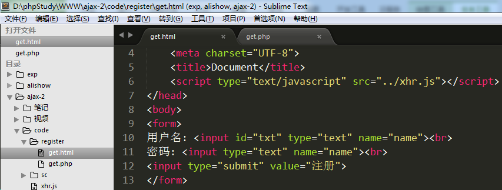


 先测试一下前后端的连通性:


2. get.php

​     1) 接收前端发送过来的用户名
     2) 模拟用户被占用的情况 
     3) 将结果返回给前端（1用户名可用   2用户名被占用）


3. get.html

​     1) 接收后端返回的数据，判断是1还是2。

​     2) 如果等于1，则提示用户名可用；如果等于2，提示用户名被占用


关键点总结:

1. 用户名文本框绑定失焦事件

2. 发送ajax请求基本属于流程化操作

   1) 实例化XMLHttpRequest对象
   2) 调用open方法准备请求，==get方式发送将数据拼接在url地址之后即可==
     xhr.open('get',  'get.php?==n='+name==);
   3) 调用send方法发送请求，==get方式只需要将 null  作为参数传入即可==
   4) 调用onreadystatechange事件，在readyState=4时使用responseText接收返回值。此步使用alert或者console.log先输出接收的结果即可，**==不要着急将结果显示在网页上==**。

3. 创建后端php程序，接收用户名进行验证

   核心SQL:  select * from ali_admin where admin_email = '$name';

   该SQL语句的执行结果只可能是两种： 0条数据    1条数据(因为admin_email字段唯一)

     0条数据: 说明没有该用户名 （没有被占用）

     1条数据: 说明已存在该用户名 （已被占用）

   根据SQL执行结果返回1或者2，1代表未被占用，2代表已被占用

4. 修改get.html文件，将结果显示在网页上

   获取用来显示结果的span标签，判断接收的结果为1还是2。如果为1，则将用户名可用写入span标签；反之，则将用户名已被占用写入span标签


## 1.2 POST方式实现新用户注册---用户名检测

post和get两种方式的整体思路一致，只是细节上有所差别

 1) 使用open准备请求时，参数1需要设置为post，参数2只需要设置后端程序地址。
 2) 将需要传递到后端的数据拼接成一个独立的字符串，字符串的格式为
            ==var str = ‘key=value&key=value&....’;==    （内部结构跟get传参时的结构一致）
 3) 调用setRequestHeader方法将数据格式转为 application/x-www-form-urlencoded
 4) 将拼接好的数据字符串作为参数传入send方法
 5) 后端的php程序需要使用 $_POST来接收数据


前端的区别:


后端的区别:


关键点总结:
 1) 发送程序时，参数1设置为post，参数2只用设置请求的后端文件路径
​    xhr.open('post', 'post.php');
 2) 将需要传递到后端的数据拼接成一个独立的字符串
​    var str = 'name='+name; 
 3) 调用setRequestHeader方法将数据格式转为 application/x-www-form-urlencoded
​    xhr.setRequestHeader('content-type', 'application/x-www-form-urlencoded');
 4) 发送请求时，要将之前拼接好的字符串作为参数放入send方法中
​    xhr.send(str);


补充说明 --- 实际验证用户名是否存在的方法

核心：  `$sql = "select * from ali_admin where admin_email='$username'";`

该SQL语句要么查询出1条数据，要么查询出0条数据
  1条数据说明: 用户名已被占用
  0条数据说明: 用户名未被占用 -- 用户名可用


# 2. GET缓存

## 2.1 什么是缓存？

   浏览器的请求需要从服务器获得许多 css、img、js 等相关的文件，如果每次请求都把相关的资源文件加载一次，对 带宽、服务器资源、用户等待时间 都有严重的损耗。如果浏览器将css、img、js等文件在第一次请求成功后就保存在本机上，以后的每次请求就在本机获得相关的资源文件，那么就可以明显地加快用户的访问速度，同时可以节省各种资源(带宽、服务器资源、用户等待时间)。

## 2.2 GET缓存测试

 ajax方式，get会有缓存问题。

 案例:
   index.html页面中创建一个按钮，点击该按钮时发送ajax请求，得到后端php程序返回的当前时间戳并显示。


  目标:  点击“获取时间戳”按钮时，触发ajax请求，访问后端的getTime.php文件，得到时间戳并弹出显示

1. index.html --- 发送请求

   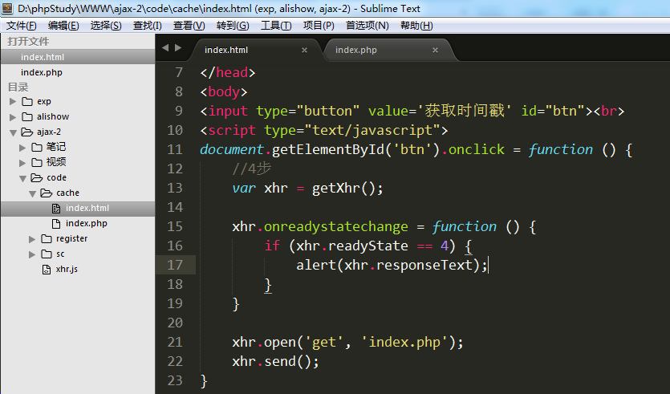


2. index.php --- 输出当前时间戳即可。

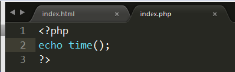


 在IE下测试:

 

显示的时间戳永远都是这个，说明是缓存问题。


## 2.3 解决方法

 解决方法有两种:
  1) 前端方案:  在open准备ajax请求时，为请求的地址增加随机后缀。相当于每次请求都是新的地址
  2) 后端方案:  后端程序设置不允许缓存的头信息，php程序固定使用如下3句即可。
    header('cache-controller:no-cache');
    header('Pragam:no-cache');
    header('Expires:-1');


1) 前端方案:


2) 后端解决方案:

​    header('cache-controller:no-cache');
    header('Pragam:no-cache');
    header('Expires:-1');


# 3. 同步和异步

## 3.1 同步/异步概念

  同步: ==顺序执行==  第一步---> 第二步 ---> 第三步 ....

  异步:  甲在完成一系列工作时，自己完成主工作。将一些分支工作交给乙，甲此时一直在完成自己的工作，并等待乙完成的结果。乙完成后将结果返回给甲。


  核心: open方法的参数3

​    参数3是一个布尔值， true异步方式（默认）， false是同步方式


## 3.2 案例

   同时显示图片和弹出框

  访问时: 先弹出123，点击“确定”之后，才显示图片 --- 同步


 1) index.html文件


 2) index.php文件


 


异步执行情况:  先显示图片，1秒后才显示时间戳弹出框

同步执行情况:  等待1秒后显示时间戳弹出框，再点击确定之后才显示图片


重点 :  在实际开发中 95% 以上的请求，都使用异步。


# 4. XMLHttpRequest2.0新特性

## 4.1 timeout 和 ontimeout

  timeout： 请求超时设置。属性，用来设置等待响应时长，如果超过指定时长，则会触发ontimeout事件

​	xhr.timeout = 3000;    // 设置等待时长为3秒

  ontimeout： 事件，用来设置超过等待时长后的动作

​        xhr.ontimeout = function () {

​		alert('请求超时');

​        }


在创建xhr对象之后，来设置timeout属性；如果设置了timeout属性，那么就建议设置ontimeout事件。


## 4.2 FormData表单对象

小案例:  点击button按钮时，将用户名和密码值通过ajax发送到后端php页面


FormData对象优势就是能够一次性将表单中的所有数据全部取出，包括文件域的文件对象。

1)创建表单 --- form标签很重要， method和action不重要
   每个表单域需要设置name值

2)发送ajax请求
①将表单数据取出 --- FormData
i.获取form表单对象:        var fm = document.getElementById(‘mainForm’);  //DOM对象
ii.实例化FormData对象:  var fd = new FormData(fm);

②发送ajax请求
   使用FormData对象以后，必须使用post方式来发送ajax请求。
   将FormData对象，作为参数传入 send方法中  xhr.send(fd);

③ 使用FormData对象提交表单时，不需要设置 setRequestHeader方法


注意点: 

   ① form标签要给id值，方便获取form标签的DOM对象

   ② 每个域都要给 name值

   ③ 提交按钮必须用 button，因为submit有跳转功能

代码实现:

1) 使用FormData对象获取所有表单的数据，并发送ajax请求


2) 在formdata.php页面，接收数据


访问结果:

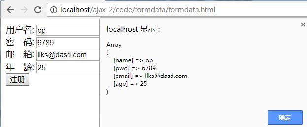


FormData的内部构造:  key-value


# 5. 文件上传进度条

 1) 完成Ajax文件上传

​    核心: Ajax方式上传文件必须使用FormData对象

​    关键点:  
     ① 表单使用提交按钮，一定是button
     ② 获取文件对象 ---- FormData
          i.根据id获取form表单对象 ---- DOM
          ii. 实例化 FormData对象，将表单对象作为参数传入
	  iii. 因为使用了FormData，所以一定要用post方式发送请求，将fd作为参数传入send方法

 

 upload.html

​    获取文件数据，发送ajax请求


  upload.php 


2) 调整php配置文件（php.ini），使其支持大文件上传

  ① 修改允许上传文件最大的大小


   ② 修改post表单提交数据的最大大小


   重启Apache服务器。


  3) 文件进度条

​     ① 在页面上设置一个div，用来表示进度条

  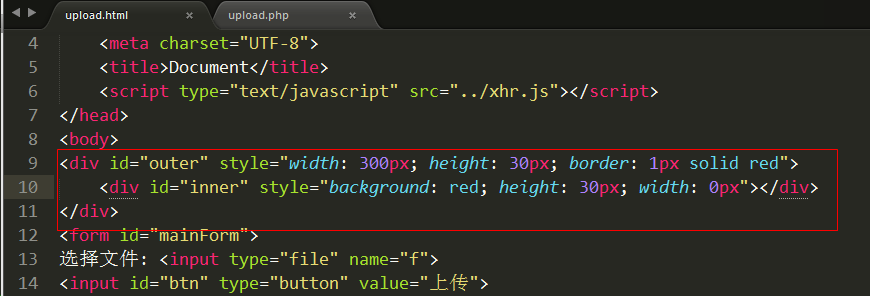


​       ②  根据实际上传百分比来绘制进度条的宽度

​        核心:  xhr对象中有一个子对象（upload），upload对象中有一个事件 onprogress。该事件大约每100ms执行一次，里面有两个重要属性  loaded(已上传大小)    total（总大小）


# Ajax技术-3 #

# 1. JSON

## 1.1 什么是JSON？

JSON:  JavaScript Object Notation 是一种轻量级数据交互格式。  


数据交互: 每一种语言的编码都不一样，它们之间互不认识。但是现在的情况是不同的语言开发出的系统也需要进行数据交互，这时候就需要一种大家都认识的语言或者技术来实现。


xml: 扩展标记语言

## 1.2 JSON数据的声明和使用

声明:  var json_obj = {"key1":"value1", "key2":"value2", ...};
key: ==双引号包含的字符串==
value: 数据--数值型、字符串、数组、json对象

```
//key：必须用双引号
var json1 = {"a":"Hello", "b":"world"};
alert(json1.a);

var json2 = {
    "name": "郭德纲",
    "age": 50,
    "tudi": ['岳云鹏', '烧饼', '张云雷'],
    "son": {"name":"郭麒麟", "age":20}
};
alert(json2.name);
alert(json2.tudi[1]);
alert(json2.son.name);

//数组，内部的每个单元都是一个json
var json3 = [
    {"name":"赵四",   "age":50},
    {"name":"小沈阳", "age":46},
    {"name":"刘能",   "age":50},
    {"name":"宋小宝", "age":52},
];
alert(json3[2].name);
```


JSON的本质:  JSON 是 JS 对象的字符串表示法，它使用文本表示一个 JS 对象的信息，本质是一个字符串。
var obj = {a:"hello", b:"world"};       // js对象
var obj = {"a":"hello", "b":"world"};    // ==json格式的js对象==，也可以叫json对象 (JSON才是真正的JSON对象)
var str = '{"a":"hello", "b":"world"}';    // json，也叫json格式的字符串 ==必须外层单引号，内存双引号==

var str = "{'a':'Hello', 'b':'world'}";  //错误，不能这样写，会影响到其他程序的执行


## 1.3 PHP数组转JSON格式的字符串

 php提供了函数：  json_str  json_encode($arr);

案例1: 索引数组转JSON  --->  数组
案例2: 关联数组转 JSON  --->  json对象
案例3: 二维数组转JSON  --->  一维数组，每个单元都是一个json对象


```
//索引数组
$arr = ['zs', 'ls', 'ww'];
// 一个索引数组被json_encode之后仍然是一个数组，
// 但是是一个字符串形式数组
echo json_encode($arr); // '["zs", "ls", "ww"]'

echo "<hr>";

//关联数组
$info = ['id'=>1001, 'name'=>'王小明', 'age'=>8];
// 一维关联数组被json_encode之后是一个json字符串
echo json_encode($info); // '{"id":1001, "name":"王小明", "age":8}'

echo "<hr>";

//二维数组
$list = [
    ['id'=>1001, 'name'=>'王小明', 'age'=>8],
    ['id'=>1002, 'name'=>'韩梅梅', 'age'=>10],
    ['id'=>1003, 'name'=>'李雷', 'age'=>9]
];
// 二维数组，会转为数组，内部的每个单元都是json
echo json_encode($list);
/*
'[
    {"id":1001,"name":"王小明","age":8},
    {"id":1002,"name":"韩梅梅","age":10},
    {"id":1003,"name":"李雷","age":9},
]'
*/
```


执行结果:


## 1.4 JSON字符串转JSON对象 --- javascript代码

前端的ajax请求，最后接收到的都是字符串 --- responseText，以字符串形式接收后端返回的数据

var a = '[{"id":10001,"name":"zs","age":20},{"id":10002,"name":"ls","age":21},{"id":10003,"name":"ww","age":19}]'


json格式的字符串转为json对象:  JSON.parse(json_str); 
参数: json格式的字符串


```
var s = '{"id":1001,"name":"王小明","age":8}';
alert(s.name);

//将json格式字符串转为json
var json = JSON.parse(s);
alert(json.name);


var arr = '[{"id":1001,"name":"\u738b\u5c0f\u660e","age":8},{"id":1002,"name":"\u97e9\u6885\u6885","age":10},{"id":1003,"name":"\u674e\u96f7","age":9}]';
alert(arr[1]);

var arr1 = JSON.parse(arr);
console.log(arr1[1]);
```


## 1.5 案例 --- 搜索用户名，显示用户列表信息

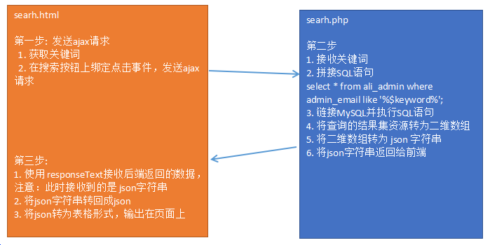 

思路:
1) 创建一个搜索页面，定义好搜索框，表头。在搜索按钮上绑定点击事件。
2) 点击事件能够发送ajax请求，并将用户名文本框中的内容一起发送到后端php程序
3) 后端php程序接收用户名，链接MySQL进行模糊查询，再将数组返回给前端
4) 前端接收到后端php返回值之后，循环显示出来


代码实现 : 

1) 创建一个搜索页面，定义好搜索框，表头。在搜索按钮上绑定点击事件。

 页面布局:


2) 点击事件能够发送ajax请求，并将用户名文本框中的内容一起发送到后端php程序

在搜索按钮上绑定点击事件 --- 获取文本框中的用户名，发送ajax请求


3) 后端php程序接收用户名，链接MySQL进行模糊查询，再将数组返回给前端

  核心操作: 将资源转为二维数组，再将二维数组转为json字符串，再返回给前端


 


4) 前端接收到后端php返回值之后，循环显示出来


# 2. jQuery提供的Ajax方法 #

 jQuery提供了4个ajax方法:  `$.get()  $.post()  $.ajax()  $.getJSON()`

 前三个常用

##  2.1 $.get ##
 $.get(var1, var2, var3, var4);
  参数1: 请求的后端程序的地址
  参数2: 要发送到后端程序的数据，json对象/js对象（推荐）或者 字符串
  参数3: 当readyState==4时的触发函数，该函数中有一个参数，就是后端程序返回的数据
  参数4: 设置返回数据的类型:  text(默认)  json     xml


案例: 在get.html文件中发送一个ajax请求，去请求后端的get.php页面，同时将id=1数据发送给后端

示例: 

```
$.get('get.php', {"goods_id":10101, "_":Math.random()}, function(msg){
	alert(msg);
}, 'json');
```

​	 

解析:   上面的代码等价于原生js的

```
var xhr = new XMLHttpRequest();
xhr.onreadystatechange = function(){
	if(xhr.readyState == 4){
		msg = xhr.responseText;
		msg = JSON.parse(msg);
		alert(msg);
	}
}
xhr.open('get', 'getData.php?goods_id=10101&_='+Math.random());
xhr.send(null);
```

​     

使用jquery提供的ajax方法，就是为了简化开发。

  

使用 $.get 改造 1.5的搜索案例

1) 表格和文本框一样


2) $.get发送请求

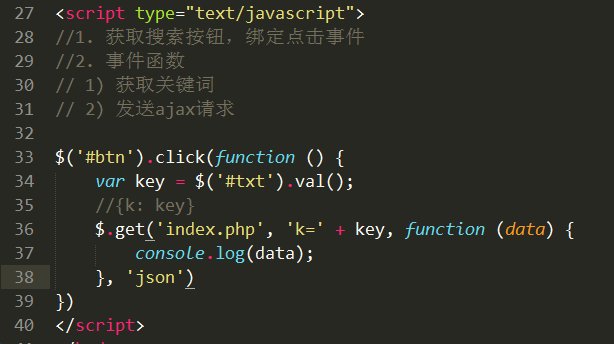


##  2.2 $.post ##
`$.post`函数的用法和`$.get`一模一样，只是发送请求方式变为post

 $.post(var1, var2, var3 , var4);    //最标准的写法
  参数1: 请求的后台程序的地址
  参数2: 要发送到后台程序的数据，json对象/js对象（推荐） 或者 字符串
  参数3: 当readyState=4时的触发函数，该函数中有一个参数，就是后台程序返回的数据
  参数4: 设置返回数据的类型:  text(默认)  json     xml


示例: 

```
$.post('getData.php', {"goods_id":10101}, function(msg){
	alert(msg);
}, 'json');
```

​	 

解析:   上面的代码等价于原生js的

```
var xhr = new XMLHttpRequest();
xhr.onreadystatechange = function(){
	if(xhr.readyState == 4){
		msg = xhr.responseText;
		msg = JSON.parse(msg);
		alert(msg);
	}
}
xhr.open('post', 'getData.php');
var param = 'goods_id=10101';
xhr.setRequestHeader('content-type', 'application/x-www-form-urlencoded');
xhr.send(param);
```


## 2.3 案例 --- 搜索框下拉列表


数据表设计:


key_id: 主键

key_name: 关键词


 思路分析:

1. index.html  ---  在搜索框上绑定keyup事件，获取搜索框内容并发送ajax请求

   1) 在搜索文本框上绑定键盘弹起事件

   2) 事件函数

      ① 获取搜索框内容

      ② 发送ajax请求，等待结果

   

2. getKeys.php ---  接收关键词，并根据关键词从数据表中查出相关的其他关键词，返回给前端

   1) 接收关键词

   2) 编写SQL语句，查询和接收关键词相关的所有关键词

   3) 将查询结果返回给前端

   

3. index.html --- 将接收到关键词循环显示到下拉列表（tips）中

   接收后端返回结果并显示

   1) 制作下拉列表

   2) 将后端返回的每条关键词都填充到下拉列表中

   3) 完善下拉列表

      ① 每次循环取出关键词时都先创建div，并将关键词放在div中

      ② 为div绑定鼠标悬浮事件（高亮显示）和鼠标移出事件（取消高亮显示）

      ③ 为div绑定点击事件，将选中的关键词放入搜索框

      ④ 将每个div都放入tips

      ⑤ 将tips显示出来

      ⑥ 每次向tips中填充数据时，都要先清空tips

   ​


代码实现:

index.html  ---  在搜索框上绑定keyup事件，获取搜索框内容并发送ajax请求

1) 在搜索文本框上绑定键盘弹起事件

2) 事件函数

   ① 获取搜索框内容

   ② 发送ajax请求，等待结果

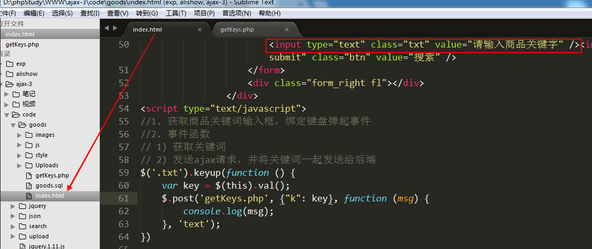


getKeys.php ---  接收关键词，并根据关键词从数据表中查出相关的其他关键词，返回给前端

1) 接收关键词

2) 编写SQL语句，查询和接收关键词相关的所有关键词

3) 将查询结果返回给前端


下拉列表

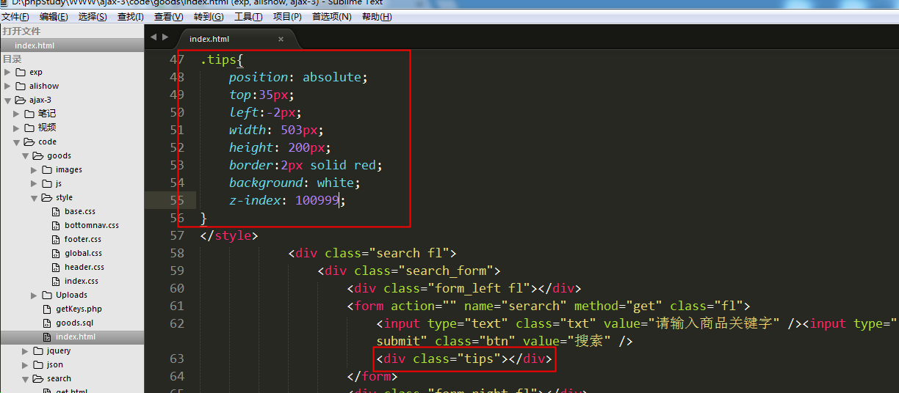


index.html 将结果显示到下拉菜单中


关键点总结:

1) 使用键盘弹起事件来触发ajax请求

   ① 获取搜索框中的内容

   ② 发送ajax请求，并将搜索框中的内容一起发送给后端

2) 接收到的数据需要循环显示在下拉菜单中

   ① 将返回的字符串转为数组（内部是json对象）

   ② 循环数组，取出每一个相似关键词

   ③ 在循环中创建div对象，将关键词加入div对象

   ④ 在div上绑定鼠标悬浮事件，修改背景和字体颜色

   ⑤ 在div上绑定鼠标移出事件，修改背景和字体颜色为初始颜色

   ⑥ 在div上绑定点击事件，将内容写在搜索框中，并隐藏下拉列表

   ⑦ 将div追加到下拉列表中，然后再将下拉列表显示出来

   ⑧  在循环显示下拉列表之前先清空下拉列表中已有内容

# Ajax技术-4

# 1. jQuery的Ajax方法 #

##   1.1 $.ajax方法 ##

 `$.ajax`使用JS对象来配置ajax请求  ---  $.ajax(obj);

 必须配置项：
  url:         要请求的后台程序地址
  data:      要发送到后台程序的数据 (建议使用json/js对象格式，也可以使用字符串，也可以是FormData)
  type:      请求类型  post和get 两种  (put、delete)
  dataType:  返回值类型  text(默认) 、 json 、xml 、 jsonp(跨域使用) 
  success:   成功完成ajax触发的事件，回调函数，其参数是后端程序的返回数据


简单案例:

 1) 发送ajax请求


 2) 后端返回数据


其他配置项：

  cache: 是否进行缓存(true/fasle)，如果设置type为get，一般设置该项为false(不缓存)。
  async: 同步/异步设置，true(异步、默认) false(同步)。
  timeout: 超时设置，多少ms之后扔未接收到后端返回数据，则结束本次请求。--- 进入error方法中
  error: 请求失败时的回调函数，该函数有三个参数。参数1是xhr对象，参数2是错误信息（错误信息通常是 "null", "timeout", "error", "not modified" 和 "parsererror"），参数3是异常对象（可选）。
  complete: Ajax完成时的回调函数。不论请求成功还是失败都会执行该方法
  beforeSend: 发送Ajax之前执行的回调函数。

  beforeSend()  --->  success/error()  ---> complete()


  contentType:  头信息设置，使用FormData对象时设置该值为false，其他情况会自动设置，不需要手动设置。
  processData:  处理数据方式，使用FormData对象时设置该值为false，其他情况会自动设置，不需要手动设置。

  注意: ==contentType和processData只有在使用FormData对象时，设置为false，其余情况均不用设置==


## 1.2 案例 ---  添加新管理员 ##

 


  如果发送的数据是FormData，那么就只能使用原生js 或者 $.ajax

  $.ajax发送请求时，如果发送的数据是FormData时，必须设置 contentType和processData为false

  1) 表单页(index.html)

​       提交按钮上，绑定点击事件，获取表单数据，发送ajax请求

  2) php页面接收表单数据，拼接SQL语句并执行 

  3) 前端接收结果，进行提示


代码实现:

1) 表单页(index.html)

​    提交按钮上，绑定点击事件，获取表单数据，发送ajax请求

​     因为用到FormData来获取表单数据，所以必须用$.ajax，发送请求时要额外配置contentType和processData

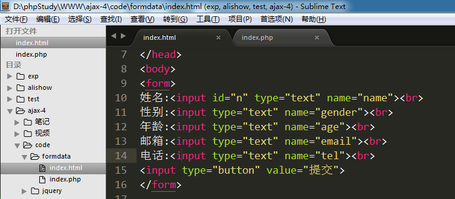

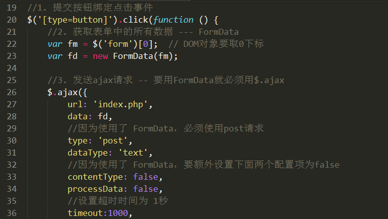


2) php页面接收表单数据，拼接SQL语句并执行  （自己完成）

3) 前端接收结果，进行提示（自己完成）


# 2. 自己封装Ajax --- 和jQuery一样 #

从一般到通用。
从一个具体的案例，完善成一个兼容相同功能函数
  1) 编写一个具体案例
  2) 分析其中的缺陷
  3) 完善缺陷


## 2.1 封装 $.get方法

1) 编写一个具体的案例
   具体案例:  封装一个get方法，能够发送ajax请求，请求1.php文件，并且能接收到1.php的返回数据

  ① 使用原生js完成整个ajax请求过程

  ② 定义$对象，再定义get成员方法


==分析具体案例存在的问题，一步一步将存在问题修正，就能够形成一个通用的函数了。==

具体案例存在的问题:
① 在创建XMLHttpRequest对象时，没有处理浏览器兼容性
② 只能访问1.php程序
③ 无法灵活向后台的1.php程序发送参数
④ 前端无法灵活接收后端返回的数据
⑤ 返回值类型单一，只能使用字符串


2) 处理创建XMLHttpRequest对象时的兼容性问题

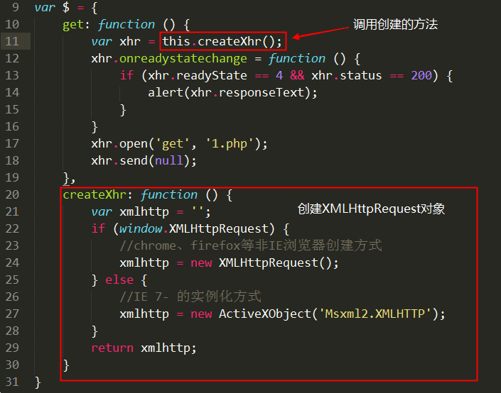


3) 处理只能访问1.php文件的文件的问题。
  思路: 定义get函数时设置形参，调用函数时传递实参

① 修改get方法，设置参数1 --- 请求的url地址


② $调用get方法时，需要传递实参

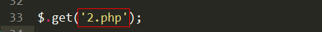


4) 处理请求后台文件时无法发送数据 
  思路: 将js对象组装为字符串，拼接在请求的url地址之后

 $.get('1.php', {"id":1, "name":"zs"} , ....)  --> 1.php?id=1&name=zs

 本质: {"id":1, "name":"zs"} ---> id=1&name=zs

 

① 封装params方法，将js对象转为字符串

 i. 创建了一个test.html页面，用来测试js对象转字符串的方法


 ii. 将封装好的函数加入到 $ 对象中


② 在get方法中定义参数2， 并在get方法中调用params方法，将参数2的js对象转为字符串，将字符串参数拼接到url地址当中

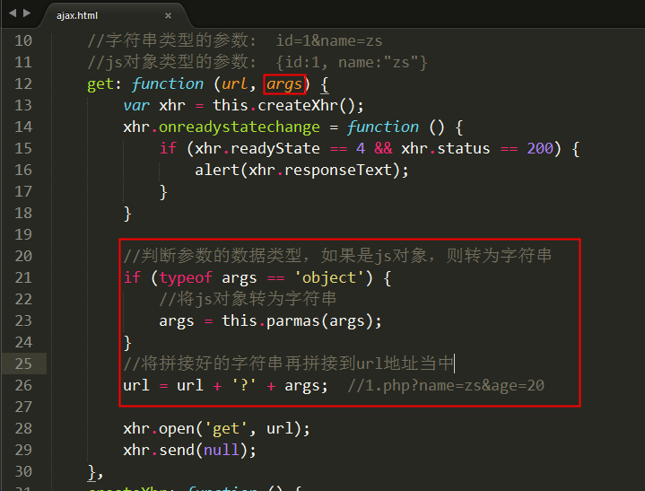

 


5) 处理readyState==4时的回调函数

① 在$.get方法中设置参数3，在方法体中使用函数形式调用，就相当于执行了一个函数


② 在调用$.get方法时，以回调函数形式传入参数3


6) 处理能够接收不同类型的返回值

① 在$.get方法声明时，设置参数4，判断参数4的值，如果是json则进行额外处理

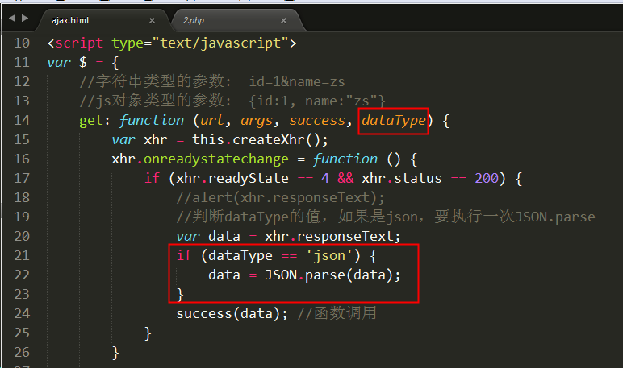

② 在调用$.get方法时，传入参数4


## 2.2 封装 $.post方法 ##
 1) 创建post方法，能够发送ajax请求
 2) 处理向后台发送的数据
 3) 处理回调函数和返回值类型


1) 封装普通的方法

2) 处理xhr的浏览器兼容性问题

3) 请求地址参数问题

4) 让请求能够发送数据

5) 回调函数

6) 设置返回值类型

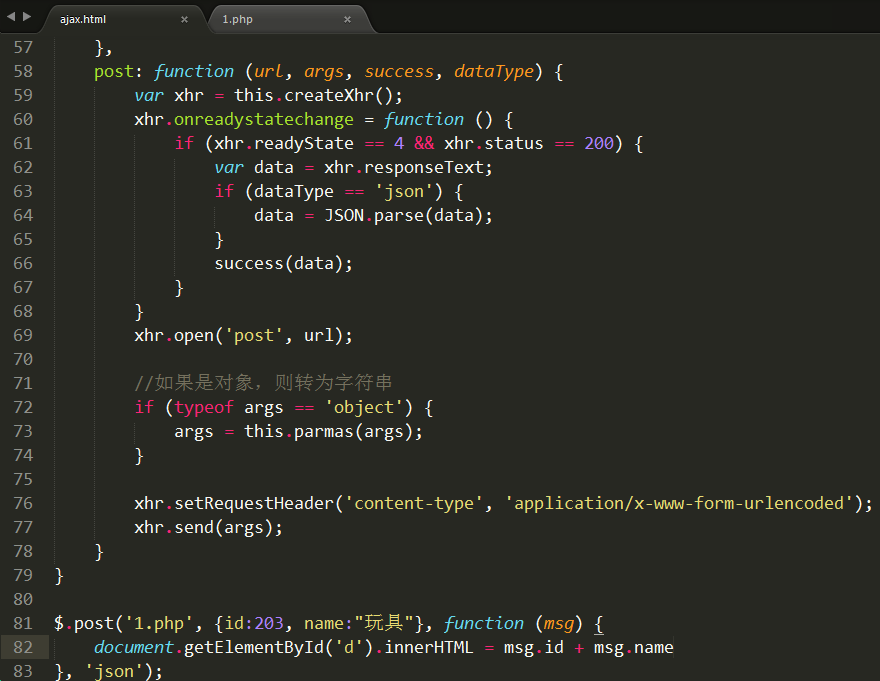


## 2.3 封装 $.ajax方法 ##
 核心思想:
1) 将发送请求的地址、方式、数据、返回值类型、回调函数都封装到js对象中，然后作为参数传入$.ajax方法中。
2) 在$.ajax方法中区分post和get方式，分别调用get方法和post方法。


# 3.模板引擎

## 3.1 为什么要使用模板引擎

通过搜索用户名案例我们发现，要渲染到网页上的数据是使用js循环拼接字符串，再将拼接好的字符串填入tbody标签中的。

   这种方式可读性差，出错不容易查找。

   模板引擎技术就是为了解决字符串拼接问题的。 ==模板引擎技术本质就是拼接字符串。==

   传统模式有两种拼接显示字符串的方式:

- 在后端程序中拼接好，然后以字符串形式返回
- 后端程序返回json字符串，前端程序接收了之后，解析json进行拼接

模板引擎方式：
    模板引擎属于前端程序拼接字符串
    提前定义好要显示格式，所有数据位置以特殊标记表示出来。模板引擎会自动分析，并将数据填写到对应的位置。


我叫__ , 今年__ 岁了


## 3.2 常见模板引擎

ArtTemplate：https://github.com/aui/artTemplate
velocity.js：https://github.com/shepherdwind/velocity.js
Handlebars：http://handlebarsjs.com


## 3.3 artTemplate快速上手

基本使用步骤:
  1) 使用script标签引入arttemplate库文件 (template-web.js)
  2) 定义标签，用来显示最终解析好的模板信息
  3) 定义模板和模板中所需数据。
      ① 定义要显示在模板中的数据，必须是 json 对象
      ② 使用script标签定义模板，type="text/template"  id="tpl"，并且使用 {{}}  将所有数据位置标记出来
  4) 调用template函数，解析模板
  5) 将解析好的模板字符串填充到事先定义好的标签中(显示到网页上)


简单案例：拼接模板字符串 “我叫张三，今年20岁”，并输出在网页的div中

模板:   我叫__ , 今年__ 岁了

var json = {"name":"zs", "age":20};


① 引入 template-web.js库文件

② 定义标签，用来显示最终解析好的模板信息

③ 定义数据和模板

④ 调用template函数将数据和模板揉到一起

⑤ 将解析好的字符串写入定义好的标签中


关键点：

1) 在定义模板时使用 script 标签， type=“text/==template==”  id="tpl"
2) 定义json对象，json对象中的key一定要和模板中的 {{key}}一致
3) 调用template函数进行解析
    参数1: 模板的id值
    参数2: json对象
    返回值:解析好的字符串


## 3.4 循环结构 --- each

  关键点: 
1) template函数需要的参数是一个json对象，所以需要声明json对象，里面是数组

2) 在定义模板时使用each进行循环

  each结构:   

  {{each data as value}}

​	输出内容

  {{/each}}

  data: 要循环的数组

  value: 循环取出的单元值

  注意: 使用 {{/each}} 结束循环


① 使用script标签引入arttemplate库文件 (template-web.js)

② 定义标签，显示最终结果的标签

③ 定义数据和模板

④ 调用template函数，将数组和模板进行解析

⑤ 将解析好的字符串显示到div中


var  arr= [

​	{"name":"zs", "age":20},

​	{"name":"ls", "age":20},

​	{"name":"ww", "age":20},

]


var arr = [

​	{"sno":1, "sname":"aaa", "sage":20, "sgender":"nv", "semail":"dasdsad@d.acom", "stel":"12134333"},

​	{"sno":2, "sname":"aaa", "sage":20, "sgender":"nv", "semail":"dasdsad@d.acom", "stel":"12134333"},

​	{"sno":3, "sname":"aaa", "sage":20, "sgender":"nv", "semail":"dasdsad@d.acom", "stel":"12134333"},

]


## 3.5 选择结构 --- if else

  关键点: 定义模板时使用 

  {{if  判断条件}}

​	程序块1

  {{else}}

​	程序块2

  {{/if}}


## 3.6 使用模板引擎改造搜索用户案例

 目标: 使用模板引擎来代替原来的字符串拼接


① 引入库文件

② 定义标签，显示最终结果的标签

③ 定义数据和模板

④ 调用template函数

⑤ 将解析好的字符串渲染到tbody中


# Ajax技术-5

模板引擎使用步骤:

 1) 引入template-web.js库文件

 2) 设置一个标签，用来显示最终解析好的字符串

 3) 设置数据和模板

​     数据: 必须使用json，如果不是需要转换或者包装等操作。

​     模板: 使用 script标签，type="text/template"， id="t"

  4) 调用template函数将数据和模板组装到一起

  5) 将解析好的字符串显示到 第二步定义的标签中

  


# 1. 模板引擎

## 1.1 选择结构 --- if else

  关键点: 定义模板时使用 

  {{if  判断条件}}

​	程序块1

  {{else}}

​	程序块2

  {{/if}}


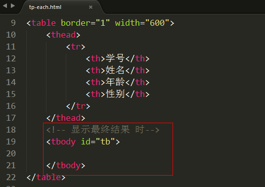


定义数据和模板


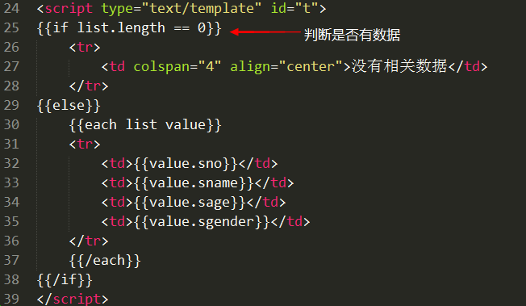


## 1.2 使用模板引擎改造搜索用户案例

目标: 使用模板引擎来代替原来的字符串拼接


① 引入库文件

② 定义标签，显示最终结果的标签

③ 定义数据和模板

④ 调用template函数

⑤ 将解析好的字符串渲染到tbody中


1) 发送ajax请求


2) 后端php接收关键词，查询，再将结果返回给前端


3) 前端显示数据 --- 模板引擎

   ① 引入 template-web.js 文件

   ② 定义显示最终结果的标签 -- tbody

   ③ 定义数据和模板

​       数据后端返回的 ---  数组，内部是json

​       需要包装成json

​       定义模板： each循环json中的数组，还可以增加if判断

​    ④ 调用template函数组装数据和模板

​    ⑤ 将结果显示到 tbody中

  

定义模板:


定义数据：


## 1.3 模板引擎原理简介(了解)

 核心原理: 使用正则替换模板引擎中的标记
 例如: 我叫{{name}}，今年{{age}}岁
  使用正则表达式找到模板字符串中的{{name}}和{{age}},再用真实的数据进行替换。

 核心方法:  
  ① reg.exec(str);
  reg: 正则表达式
  str:  字符串
  函数作用: 从str字符串中找到复合reg正则表达式的对象，如果没有则返回null

  ② str.replace(str1, str2);
  函数作用: 在str字符串中找到str1字符串，然后用str2字符串进行替换
  例如:
  str = “abcdefg”;
  str1 = “bc”;
  str2 = “zs”;
  console.log(str.replace(str1, str2)); //  azsdefg

  掌控每一步中变量的内容。


# 2. 虚拟主机配置 #
## 2.1 什么是虚拟主机 ##
虚拟主机，也叫“网站空间”，就是把一台运行在互联网上的物理服务器划分成多个“虚拟”服务器，每一个虚拟服务器都能独立运行一个网站

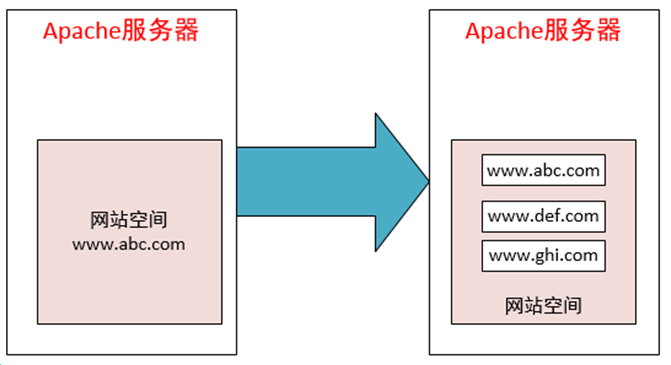


## 2.2 虚拟主机配置3步骤

目标: 将我们的apache做成虚拟主机，同时支持多个网站。  还可以为每个虚拟主机自定义域名

www.study.com


案例: 配置 www.study.com  虚拟主机

1) 修改apache配置文件(httpd.conf)，引入apache的虚拟主机配置文件(httpd-vhost.conf)
     去掉该句前的 # 号

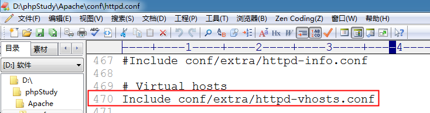


2) 修改虚拟主机配置文件
d:\phpstudy\Apache\conf\extra\httpd-vhosts.conf


3) 修改hosts文件 (使用管理员权限修改)
c:/windows/system32/drivers/etc/hosts


在浏览器中输入 www.study.com 就会访问本机的apache服务器


​                                                      

==重启Apche服务器==


注意：  www.study.com 指向  d:/phpstudy/WWW/study 目录

 配置两个域名：  www.study.com   www.demo.com


# 3. ajax跨域 #
##  3.1 什么是ajax跨域 ##
简单来说，就是网站A去调用网站B的数据。
常见案例： hao123.com的天气预报。


但是Ajax跨域存在一个问题 --- 浏览器的同源策略，该策略会阻止ajax跨域访问
同源策略（Same origin policy）是一种约定，它是浏览器的一种安全功能。 
同源:  同协议，同域名，同端口；   不同源则为跨域


同源限制案例:
www.study.com/origin/index.html使用ajax，请求www.demo.com/1.php文件中的数据

1) 创建 www.study.com/origin/index.html 文件


2) 创建 www.demo.com/1.php


访问结果:

 响应主体: 


  终端：


 看到 Access-Control-Allow-Origin 错误，就说明正在执行跨域请求，请求数据被浏览器的同源策略所阻止。

 


解决跨域问题有三种方式：

- 服务器代理
- cors （跨域资源共享）
- jsonp


##  3.2 代理实现ajax跨域 ##
  核心思想:  php中有一个函数  ==file_get_contents==。 该函数能够获取到其他网站的数据。

  file_get_contents('http://www.baidu.com/index.html');

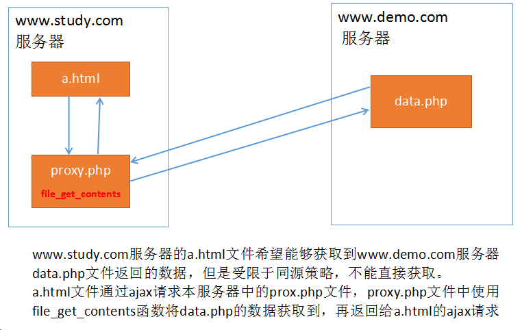

案例: 
www.study.com/proxy/index.html发送ajax请求，请求www.study.com/proxy/proxy.php文件
proxy.php文件使用file_get_contents函数读取www.demo.com/1.php文件中的内容，再返回给index.html文件中的ajax请求

1)创建  www.study.com/proxy/index.html

​     在该文件中发送ajax请求，请求同服务器(www.study.com)下的 proxy.php文件


2)创建  www.study.com/proxy/proxy.php 

​    在该文件中使用 file_get_contents函数，读取远程服务器(www.demo.com)1.php中的内容


3)创建  www.demo.com/1.php


访问结果:


##  3.3 cors跨域 ##
  cors: 跨域资源共享。
  同源策略是浏览器的策略。但是如果服务器允许其他网站的页面进行跨域访问，那么浏览器就不会对返回的数据进行限制了。

  ==核心方法: 在服务器端(PHP文件中)声明不用进行同源限制==

如果设置为 * 则是所有外部网站都可以获取数据
header('Access-Control-Allow-origin: *'); 

只允许www.study.com网站访问并获取数据
header('Access-Control-Allow-origin: http://www.study.com'); 

案例:
www.study.com/cors/index.html通过cors方式，访问www.demo.com/cors.php文件的数据	
1)创建 www.study.com/cors/index.html文件 发送ajax请求


2)创建 www.demo.com/cors.php

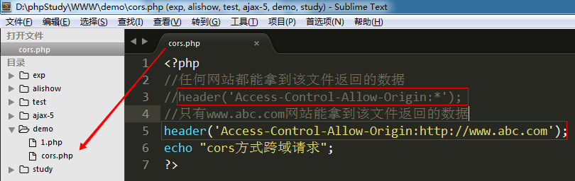


##  3.4 jsonp跨域 ##
JSONP(JSON with Padding) : 是一种解决ajax跨域访问的方案。

核心思想:
   浏览器虽然有同源策略，但是 src 和 href 两个属性却可以跨域访问。 可以利用这一“漏洞”发送ajax请求。

案例: 
www.study.com/jsonp/index.html文件中通过script标签的src属性，跨域访问www.demo.com/jsonp.php文件中的数据

1) 创建 www.study.com/json/index.html ,使用 script标签引入了  www.demo.com/jsonp.php文件


2) 创建 www.demo.com/jsonp.php文件 输出个 123


访问结果 --- 响应主体，拿到后端的返回值


3) 调整后台返回数据的方式 --- 返回了一个 ==函数字符串 例如: 'aaa(123)'== 


访问结果: 


4) 在前端页面提前定义好 函数 aaa()


访问结果 --- 123被输出到终端


5) 丰富一下后台返回数据的类型


访问结果:


##  3.5 $.ajax方法跨域操作 --- jsonp方式 ##

`$.post $.get $.ajax都能发送跨域请求。但是，$.post和$.get是要依靠cors方式的，只有$.ajax能使用jsonp方式`


核心: 
    必须设置请求类型为get ---  type: ‘get’
    必须设置dataType为jsonp --- dataType: ‘jsonp’
    必须额外设置一个jsonp参数，该参数值可以是任何英文字符串，常用callback。 jsonp: 'callback'
           ==该参数会产生一个随机字符串==
           ==前端使用该字符串创建一个函数==
           ==后端接收该字符串作为返回函数的名称==

示例:

1) 使用jsonp发送跨域请求

```
$.ajax({
    url: 'http://www.study.com/test/3.php',
    type: 'get',   
    dataType: 'jsonp',   
    jsonp: 'callback',  //解决前后端函数名统一的问题   
    success: function(msg){
        alert(msg);
        alert(msg.name);
    }
})
```


2) 后端拼接函数字符串

```
<?php 
// 函数名
$callback = $_GET['callback'];
$str = "$.ajax--->jsonp";
echo $callback . "('$str')";
?>
```

案例:
www.study.com/ajax_jsonp.html 跨域访问www.demo.com/ajax_jsonp.php文件中的内容

1)　创建 www.study.com/ajax_jsonp.html 发送ajax请求


2)　创建www.demo.com/ajax_jsonp.php 返回数据


## 3.6 调用网上接口 --- 天气预报

  网站： www.jisuapi.com


api说明:


注册，购买后可在“我的api”中看到

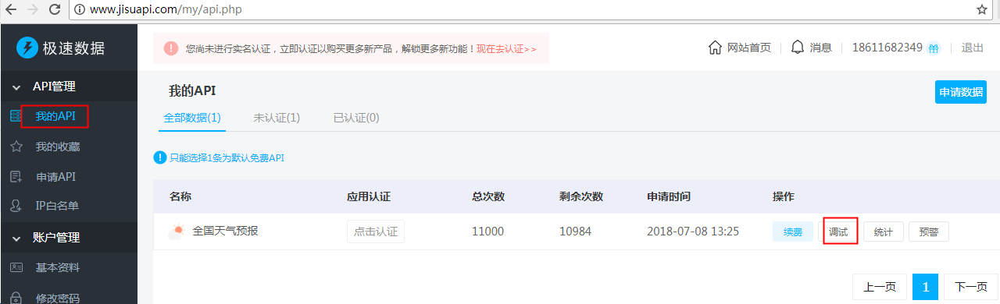


1） 发送ajax请求


2) 将取得数据筛选后显示到网页上


