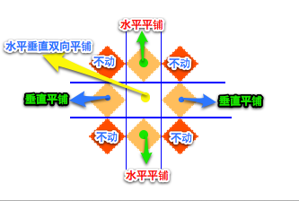

# 关于H5开发

## 目标

- 作为前端开发人员应该怎么去理解H5开发
- 不能单纯认为H5仅仅只是H4的下一个版本

## 个人愚见 

### HTML4.0.1

1. html是HyperText Markup Language `超文本标记语言`的缩写，是一款描述网页的标记语言。
2. HTML4.0.1简单的讲就是html的一个版，1999年12月发布的一直沿用至今，但是html5在慢慢代替它。
3. 总结一下它的作用是语言规范，开发网页用的。

### HTML5

1. 狭义的讲html5的新的一个规范，你可以理解成H5仅仅只是H4的下一个版本。
2. 但是如果把现在的工作岗位前端-`H5开发工程师`中的H5那就没这么简单了。

### 理解H5开发

1. 在前端领域H5是一个技术集合（技术栈），而不是一个单纯的技术点，所有不能理解为是一个html规范。
2. 需要从三个方面去梳理一下常见会学习到技术（当然远不止这些）：
   - html
     + 语义化标签
     + 新增表单类型
     + 新增表单属性
   - css
     + 新增选择器
     + 属性的增强
     + 过渡
     + 转换
     + 动画
     + 媒体查询
   - javascript
     + 新增应用API
     + canvas绘图
     + ES6
3. 还可以从职能去理解H5开发是什么：
   - 移动web开发
   - 响应式开发
   - 单页面应用开发
   - 混合APP开发
   - 微信小程序
   - 微信公众号

### 总结

H5开发泛**指对h5技术栈(html提升，css提升，javascript提升)的综合使用开发网页应用程序**

# 复习

## 目标

- 回顾在基础阶段学习的H5相关知识
- 完成测试案例

### 属性选择器 

- `E[attr=value]` 选中E元素中属性有attr的且属性值为value的元素 
- `E[attr^=value]` 选中E元素中属性有attr的且属性值以value开头的元素 
- `E[attr$=value]` 选中E元素中属性有attr的且属性值以value结尾的元素 
- `E[attr*=value]` 选中E元素中属性有attr的且属性值包含value的元素 

### 伪类选择器

- `E:first-child` 选中E元素的父元素下所有的子元素的第一个元素，如果类型为E选中否则无效
- `E:last-child` 选中E元素的父元素下所有的子元素的最后一个元素，如果类型为E选中否则无效
- `E:nth-child(n)` 选中E元素的父元素下所有的子元素的第n个元素，如果类型为E选中否则无效
- `E:nth-last-child(n)` 选中E元素的父元素下所有的子元素的倒数第n个元素，如果类型为E选中否则无效

### 伪元素选择器

- `E::before` 选中E元素的内容前伪元素 
- `E::after `  选中E元素的内容前伪元素 

### 过渡

- `transition` 需要过渡的属性 过渡时间 过渡的动画速度函数 过渡的延时时间
- `transition-property` 需要过渡的属性
- `transition-duration` 过渡时间单位秒
- `transition-timing-function` 过渡的动画速度函数 如：`ease` `linear` 
- `transition-delay` 过渡的延时时间单位秒

### 2d转换

- `transform` 转换属性  属性值为不同的转换形式
- `scale`  缩放
- `translate` 位移
- `rotate` 旋转
- `skew` 倾斜
- `transform-origin`  转换中心 

### 动画

- `animation` 动画属性
- `animation-name` 动画序列名称
- `animation-duration` 动画时长
- `animation-timing-function` 动画速度函数
- `animation-delay` 动画延时
- `animation-iteration-count` 动画执行次数  无数次 `infinite`
- `animation-direction` 动画播放方向  默认` normal`  逆播放 `alternate`
- `animation-play-state` 动画的播放状态  默认 `running` 暂停 `paused` 
- `animation-fill-mode` 动画结束状态 默认 `backwards` 保持 `forwards`

```css
@keyframes animationName {
  form{
      width:100px;
  }
  to{
      width:200px
  }
}
/* animationName 动画序列名称 */
```

### 总结

**css3知识非常繁杂属性较多，无需刻意去记忆，一定要多使用。**

# 3D转换

## 目标

- 掌握使用CSS完成一些3d效果
- 理解在网页平面内的3d效果

## 怎么在网页平面产生3d效果 

- 我们生活的环境是3d的，照片就是3d物体在2d平面呈现的例子
- 有什么特点：
  + 近大远小
  + 物体后面遮挡不可见
- 当我们在网页上构建3d效果的时候参考这些特点就能产出3d效果
- 在现实生活当中 我们通过肉眼去物体的时候和照片的成像是相同的
- 如果想要在网页产生3d效果需要透视（理解成3d物体投影在2d平面内）

## 透视和视距


- 透视（perspective）
    + 在2d平面产生近大远小视觉立体，但是只是效果二维的
    + 原理：  
      </img>   
      a. 模拟人类的视觉位置，可认为安排一只眼睛去看  
      b. 距离电脑平面的距离为视距  
      c. 距离视觉点越近的在电脑平面成像越大，越远成像越远  
    + 特点：只是显示3d图像的近大远小效果，无法呈现3d的三维成像的特点，如遮挡
    + 使用场景：只是辅助性的帮助开发者检查3d效果

    ​


## 3d转换

- `translateX`  x轴方向的位移
- `translateY`  y轴方向的位移
- `translateZ ` z轴方向的位移
- `rotateX` 绕x轴旋转
- `rotateY` 绕y轴旋转
- `rotateZ` 绕z轴旋转 

## 3d呈现

+ 3d呈现（transfrom-style）
  + 在2d平面产生近大远小视觉立体，但是只是效果二维的
  + 原理：  
    </img> </img>   
    a. 第一张图是没有使用3d呈现的  无3d效果
    b. 第二张图是使用了3d呈现的  出现遮挡三维立体效果
  + 特点：真正意义的3d呈现，三维立体,有遮挡
  + 使用场景：在3d立体图形的构建使用

## 综合案例

```html
<!DOCTYPE html>
<html lang="en">
<head>
    <meta charset="UTF-8">
    <title>Title</title>
    <style>
        .box{
            width: 200px;
            height: 200px;
            position: relative;
            margin: 100px auto;
            /*辅助3d效果开发  视觉效果 */
            /*透视：理解成在屏幕外面安排一只眼睛帮我们开3d效果*/
            /* 形成近大远小 效果  */
            /*perspective: 300px;*/

            /*真正意义的3D呈现 */
            transform-style: preserve-3d;

            transform: rotateX(30deg) rotateY(-30deg);

            animation: rotate 4s linear infinite;

        }
        .box > div{
            width: 100%;
            height: 100%;
            position: absolute;
            left: 0;
            top: 0;
            text-align: center;
            line-height: 200px;
            font-size: 20px;
            opacity: 0.4;
        }
        .box .front{
            background: red;
            transform: translateZ(100px);
        }
        .box .back{
            background: blue;
            transform: rotateY(-180deg) translateZ(100px);
        }
        .box .left{
            background: green;
            transform: rotateY(-90deg) translateZ(100px);
        }
        .box .right{
            background: yellow;
            transform: rotateY(-270deg) translateZ(100px);
        }
        .box .top{
            background: pink;
            transform: rotateX(90deg) translateZ(100px);
        }
        .box .bottom{
            background: hotpink;
            transform: rotateX(-90deg) translateZ(100px);
        }
        /* 立方体的中心在电脑平面上  */
        /* 当你选择过后正面朝外 Z正方向也是朝外 */

        @keyframes rotate {
            from{

            }
            to{
                transform: rotateX(30deg) rotateY(-390deg);
            }
        }
    </style>
</head>
<body>
    <div class="box">
        <div class="front">front</div>
        <div class="back">back</div>
        <div class="left">left</div>
        <div class="right">right</div>
        <div class="top">top</div>
        <div class="bottom">bottom</div>
    </div>
</body>
</html>
```


## 总结

- 怎么在2d的网页体现3d效果
  - 拍照片  物体 呈现 近大远小
  - 在网页 也可以安排一只虚拟的眼睛  帮我们去观察 立体的物体
- 透视
  - perspective:100px;
  - 视距  距离越近 近大远小的效果 越明显
  - 作用：辅助观察3d效果，不能真正的呈现3d
- 3d转换
  - rotateX
  - rotateY
  - rotateZ
  - translateX
  - translateY
  - translateZ

# 边框图片

## 目标

- 扩展知识增加一下知识面


### 原理

border-image

设置的图片将会被“切割”成九宫格形式，然后进行设置。如下图


“切割”完成后生成虚拟的9块图形，然后按对应位置设置背景，

其中四个角位置、形状保持不变，中心位置水平垂直两个方向平铺。如下图

 

**1、round和repeat之间的区别******

round 会自动调整尺寸，完整显示边框图片。

 

repeat 单纯平铺多余部分，会被“裁切”而不能完整显示。

 

**2、更改裁切尺寸******

border-image-slice: 34 36 27 27 分别设置裁切如下图

 

 

## 属性

- `border-image-source`  图片地址
- `border-image-slice` 图片裁剪尺寸
- `border-image-width` 边框的宽度
- `border-image-repeat` 平铺方式  `stretch` `round` `repeat`


## 总结

 关于边框图片重点理解9宫格的裁切及平铺方式，实际开发中应用不广泛，但是如能灵活动用会给我们带来不少便利。

 # 全屏切换

## 目标

- 掌握fullpage的使用完成全屏切换效果

## fullpage插件

### 简单介绍

+ 基于 jQuery 的插件，它能够帮你很方便、很轻松的制作出全屏网站。
+ 支持鼠标滚动，支持前进后退和键盘控制，多个回调函数，
  支持手机、平板触摸事件，支持 CSS3 动画，支持窗口缩放，窗口缩放时自动调整，
  可设置滚动宽度、背景颜色、滚动速度、循环选项、回调、文本对齐方式等等。
+ 参考文档：http://www.dowebok.com/demo/2014/77/

### 使用步骤

+ 引用文件
    ~~~html
        <link rel="stylesheet" href="css/jquery.fullPage.css">
        <script src="js/jquery.min.js"></script>
        <script src="js/jquery.fullPage.js"></script>
    ~~~
    + html结构
    ~~~html
    <div id="fullpage">
        <div class="section">第一屏</div>
        <div class="section">第二屏</div>
        <div class="section">
            <div class="slide">第三屏的第一屏</div>
            <div class="slide">第三屏的第二屏</div>
            <div class="slide">第三屏的第三屏</div>
            <div class="slide">第三屏的第四屏</div>
        </div>
        <div class="section">第四屏</div>
    </div>
    ~~~
    + js初始化
    ~~~javascript
    $(function(){
        $('#fullpage').fullpage();
    });
    ~~~

### 参考api

- 配置

| 选项                                | 类型   | 默认值         | 说明                                   |
| --------------------------------- | ---- | ----------- | ------------------------------------ |
| verticalCentered                  | 字符串  | true        | 内容是否垂直居中                             |
| resize                            | 布尔值  | false       | 字体是否随着窗口缩放而缩放                        |
| slidesColor                       | 数组   | 无           | 设置背景颜色                               |
| sectionsColor                     | 数组   | 无           | 设置背景颜色                               |
| anchors                           | 数组   | 无           | 定义锚链接                                |
| scrollingSpeed                    | 整数   | 700         | 滚动速度，单位为毫秒                           |
| easing                            | 字符串  | easeInQuart | 滚动动画方式                               |
| menu                              | 布尔值  | false       | 绑定菜单，设定的相关属性与 anchors 的值对应后，菜单可以控制滚动 |
| navigation                        | 布尔值  | false       | 是否显示项目导航                             |
| navigationPosition                | 字符串  | right       | 项目导航的位置，可选 left 或 right              |
| navigationColor                   | 字符串  | #000        | 项目导航的颜色                              |
| navigationTooltips                | 数组   | 空           | 项目导航的 tip                            |
| slidesNavigation                  | 布尔值  | false       | 是否显示左右滑块的项目导航                        |
| slidesNavPosition                 | 字符串  | bottom      | 左右滑块的项目导航的位置，可选 top 或 bottom         |
| controlArrowColor                 | 字符串  | #fff        | 左右滑块的箭头的背景颜色                         |
| loopBottom                        | 布尔值  | false       | 滚动到最底部后是否滚回顶部                        |
| loopTop                           | 布尔值  | false       | 滚动到最顶部后是否滚底部                         |
| loopHorizontal                    | 布尔值  | true        | 左右滑块是否循环滑动                           |
| autoScrolling                     | 布尔值  | true        | 是否使用插件的滚动方式，如果选择 false，则会出现浏览器自带的滚动条 |
| scrollOverflow                    | 布尔值  | false       | 内容超过满屏后是否显示滚动条                       |
| css3                              | 布尔值  | false       | 是否使用 CSS3 transforms 滚动              |
| paddingTop                        | 字符串  | 0           | 与顶部的距离                               |
| paddingBottom                     | 字符串  | 0           | 与底部距离                                |
| fixedElements                     | 字符串  | 无           |                                      |
| normalScrollElements              |      | 无           |                                      |
| keyboardScrolling                 | 布尔值  | true        | 是否使用键盘方向键导航                          |
| touchSensitivity                  | 整数   | 5           |                                      |
| continuousVertical                | 布尔值  | false       | 是否循环滚动，与 loopTop 及 loopBottom 不兼容    |
| animateAnchor                     | 布尔值  | true        |                                      |
| normalScrollElementTouchThreshold | 整数   | 5           | -                                    |

- 方法

| 名称                     | 说明                      |
| ---------------------- | ----------------------- |
| moveSectionUp()        | 向上滚动                    |
| moveSectionDown()      | 向下滚动                    |
| moveTo(section, slide) | 滚动到                     |
| moveSlideRight()       | slide 向右滚动              |
| moveSlideLeft()        | slide 向左滚动              |
| setAutoScrolling()     | 设置页面滚动方式，设置为 true 时自动滚动 |
| setAllowScrolling()    | 添加或删除鼠标滚轮/触控板控制         |
| setKeyboardScrolling() | 添加或删除键盘方向键控制            |
| setScrollingSpeed()    | 定义以毫秒为单位的滚动速度           |

- 回调函数

| 名称             | 说明                                       |
| -------------- | ---------------------------------------- |
| afterLoad      | 滚动到某一屏后的回调函数，接收 anchorLink 和 index 两个参数，anchorLink 是锚链接的名称，index 是序号，从1开始计算 |
| onLeave        | 滚动前的回调函数，接收 index、nextIndex 和 direction 3个参数：index 是离开的“页面”的序号，从1开始计算；nextIndex 是滚动到的“页面”的序号，从1开始计算；direction 判断往上滚动还是往下滚动，值是 up 或 down。 |
| afterRender    | 页面结构生成后的回调函数，或者说页面初始化完成后的回调函数            |
| afterSlideLoad | 滚动到某一水平滑块后的回调函数，与 afterLoad 类似，接收 anchorLink、index、slideIndex、direction 4个参数 |
| onSlideLeave   | 某一水平滑块滚动前的回调函数，与 onLeave 类似，接收 anchorLink、index、slideIndex、direction 4个参数 |

# dom扩展

## 目标

- 能够使用H5扩展API完成页面效果

## 扩展内容

### 获取元素

~~~javascript
document.getElementsByClassName ('class'); 
//通过类名获取元素，以伪数组形式存在。

document.querySelector('selector');
//通过CSS选择器获取元素，符合匹配条件的第1个元素。

document.querySelectorAll('selector'); 
//通过CSS选择器获取元素，以伪数组形式存在。
~~~

### 类名操作

~~~javascript
Node.classList.add('class'); 
//添加class

Node.classList.remove('class'); 
//移除class

Node.classList.toggle('class'); 
//切换class，有则移除，无则添加

Node.classList.contains('class'); 
//检测是否存在class
~~~

### 自定义属性

> 在HTML5中我们可以自定义属性，其格式如下data-*=""

~~~html

<div id="demo" data-my-name="itcast" data-age="10">
<!--1. 大家理解的自定义属性：自己定义的属性-->
<!--2. 非标准属性：就是自定义属性-->
<!--3. 像：name class id title alt 标准属性  反之 非标准-->

<!--H5规范 用来存储数据的属性 -->
<!--4. 以 data- 开始的属性认为是自定义属性 -->
<!--5. 操作自定义属性注意些：-->
<!--6. dataset对象 指定的是当前dom元素上的自定义属性的集合 -->
<!--7. 获取自定义属性：dataset.属性名称 dataset[属性名称] -->
<!--8. 设置自定义属性： dataset.属性名称 = 属性值   dataset[属性名称] = 属性值 -->
<!--9. 自定义属性的名称遵从驼峰命名 -->
<!--10. dom上的属性的定义 不支持大写 写了也转换成小写-->
<script>
/*
  Node.dataset是以对象形式存在的，当我们为同一个DOM节点指定了多个自定义属性时，
  Node.dataset则存储了所有的自定义属性的值。
  */
var demo = document.querySelector(反馈);
//获取
//注：当我们如下格式设置时，则需要以驼峰格式才能正确获取
var name = demo.dataset['myName'];
var age = demo.dataset['age'];
//设置
demo.dataset['name'] = 'web developer';
<script/>
~~~
## 总结

在不使用第三方库的情况下，使用最便捷的方式操作DOM，完成页面效果

# 全屏操作

## 目标

- 完成元素的全屏和取消全屏操作
- 理解私有前缀处理兼容问题

## 知识内容

### 全屏操作API

- `Node.requestFullScreen()` 开启全屏显示
- `Node.cancelFullScreen()` 关闭全屏显示

> 注意：`cancelFullScreen()` 的调用时`document`

### h5的api兼容问题

- 由于其兼容性原因，不同浏览器需要添加前缀如：
  webkit内核浏览器：webkitRequestFullScreen、webkitCancelFullScreen，如chrome浏览器。
  Gecko内核浏览器：mozRequestFullScreen、mozCancelFullScreen，如火狐浏览器。
- document.isFullScreen检测当前是否处于全屏
  不同浏览器需要添加前缀
  document.webkitIsFullScreen、document.mozIsFullScreen


## 总结

能够使用全屏操作  但是要注意 浏览器兼容问题

# 自定义播放器

## 目标

- 独立完成自定义播放器处理浏览器表现不一致问题
- 独立查找API完成自定义播放器功能

## 知识内容

### api

> 音频和视频API一致

方法

| 方法             | 描述                   |
| -------------- | -------------------- |
| addTextTrack() | 向音频/视频添加新的文本轨道       |
| canPlayType()  | 检测浏览器是否能播放指定的音频/视频类型 |
| load()         | 重新加载音频/视频元素          |
| play()         | 开始播放音频/视频            |
| pause()        | 暂停当前播放的音频/视频         |


属性


| 属性                  | 描述                                   |
| ------------------- | ------------------------------------ |
| audioTracks         | 返回表示可用音轨的 AudioTrackList 对象          |
| autoplay            | 设置或返回是否在加载完成后随即播放音频/视频               |
| buffered            | 返回表示音频/视频已缓冲部分的 TimeRanges 对象        |
| controller          | 返回表示音频/视频当前媒体控制器的 MediaController 对象 |
| controls            | 设置或返回音频/视频是否显示控件（比如播放/暂停等）           |
| crossOrigin         | 设置或返回音频/视频的 CORS 设置                  |
| currentSrc          | 返回当前音频/视频的 URL                       |
| currentTime         | 设置或返回音频/视频中的当前播放位置（以秒计）              |
| defaultMuted        | 设置或返回音频/视频默认是否静音                     |
| defaultPlaybackRate | 设置或返回音频/视频的默认播放速度                    |
| duration            | 返回当前音频/视频的长度（以秒计）                    |
| ended               | 返回音频/视频的播放是否已结束                      |
| error               | 返回表示音频/视频错误状态的 MediaError 对象         |
| loop                | 设置或返回音频/视频是否应在结束时重新播放                |
| mediaGroup          | 设置或返回音频/视频所属的组合（用于连接多个音频/视频元素）       |
| muted               | 设置或返回音频/视频是否静音                       |
| networkState        | 返回音频/视频的当前网络状态                       |
| paused              | 设置或返回音频/视频是否暂停                       |
| playbackRate        | 设置或返回音频/视频播放的速度                      |
| played              | 返回表示音频/视频已播放部分的 TimeRanges 对象        |
| preload             | 设置或返回音频/视频是否应该在页面加载后进行加载             |
| readyState          | 返回音频/视频当前的就绪状态                       |
| seekable            | 返回表示音频/视频可寻址部分的 TimeRanges 对象        |
| seeking             | 返回用户是否正在音频/视频中进行查找                   |
| src                 | 设置或返回音频/视频元素的当前来源                    |
| startDate           | 返回表示当前时间偏移的 Date 对象                  |
| textTracks          | 返回表示可用文本轨道的 TextTrackList 对象         |
| videoTracks         | 返回表示可用视频轨道的 VideoTrackList 对象        |
| volume              | 设置或返回音频/视频的音量                        |

事件

| 事件             | 描述                     |
| -------------- | ---------------------- |
| abort          | 当音频/视频的加载已放弃时          |
| canplay        | 当浏览器可以播放音频/视频时         |
| canplaythrough | 当浏览器可在不因缓冲而停顿的情况下进行播放时 |
| durationchange | 当音频/视频的时长已更改时          |
| emptied        | 当目前的播放列表为空时            |
| ended          | 当目前的播放列表已结束时           |
| error          | 当在音频/视频加载期间发生错误时       |
| loadeddata     | 当浏览器已加载音频/视频的当前帧时      |
| loadedmetadata | 当浏览器已加载音频/视频的元数据时      |
| loadstart      | 当浏览器开始查找音频/视频时         |
| pause          | 当音频/视频已暂停时             |
| play           | 当音频/视频已开始或不再暂停时        |
| playing        | 当音频/视频在已因缓冲而暂停或停止后已就绪时 |
| progress       | 当浏览器正在下载音频/视频时         |
| ratechange     | 当音频/视频的播放速度已更改时        |
| seeked         | 当用户已移动/跳跃到音频/视频中的新位置时  |
| seeking        | 当用户开始移动/跳跃到音频/视频中的新位置时 |
| stalled        | 当浏览器尝试获取媒体数据，但数据不可用时   |
| suspend        | 当浏览器刻意不获取媒体数据时         |
| timeupdate     | 当目前的播放位置已更改时           |
| volumechange   | 当音量已更改时                |
| waiting        | 当视频由于需要缓冲下一帧而停止        |


### 细节注意

```css
/*全屏操作后  自带的控制栏会显示  在显示的时候隐藏*/
video::-webkit-media-controls {
    display: none !important;
}
.controls {
    width: 700px;
    height: 40px;
    background-color: rgba(255, 255, 255, 0.2);
    border-radius: 4px;
    position: absolute;
    left: 50%;
    margin-left: -350px;
    bottom: 5px;
    /*比全屏的状态下的视频元素高*/
    z-index: 100000000000;
    opacity: 1;
}
```


## 总结

需求驱动开发者使用什么API

# history

## 目标

- 掌握新增API的使用
- 理解在单页面应用程序的使用

## 知识内容

### 解释API

- `pushState(data, title, url)` 追加一条历史记录  
    + data用于存储自定义数据，通常设为null

      + title历史记录标题，基本上没有被支持，一般设为空

      ​+ url 以当前域为基础增加一条历史记录，不可跨域设置

- `replaceState(data, title, url)` 与pushState()基本相同，
  不同之处在于replaceState()，只是替换当前url，不会增加/减少历史记录。

- `popstate`事件，当前进或后退时则触发  

### 应用场景

- 在单页面应用程序中，改变地址栏，不发生跳转，使用异步更新网页局部内容
- 在单页面应用程序中，回退前进历史的时候，更新网页局部内容
- 常用在对用户体验性能要求较高，有需要去满足SEO的网站


## 总结

在淘宝的搜索页使用这个技术 ，很好的提高了用户体验

# 本地存储

## 目标

- 掌握客户端存储技术
- 应用本地存储在开发中

## 知识内容

### document.cookie

使用：
~~~
1. 设置cookie数据：document.cookie = '键=值;Expires=日期'
2. 获取cookie数据：document.cookie
~~~

1、如果没有设置有效期，会话结束就失效
2、如果设置有效期，依据有效期时间失效
3、在会话过程中，每次请求在报文的头部会携带cookie信息

###  window.sessionStorage

使用：
~~~
1.获取sessionStorage的长度：window.sessionStorage.length
2.根据对应的索引去获取对应sessionStorage的key的值：window.sessionStorage.key(索引);
3.添加/编辑sessionStorage的内容：window.sessionStorage.setItem(键,值);
4.根据对应的key获取对应的的value：window.sessionStorage.getItem(键);
5.根据对应的key删除记录：window.sessionStorage.removeItem(键);
6.清空存储：window.sessionStorage.clear();
~~~

1、生命周期为关闭浏览器窗口  
2、在同一个窗口(页面)下数据可以共享

###  window.localStorage

使用：
~~~
1.获取localStorage的长度：window.localStorage.length
2.根据对应的索引去获取对应localStorage的key的值：window.localStorage.key(索引);
3.添加/编辑localStorage的内容：window.localStorage.setItem(键,值);
4.根据对应的key获取对应的的value：window.localStorage.getItem(键);
5.根据对应的key删除记录：window.localStorage.removeItem(键);
6.清空存储：window.localStorage.clear();
~~~

1、永久生效，除非手动删除 关闭页面也会存在  
2、可以多窗口（页面）共享（同一浏览器可以共享）

## 总结

| 特性     | cookie                                   | sessionStorage                          | localStorage   |
| ------ | ---------------------------------------- | --------------------------------------- | -------------- |
| 数据生命期  | 默认关闭浏览器失效                                | 页面会话期间可用                                | 除非数据被清除，否则一直存在 |
| 存放数据大小 | 4K左右（因为每次http请求都会携带cookie）               | 一般5M或更大                                 | 约20M           |
| 与服务器通信 | 由对服务器的请求来传递，每次都会携带在HTTP头中，如果使用cookie保存过多数据会带来性能问题 | 数据不是由每个服务器请求传递的，而是只有在请求时使用数据，不参与和服务器的通信 |                |
| 易用性    | cookie需要自己封装setCookie，getCookie          | 可以用源生接口                                 |                |
| 共同点    | 都是保存在浏览器端，和服务器端的session机制不同              |                                         |                |

# 离线缓存

## 目标
- 理解构建离线应用

## 知识内容

### 离线缓存使用  
- 关联缓存清单
    ```html
      <html manifest="demo.appcache"></html>
    ```
- 配置缓存清单
    ```
    CACHE MANIFEST

    CACHE:

    #此部分写需要缓存的资源 （#是注释的意思）

    ./images/img1.jpg
    ./images/img2.jpg
    ./images/img3.jpg
    ./images/img4.jpg
    ./images/img5.jpg

    NETWORK:

    #此部分要写需要有网络才可访问的资源，无网络刚不访问

    ./js/main.js

    *

    FALLBACK:

    #当访问不到某个资源的情况下，自动由另一个资源替换

    ./css/online.css ./css/offline.css

    ./online.html ./offline.html
    ```


    ​```
### 优势
- 1、可配置需要缓存的资源
- 2、网络无连接应用仍可用
- 3、本地读取缓存资源，提升访问速度，增强用户体验
- 4、减少请求，缓解服务器负担

### 缓存清单
- 一个普通文本文件，其中列出了浏览器应缓存以供离线访问的资源，推荐使用.appcache为后缀名
- 例如我们创建了一个名为demo.appcache的文件，然后在需要应用缓存在页面的根元素(html)添加属性manifest="demo.appcache"，路径要保证正确。

### manifest文件格式
- 1、顶行写CACHE MANIFEST
- 2、CACHE: 换行 指定我们需要缓存的静态资源，如.css、image、js等
- 3、NETWORK: 换行 指定需要在线访问的资源，可使用通配符
- 4、FALLBACK: 换行 当被缓存的文件找不到时的备用资源

### 其它
- 1、CACHE: 可以省略，这种情况下将需要缓存的资源写在CACHE MANIFEST
- 2、可以指定多个CACHE: NETWORK: FALLBACK:，无顺序限制
- 3、#表示注释，只有当demo.appcache文件内容发生改变时或者手动清除缓存后，才会重新缓存。
- 4、chrome 可以通过chrome://appcache-internals/工具和离线（offline）模式来调试管理应用缓存

## 总结

HTML5中我们可以轻松的构建一个离线（无网络状态）应用，只需要创建一个manifest文件。

# 拖拽上传

## 目标

- 掌握并使用拖拽事件
- 结合拖拽事件完成拖拽上传

## 知识内容

### 拖拽事件
+ 拖拽元素
   - ondrag 	应用于拖拽元素，整个拖拽过程都会调用
    - ondragstart应用于拖拽元素，当拖拽开始时调用
    - ondragleave应用于拖拽元素，当鼠标离开拖拽元素时调用
    - ondragend应用于拖拽元素，当拖拽结束时调用
+ 目标元素
   - ondragenter应用于目标元素，当拖拽元素进入时调用
    - ondragover应用于目标元素，当停留在目标元素上时调用
    - ondrop应用于目标元素，当在目标元素上松开鼠标时调用
    - ondragleave应用于目标元素，当鼠标离开目标元素时调用

### 拖拽上传

```HTML
<!DOCTYPE html>
<html lang="en">
<head>
    <meta charset="UTF-8">
    <title>Title</title>
    <style>
        .box {
            width: 200px;
            height: 200px;
            border: 1px dashed #ccc;
            line-height: 200px;
            text-align: center;
            color: #ccc;
        }
    </style>
</head>
<body>
<div class="box">拖放图片到该区域</div>
<script>
    var box = document.querySelector('.box');
    box.addEventListener('dragenter', function (e) {
        /*禁用浏览器默认预览文件或下载文件操作*/
        e.preventDefault();
    });
    box.addEventListener('dragover', function (e) {
        /*禁用浏览器默认预览文件或下载文件操作*/
        e.preventDefault();
    });
    box.addEventListener('drop', function (e) {
        e.preventDefault();
        /*第一个文件数据*/
        var file = e.dataTransfer.files[0];
        //console.log(file);
        /*把数据设置到表单数据中*/
        var formData = new FormData();
        formData.append('dragImage', file);
        /*通过ajax异步提交*/
        var xhr = new XMLHttpRequest();
        xhr.open('post','upload.php');
        xhr.send(formData);
        xhr.onreadystatechange = function () {
            if(xhr.readyState == 4 && xhr.status == 200){
                /*上传成功*/
                console.log('ok');
                var img = new Image();
                img.src = xhr.responseText;
                document.querySelector('body').appendChild(img);
            }
        }
    });
</script>
</body>
</html>
```


## 总结

在支持H5的浏览器中可使用拖拽上传

# 视差滚动

## 目标

- 掌握stellar插件的使用
- 理解什么是视差滚动效果

## 知识内容 

### 视差滚动

- 描述
    + 视差滚动（Parallax Scrolling）指网页滚动过程中，
      多层次的元素进行不同程度的移动，视觉上形成立体运动效果的网页展示技术
      主要核心就是前景和背景以不同的速度移动，从而创造出3D效果。 
      这种效果可以给网站一个很好的补充。

- 特性
    + 视差滚动效果酷炫，适合于个性展示的场合。
    + 视差滚动徐徐展开，适合于娓娓道来，讲故事的场合。
    + 视差滚动容易迷航，需要具备较强的导航功能。

- 原理
    + 传统的网页的文字、图片、背景都是一起按照相同方向相同速度滚动的，
      而视差滚动则是在滚动的时候，内容和多层次的背景实现或不同速度，或不同方向的运动。
      有的时候也可以加上一些透明度、大小的动画来优化显示。利用background-attachment属性实现。 

    ### 使用步骤

    + 引用文件
    ~~~html
        <script src="jquery/jquery.min.js"></script>
        <script src="jquery.stellar.min.js"></script>
    ~~~
    + html结构
    ```html
        <div class="content" id="content1">
            <p>TEXT HERE</p>
        </div>
        <div class="content" id="content2">
            <p>TEXT HERE</p>
        </div>
        <div class="content" id="content3" data-stellar-background-ratio="0.5">
            <p>TEXT HERE</p>
        </div>
        <div class="content" id="content4" data-stellar-background-ratio="0.5">
            <p>TEXT HERE</p>
        </div>
        <div class="content" id="content5" data-stellar-background-ratio="0.5">
            <p>TEXT HERE</p>
        </div>
        <div class="content" id="content6" data-stellar-background-ratio="0.5">
            <p>TEXT HERE</p>
        </div> 
    ```
    + 基本样式
    ~~~css
        .content {
            background-attachment: fixed;
            height: 400px;
        }
        #content1 {
            background-image: url("..");
        }
        #content2 {
            background-image: url("..");
        }
        #content3 {
            background-image: url("..");
        }
        #content4 {
            background-image: url("..");
        }
        #content5 {
            background-image: url("..");
        }
        #content6 {
            background-image: url("..");
        }
    ~~~
    + js初始化
    ~~~javascript
        $.stellar({
            horizontalScrolling: false,
            responsive: true
        });
    ~~~
    ### 参数解释

| 名称                                      | 说明                                       |
| --------------------------------------- | ---------------------------------------- |
| horizontalScrolling 和 verticalScrolling | 该配置项用来设置视差效果的方向。horizontalScrolling设置水平方向，verticalScro设置垂直方向， 为布尔值，默认为true |
| responsive                              | 该配置项用来制定load或者resize时间触发时是否刷新页面，其值为布尔值，默认为false |
| hideDistantElements                     | 该配置项用来设置移出视线的元素是否隐藏，其值为布尔值，若不想隐藏则设置为false |
| data-stellar-ratio="2"                  | 定义了此元素针对页面滚动的速度比率，比如，0.5为页面滚动的50%，2为页面滚动的200%，所以数值越大，你可以看到页面元素滚动速度越快。 |
| data-stellar-background-ratio           | 该配置项用在单个元素中，其值为一个正数，用来改变被设置元素的影响速度。 例如 值为0.3时，则表示背景的滚动速度为正常滚动速度的0.3倍。如果值为小数时最好在样式表中设置 |

## 总结

多层次的元素进行不同程度的移动，视觉上形成立体运动效果的网页展示技术

