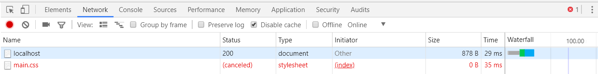

# Node基础笔记

## Node快速体验

### 1. Node介绍

#### 1.1. [Node.js](https://nodejs.org/en/)是什么

- `Node`  是一个基于` Chrome V8` 引擎的` JavaScript ` 运行环境。  
  - `Node`  不是一种独立的语言、
  - `Node`不是 `JavaScript ` 框架，
  - `Node`是一个**除了浏览器之外的、可以让` JavaScript ` 运行的环境**
- 特点:非阻塞IO模型/事件驱动/跨平台/单线程

#### 1.2. 为什么要学习 Node

- 企业需求
- 大前端必备技能
- 为了更好的学习前端框架

#### 1.3. Node 能做什么

- Web 服务器
- 命令行工具
- 网络爬虫:是一种按照一定的规则，自动地抓取网站信息的程序
- 桌面应用程序开发

#### 1.4. 一些资源

1. 文档

   [Node.js 官方文档](https://nodejs.org/en/docs/)
   [Node.js 中文文档（非官方）](http://nodejs.cn/)

2. 书籍

   [深入浅出 Node.js](https://read.douban.com/ebook/12053349/)
   [Node.js 权威指南](https://book.douban.com/subject/25892704/)
   [Node.js 实战](https://book.douban.com/subject/25870705/)
   [Node.js实战（第2季）](https://book.douban.com/subject/26642320/)

3. github资源

   [Node.js 包教不包会](https://github.com/alsotang/node-lessons)
   [ECMAScript 6 入门](http://es6.ruanyifeng.com/)
   [七天学会 NodeJS](https://github.com/nqdeng/7-days-nodejs)

4. 社区

   **[Node.js 中文社区](https://cnodejs.org/)** 

#### 1.5. Node 发展历史

[聊聊 Node.js 的历史](https://gitbook.cn/books/58e796fd09012f0a48761eae/index.html)
[来自朴灵大大的 -- Node.js 简史](https://cnodejs.org/topic/555d3d54e684c4c8088a0d78)


### 2. Node起步

#### 2.1. 安装Node

- 下载：https://nodejs.org/en/download/
- 历史版本：https://nodejs.org/en/download/releases/

>  对于已经装过的，重新安装就会升级
>
> 确认 Node 环境是否安装成功
>
> 打开命令行，输入 node --version
>
> 或者 node -v


#### 2.2. REPL环境(了解)

在命令行工具界面输入`node`  按回车 就进入到了`REPL` 环境

- read
- eval
- print
- loop

> 类似于浏览器中的 Console控制台 ，可以做一些代码测试。
>
> 按ctrl + 两次c 退出REPL环境
>
> 但是, 我们写代码肯定不是在控制台中写,而是写在一个单独的.js文件中.

#### 2.3. HelloWorld

1. 新建一个 `hello.js` 并写入以下示例代码

```js
var message = 'Hello World!'
console.log(message)
```

2.  打开命令行并定位到 `hello.js ` 文件所属目录

3.  在命令行中输入 `node hello.js ` 回车执行

``` bash
node hello.js
```

#### 2.4. Node中的js

**node中的js和浏览器中的js不同:**

- 浏览器中的js
  - ECMAScript
  - BOM
  - DOM
- node中的js
  - ECMAScript
  - 自己的API
  - **没有BOM和DOM**


## Node中的模块和包管理器npm

### 1. Node中的模块体验

#### 1.1. 文件读写

1. 文件读取：

```js
var fs = require('fs');
fs.readFile('/etc/passwd', (err, data) => {
  if (err) throw err;
  console.log(data);
});
```

2. 文件写入：

```js
var fs = require('fs')

fs.writeFile('message.txt', 'Hello Node.js', (err) => {
  if (err) throw err;
  console.log('The file has been saved!');
});
```

#### 1.2. HTTP 服务

``` js
// node把处理web服务器相关的功能 封装到了 http模块中

// 1. 导入http模块
var http = require('http');

// 2. 使用http这个模块中的createServer()创建一个服务器实例对象
var server = http.createServer();

// 3. 为这个服务器实例对象注册 request 请求处理函数
// 请求处理函数function(形参1,形参2){}
// 形参1:request请求对象 获取到当前请求的路径,方法等信息
// 形参2:response响应对象 发送响应数据
server.on('request', function(request, response) {
    console.log('服务端收到客户端的请求啦!!!');
    // 向客户端页面返回字符串
    response.write("hello node");
    // 结束响应
    response.end();
});

// 4. 绑定端口号,启动web服务器
server.listen(12345, function() {
    console.log(' 请访问http://localhost:12345');
});
```

> 注意: 
>
> 1. 注册request处理函数 有两个形参 request和response 不要搞混
> 2. 在写完服务器代码后 保存代码 ->在cmd中 `node 文件名` 然后回车执行
> 3. 每次修改代码后 要重新在cmd中 `node 文件名` 执行这个文件
> 4. !! 端口号尽量写的大一些 大于3000 否则容易和已经运行的软件所占用的接口相冲突!


### 2. Node中的模块系统

#### 2.1 什么是模块?

- 随着项目的推进、逻辑的复杂,不可能把所有js代码都写在一个文件中
- **一个js文件就是一个具有独立功能的模块**
- Node中按照模块去划分功能,有一套模块加载机制:
  - module.exports导出模块成员
  - require()导入模块成员

#### 2.2 导入模块(require方法)

- **作用:**加载并执行模块中的代码!!!!

- **使用**:`require()` 方法的()中可以写:

  ```js
  // 1. node自带的模块,如fs、http
  require('fs');
  // 2. 通过路径引入的自己的js文件
  require('./foo.js');
  ```

  > 注意事项

  1. `require()` 加载模块是**同步**加载!!

  2. 引入自己的js文件时,路径中的./或者../**不能省略**

  3. 如果省略,`require()` 会把它当成是一个node自带的模块

      报错信息不要害怕!!!一定要去看!!!

  4. 模块后缀`.js` **可以省略不写**


#### 2.3 导出模块

模块中定义的变量是**局部**的, 

那如何在A模块使用B模块中定义好的变量呢?

这个问题, 就涉及到了模块加载机制

1. ##### 导出模块中的变量

- 每个模块中都有一个 `module` 对象
- `module `对象中有一个` exports `对象
- 我们可以把需要导出的成员都挂载到` module.exports ` 对象上

`foo.js` 

```js
var a = 10;
var b = 20;
function add(){};

module.exports.a = a;
module.exports.b = b;
module.exports.add = add;

// 可以理解为在模块的末尾有这样一句代码: return module.exports;
// return module.exports;
```

`main.js` 

2. ##### 导入模块

```js
// 1 导入模块
var foo = require('./foo.js);
// 2 使用模块中的成员                  
console.log(foo.add);
console.log(foo.a);
```

> 注意 :导出模块中的成员有多种方法,我们这里先讲其中一种


#### 2.3. 模块分类及第三方模块(包)的使用

- 核心模块

  - 由 `Node` 本身提供，例如` fs` 、`http` 等
- 自定义(用户)模块

  - 自己写的.js文件，按照路径来加载，注意 `./` 或者 `../` 不能省略

- 第三方模块
  1. 在[npm网站](https://www.npmjs.com/)找包(模块) 
  2. 打开cmd, 使用命令 `npm install 包名` 安装包
  3. 在需要使用的位置, 通过`require('第三方包名') ` 加载包
  4. 看文档调用 API

> 这里 我们先体验npm的使用,之后会进行详细讲解


### 3. npm包管理器

#### 3.1. [npm](https://www.npmjs.com/) 是什么 

- npm 全称  `Node Package Manager`，它的诞生是为了解决 Node 中第三方包共享的问题。 和浏览器一样，由于都是 JavaScript，所以前端开发也使用 npm 作为第三方包管理工具。 例如大名鼎鼎的 jQuery、Bootstrap 等都可以通过 npm 来安装。 所以官方把 npm 定义为  `JavaScript Package Manager`。

- > yarn也是包管理器

#### 3.2 npm 命令行工具

- 只要你安装了 node 就已经安装了 npm,可以在cmd中进行npm的指令操作

  ```bash
  // 检验npm是否安装成功
  npm --version
  ```

- 常用命令

  ```cmd
  // 在项目中初始化一个 package.json 文件,凡是使用 npm 来管理的项目都会有这么一个文件
  // 只敲一次就可以!
  npm init   
  
  // 跳过向导，快速生成 package.json 文件,简写是npm init -y
  npm init --yes
  
  // 一次性安装 dependencies 中所有的依赖项,简写是 npm i
  npm install
  
  // 安装指定的包，可以简写为 npm i 包名
  // npm 5 以前只下载，不保存依赖信息，如果需要保存，则需要加上 --save 选项
  // npm 5 以后就可以省略 --save 选项了
  npm install 包名
  
  // 一次性安装多个指定包
  npm install 包名 包名 包名 ...
  
  // 安装指定版本的包!!!
  npm install jquery@版本号
  // 如果不指定版本号,默认安装最新稳定版本
  
  // 卸载指定的包
  npm uninstall 包名
  
  // 查看使用帮助
  npm help
  
  // 查看某个命令的使用帮助
  // 例如我忘记了 uninstall 命令的简写了，这个时候，可以输入 npm uninstall --help 来查看使用帮助
  npm 命令 --help
  ```

#### 3.3.  package.json

- 我们的项目会放到云端的仓库中，例如 github ，第三方包没有上传的意义，我们只需要把我们的源码放到云端仓库，`node_modules` 目录中存储的就是第三方包（不用担心丢失问题），如果没有 `package.json` 文件则你就找不回来了。

- 建议每一个项目都要有一个  `package.json`  文件（包描述文件，就像产品的说明书一样），给人踏实的感觉最重要的就是保存这个项目的第三方依赖信息（因为我们不需要提交第三方包到我们的云端仓库，只需要提交我们自己的代码），有了这个文件中的依赖信息结合  `npm install`  命令我们就可以放心了。

- 这个文件可以通过 `npm init` 的方式来自动初始化出来。

  ```cmd
  npm init
  ```

- 对于咱们目前来讲，最有用的是那个 `dependencies` 选项，可以用来帮我们保存第三方包的依赖信息。

- 如果你的 `node_modules` 删除了也不用担心，我们只需要：`npm install` 就会自动把 `package.json` 中的 `dependencies` 中所有的依赖项都下载回来。

- 建议每个项目的根目录下都有一个 `package.json` 文件

  - 不同的项目有不同依赖，各自保存各自的

- 执行 npm install 包名的的时候可以加上--save

  ```
  --save
  ```

  这个选项，目的是用来保存依赖项信息

  - npm 5 以前不会自动保存依赖信息到 package.json 文件中，必须手动加 `--save` 选项才可以
  - npm 5 以后不需要加 `--save` 选项了，因为它会自动保存依赖项

#### 3.4. package-lock.json

- npm 5 以前是不会有 `package-lock.json` 这个文件的。（被开发者诟病，吐槽的问题）。
- 当你安装包的时候，npm 都会生成或者更新 `package-lock.json` 这个文件。
- npm 5 以后的版本安装包不需要加 `--save` 参数，它会自动保存依赖信息
- 当你安装包的时候，会自动创建或者是更新 `package-lock.json` 这个文件
- `package-lock.json`  这个文件会保存  `node_modules`  中所有包的信息（版本、下载地址）
  - 这样的话重新 `npm install` 的时候速度就可以提升


## ES6

### 1.1. [ES6](http://es6.ruanyifeng.com)介绍

ES6 既是一个历史名词，也是一个泛指，含义是 5.1 版以后的 JavaScript 的下一代标准，涵盖了 ES2015、ES2016、ES2017 等等，而 ES2015 则是正式名称，特指该年发布的正式版本的语言标准。一般是指 ES2015 标准，但有时也是泛指“下一代 JavaScript 语言”。 

### 1.2. 基础语法

#### 1.2.1. 变量声明 const、let

`var` 

- 作用:声明变量
- 变量提升
- 全局作用域和函数级作用域
- 可以重复命名
- 无块级作用域

`let` 

- 作用:声明变量
- **块级作用域**
- 必须先声明后使用
- 在同一个块内不允许重复命名
- 没有变量提升

`const`

- 作用:声明**常量**
- **块级作用域**
- **声明的同时必须赋值** !!!!
- 声明的常量不能被重新赋值
- 必须先声明后使用
- 在同一个块内不允许重复命名


#### 1.2.2 解构赋值

> 解构: 从数组和对象中提取值，把值赋值给变量

1. 数组解构赋值
2. - 有顺序问题
   - 可以指定默认值
   - 被赋值的变量和数组中的元素个数可以不相等

2. 对象解构赋值
   - 无顺序问题
3. - 可以指定默认值
4. - 被赋值的变量和对象中的key-value个数可以不相等
5. - **有两种写法**
     - 被赋值的变量名和对象中的key名一致
     - 可以给被赋值的变量**起别名**, {key名:别名}={key:value}

```js
// 练习
const node = {
  loc: {
    start: {
      line: 1,
      column: 5
    }
  }
};

let { loc, loc: { start }, loc: { start: { line }} } = node;
// 输出 
line // 
loc  // 
start //
```


#### 1.2.3 模板字符串 

``` js
// 采用模板字符串的做法
// `${变量}`

var str2 = `
你好,我叫${person.name},
我今年${person.age}岁了,
我是${person.gender}生
`;
console.log(str2);
// 使用场景:如果需要拼接字符串或者换行了,那就用模板字符串
// 'abc';
// `abc`;
```

#### 1.2.4 函数扩展

1. 函数参数的默认值

   - 函数参数不能同名
   - 参数默认值不是传值,而是惰性求值
   - 函数参数默认是声明的,不能在函数体中再次声明

2. 函数参数默认值与解构赋值结合

3. rest参数

   ``` js
   // 写法:在函数参数位置 写: ...参数名
   
   // 注意: 与rest参数搭配使用的形参abc是一个数组
   
   // 作用: 将多余的参数放在数组中
   
   // 好处:如果使用了rest参数,那么就不需要使用arguments对象
   
   // 场景:利用rest参数就可以向函数传任意数量的参数啦!
   
   // 小细节: ...values后面不能再写其他参数!->rest参数要写在参数列表的末尾!
   ```

4. 箭头函数

   - ES6允许使用箭头 => 去定义函数

   - 基本用法

     ```js
     // 箭头函数基本用法
     // 之前的写法
     var f = function(a) {
         return a;
     };
     // 现在的写法
     // fNew是函数名
     // =>前面的a是形参名
     // => 后面的a是函数体
     var fNew = a => a;
     // console.log((fNew(10)));
     
     // 考虑函数参数和函数体的不同写法,箭头函数的写法就有了不同的组合
     // 1. 函数只有一个参数时,函数体只有一代码并且没有返回值时
     var fn1 = x => console.log(x);
     // fn1(20);
     // 2. 函数没有参数时,函数体只有一句代码并且有返回值
     var fn2 = () => { return 10; };
     // console.log(fn2());
     // 3. 函数有多个参数时,函数体只有一句代码并且有返回值
     var fn3 = (x, y) => { return x + y; };
     // console.log(fn3(10, 20));
     // 4. 函数体有多行代码时,函数只有一个参数时
     var fn4 = x => {
         var y = 10;
         return y + x;
     };
     console.log(fn4(20));
     
     // 注意:
     // 1. 参数只有一个时 ()省略不写
     // 2. 没有参数时 ()不能省略
     // 3. 多个参数时, ()不能省略
     // 4. 函数体只有一句代码时并且有返回时 {}不能省略
     // 5. 函数体有多行代码时,{}不能省略, 多行代码写在{}里面啊
     // 6. 函数体只有一句代码时,并且没返回值,{}可以省略
     // 建议: 所有的匿名函数 改成箭头函数的写法
     ```

### 箭头函数使用注意及this问题

```js
var per = {
    name: "TOM",
    sayHi: function() {
        console.log(this.name);
        // 1. 
        // setTimeout(function() {
        //     console.log(this.name);
        // }, 1000);
        // 2.
        // var _this = this;
        // setTimeout(function() {
        //     console.log(_this.name);
        // }, 1000);
        // 3.
        // setTimeout(function() {
        //     console.log(this.name);
        // }.bind(this), 1000);
        // 4.
        // setTimeout(() => {
        //     console.log(this.name);
        // }, 1000);
    }
}

per.sayHi();
```

> 注意事项:

1. 箭头函数中的this自动绑定外部环境的this
2. 箭头函数中没有自己的this
3. 箭头函数不能用于构造函数
4. 箭头函数中的没有arguments对象,可以用剩余参数...rest代替
5. 箭头函数通常用于匿名函数


## 导出模块成员

### 1> 导出多个成员：写法一

```
// 导出多个成员：写法一
module.exports.a = 123;
module.exports.b = 456;
module.exports.c = 789;
```

### 2> 导出多个成员：写法二

Node 为了降低开发人员的痛苦，所以为 `module.exports` 提供了一个别名 `exports` （下面写法等价于上面的写法）。

```
console.log(exports === module.exports) // => true
exports.a = 123;
exports.b = 456;
exports.c = 789;
console.log(exports);
// 但是最终导出的依然是module.exports!
```

### 3> 导出多个成员：写法三

```
// module.exports = {
//   d: 'hello',
//   e: 'world',
//   fn: function () {
//     // 
//     // 
//     // 
//     // 
//     // 
//     // 
//     // 
//     // 
//     // 
//     // 
//     // 
//     // 
//     // 
//     // 
//     // 
//     // 
//     // 
//     // 
//     // 
//     // 
//     // 
//     // 
//     // 
//     // 
//     // 
//     // 
//     // 
//     // 
//     // fs.readFile(function () {

//     // });
//   }
// }
```

### 4> 导出单个成员

```
// 导出单个成员：错误的写法
// 因为每个模块最终导出是 module.exports 而不是 exports 这个别名
// exports = function (x, y) {
//   return x + y;
// };


// 导出单个成员：必须这么写
module.exports = function (x, y) {
  return x + y;
};
```

> 注意：导出单个只能导出一次，下面的情况后者会覆盖前者：

```
module.exports = 'hello';

// 以这个为准，后者会覆盖前者
module.exports = function (x, y) {
  return x + y;
};
```

> 最终导出的依然是module.exports!!!!
>
> exports是对module.exports的引用
>
> require导入的是模块的module.exports

## Express

### 1. [Express](http://expressjs.com/)介绍

- 在 Node 中，有很多 Web 开发框架，我们这里以学习 `Express`为主。 
- 精简的、灵活的 Node.js Web 程序框架，为构建Web 程序提供了一系列健壮的功能特性 

### 2. 起步

#### 2.1. 安装

```bash
# 创建并切换到 code 目录
mkdir code
cd code

# 初始化 package.json 文件
npm init -y

# 安装 express 到项目中
npm i express
```

#### 2.2.  `Hello World`

```js
// 1. 加载 Express
const express = require('express');

// 2. 调用 express() 得到一个 app
//    类似于 http.createServer()
const app = express();

// 3. 设置请求对应的处理函数
//    当客户端以 GET 方法请求 / 的时候就会调用第二个参数：请求处理函数
app.get('/', (req, res) => {
  res.send('hello world')
});

// 4. 监听端口号，启动 Web 服务
app.listen(12345, () => console.log('app listening on port 12345!'));

```

#### 2.3.  发送页面字符串

我们可以发送"hello world",

那么也可以通过fs读取文件的方式,发送页面的字符串到客户端

```js
// 1. 加载模块
// 加载express
const express = require('express');
// 加载fs模块
const fs = require('fs');

// 2. 通过express() 得到app实例
const app = express();

// 3. 监听某个请求方式和请求标识的请求,实现对应的处理函数
// 请求处理函数中 (req,res)=>{}
app.get('/', (req, res) => {
    // res.send('hello---');
    // res.send('<h1>helloWorld</h1>');
    // 把标签写在字符串中,然后发送响应
    // res.send(`<h1>ABC</h1><p>XXX</p>`);
    // 考虑把标签放在一个html文件中,然后把文件中的数据发送响应
    // 利用fs模块读取index.html文件的内容
    fs.readFile('./index.html', (err, data) => {
        if (err) {
            console.log(err);
        }
        // console.log(data);
        // 把二进制数据转换成字符串
        // console.log(data.toString());
        // 发送响应
        res.send(data.toString());
    });
});

// 4. 绑定端口号,启动服务器
app.listen(12345, () => {
    console.log('please run it at localhost:12345');
});

```

> 注意:每次修改这个文件中的代码 都需要在cmd中重新启动这个文件!!


#### 2.4. 路由

- 路由（Routing）是由一个 URI（或者叫路径标识）和一个特定的 HTTP 方法（GET、POST 等）组成的，涉及到应用如何处理和响应客户端请求。
- 每一个路由都可以有一个或者多个处理器函数，当匹配到路由时，这些函数将被执行。

```js
// app 是 express 实例
// METHOD 是一个 HTTP 请求方法
// PATH 是服务端路径（定位标识）
// HANDLER 是当路由匹配到时需要执行的处理函数
app.METHOD(PATH, HANDLER);

// 演示路由功能

// 1. require()加载express包
const express = require('express');

// 2. 使用express()的实例app
// 相当于http模块中的 http.createServer();
const app = express();

// 3. 配置请求路径对应的请求处理函数
app.get('/', (req, res) => {
    res.send('/');
});
app.get('/one', (req, res) => {
    res.send('/one');

});
app.get('/two', (req, res) => {
    res.send('/two');
});
app.get('/three', (req, res) => {
    res.send('/three');
});

// 4. 绑定端口号,启动服务器
app.listen(12345, () => {
    console.log('please run it at localhost:12345');
});
```


## 留言板案例

### 案例说明和准备

- 效果演示
- 目的:
  - 练习express中的常用API
  - 熟悉ES6的新特性
  - 使用常用的第三方包,如mysql、express-art-template等
- 介绍:
  - 留言列表页面:显示留言内容、点击'留言'按钮,跳转到留言编辑页面
  - 留言编辑页面:留言表单、点击'提交'按钮,跳转回列表页面
  - 页面样式不作为重点,只实现功能即可
- 准备:案例使用express框架
  - 初始化package.json
  - 安装express
  - 准备好所需要的页面文件

### 列表页-服务端渲染列表页面

```
   	1. 提供假数据data
   	2. 配置渲染列表页的路由,实现对应处理函数
   	3. 使用模板引擎渲染列表页
 - 安装art-template
 - 配置art-template
 - 使用res.send();
```

`app.js` 

```js
const express = require('express');
const fs = require('fs');
const artTemplate = require('art-template');

var datas = {
    items: [
        { 'name': 'AAA', 'email': 'aaa@qq.com', 'content': '内容111' },
        { 'name': 'BBB', 'email': 'bbb@qq.com', 'content': '内容222' },
        { 'name': 'CCC', 'email': 'ccc@qq.com', 'content': '内容333' },
    ]
};

const app = express();

app.get('/', (req, res) => {
    // 1. 读取views中的index.html中的数据
    fs.readFile('./views/index.html', (err, data) => {
        if (err) {
            throw err;
        }
        // 2. 使用art-template渲染模板
        const str = artTemplate.render(data.toString(), { items: datas.items });
        // 3. 发送响应到客户端
        res.send(str);
    });
});

app.listen(12345, () => {
    console.log('run-----');
});
```

`index.html` 

```html
<body>
    <a href="/publishMessage">我要留言</a>
    <!-- <p>{{items}}</p> -->
    <ul>
        <!-- <li><span>谁说:</span><span>留言内容</span></li>
        <li><span>谁说:</span><span>留言内容</span></li>
        <li><span>谁说:</span><span>留言内容</span></li> -->
        {{each items}}
        <li><span>{{$value.name}}谁说:</span><span>{{$value.content}}</span></li>
        {{/each}}
    </ul>
</body>
```

`publish.html` 

```html
<body>
    <h1>编辑留言</h1>
    <form action="/publish" method="POST">
        <div>
            <label for="">您的大名</label>
            <input type="text" name="name">
        </div>
        <div>
            <label for="">您的邮箱</label>
            <input type="email" name="email">
        </div>
        <div>
            <label for="">留言内容</label>
            <textarea name="content" id="" cols="30" rows="10"></textarea>
        </div>
        <div>
            <button>点击提交</button>
        </div>
    </form>
</body>
```


### 编辑留言页-服务端渲染编辑页面

1. 监测请求标识/publishMessage.html  实现对应的处理函数
2. 使用模板引擎渲染编辑页面
   - 安装express-art-template包
   - 配置express-art-template包

`index.html` 

```html
<a href="/publishMessage">我要留言</a>
```

`publish.html` 

```html
<body>
    <h1>编辑留言</h1>
    <form action="/publish" method="POST">
        <div>
            <label for="">您的大名</label>
            <input type="text" name="name">
        </div>
        <div>
            <label for="">您的邮箱</label>
            <input type="email" name="email">
        </div>
        <div>
            <label for="">留言内容</label>
            <textarea name="content" id="" cols="30" rows="10"></textarea>
        </div>
        <div>
            <button>点击提交</button>
        </div>
    </form>
</body>
```

`app.js` 

```js
const express = require('express');
const fs = require('fs');

const app = express();
app.engine('html', require('express-art-template'));

var datas = {
    items: [
        { 'name': 'AAA', 'email': 'aaa@qq.com', 'content': '内容111' },
        { 'name': 'BBB', 'email': 'bbb@qq.com', 'content': '内容222' },
        { 'name': 'CCC', 'email': 'ccc@qq.com', 'content': '内容333' },
    ]
};

app.get('/', (req, res) => {
    // 1. 读取views中的index.html中的数据
    fs.readFile('./views/index.html', (err, data) => {
        if (err) {
            throw err;
        }
        // 2. 使用art-template渲染模板
        const str = artTemplate.render(data.toString(), { items: datas.items });
        // 3. 发送响应到客户端
        res.send(str);
    });
});

// app.get('/publishMessage', (req, res) => {
//     // 1. 读取views中的index.html中的数据
//     fs.readFile('./views/publish.html', (err, data) => {
//         if (err) {
//             throw err;
//         }
//         // 2. 使用art-template渲染模板
//         const str = artTemplate.render(data.toString(), { items: datas.items });
//         // 3. 发送响应到客户端
//         res.send(str);
//     });
// });
// 1. 2. 3. 三步很麻烦 可以使用更方便的插件将这三部简化为一步
app.get('/publishMessage', (req, res) => {
    res.render('publish.html', { items: datas.items });
});

app.listen(12345, () => {
    console.log('run-----');
});

```

### 编辑留言页-服务端处理表单

1. 找到要提交的表单 在publish.html中
2. 配置对应的请求标识、实现处理函数
3. 安装body-parser以获取req.body
4. 重定向到留言列表页

`app.js` 

```js
const express = require('express');
const fs = require('fs');
const bodyParser = require('body-parser')

const app = express();
app.engine('html', require('express-art-template'));
app.use(bodyParser.urlencoded({ extended: false }))

const datas = {
    items: [
        { 'name': 'AAA', 'email': 'aaa@qq.com', 'content': '内容111' },
        { 'name': 'BBB', 'email': 'bbb@qq.com', 'content': '内容222' },
        { 'name': 'CCC', 'email': 'ccc@qq.com', 'content': '内容333' },
    ]
};

app.get('/', (req, res) => {
    // 1. 读取views中的index.html中的数据
    fs.readFile('./views/index.html', (err, data) => {
        if (err) {
            throw err;
        }
        // 2. 使用art-template渲染模板
        const str = artTemplate.render(data.toString(), { items: datas.items });
        // 3. 发送响应到客户端
        res.send(str);
    });
});

// app.get('/publishMessage', (req, res) => {
//     // 1. 读取views中的index.html中的数据
//     fs.readFile('./views/publish.html', (err, data) => {
//         if (err) {
//             throw err;
//         }
//         // 2. 使用art-template渲染模板
//         const str = artTemplate.render(data.toString(), { items: datas.items });
//         // 3. 发送响应到客户端
//         res.send(str);
//     });
// });
// 1. 2. 3. 三步很麻烦 可以使用更方便的包将这三部简化为一步
app.get('/publishMessage', (req, res) => {
    res.render('publish.html', { items: datas.items });
});

app.post('/publish', (req, res) => {
    console.log(req.body);
    res.redirect('/');
});


app.listen(12345, () => {
    console.log('run-----');
});

```

### 数据持久化-抛出问题

> 将表单数据保存在datas中

`app.js` 

```js
const express = require('express');
const fs = require('fs');
const artTemplate = require('art-template');
var bodyParser = require('body-parser')

const app = express();
app.engine('html', require('express-art-template'));
app.use(bodyParser.urlencoded({ extended: false }))


const datas = {
    items: [
        { 'name': 'AAA', 'email': 'AAa@11.com', 'content': '内容111' },
        { 'name': 'AAA', 'email': 'AAa@11.com', 'content': '内容111' },
        { 'name': 'AAA', 'email': 'AAa@11.com', 'content': '内容111' },
    ]
};

app.get('/', (req, res) => {
    res.render('index.html', { items: datas.items });
});


app.get('/publishMessage', (req, res) => {
    res.render('publish.html');
});

app.post('/publish', (req, res) => {
    // console.log(req.body);
    // 1.  接收表单数据
    const body = req.body;
    // console.log(body);
    // 2. 将表单数据保存在datas中
    datas.items.unshift(body);
    // console.log(datas);
    // 3. 重定向到列表页
    res.redirect('/');
});

app.listen(12345, () => {
    console.log('run-----');
});
```

> 发现每次重启动服务器,datas中的数据都被重置->想到把数据写入到data.json中

### 数据持久化-data.json

`data.json` 

```json
{
    "items": [{
            "name": "BBB",
            "email": "bbb@163.com",
            "content": "asdasdasd"
        },
        {
            "name": "AAA",
            "email": "AAA@qq.com",
            "content": "adsadasdasd"
        }
    ]
}
```

`app.js` 

```js
const express = require('express');
const fs = require('fs');
const artTemplate = require('art-template');
var bodyParser = require('body-parser')

const app = express();
app.engine('html', require('express-art-template'));
app.use(bodyParser.urlencoded({ extended: false }))

app.get('/', (req, res) => {
    // 1. 读取data.json中的数据
    fs.readFile('./data.json', (err, data) => {
        if (err) {
            throw err;
        }
        // console.log(data.toString());
        data = JSON.parse(data.toString());
        // console.log(data.items);
        res.render('index.html', { items: data.items });
    })
});

app.get('/publishMessage', (req, res) => {
    res.render('publish.html');
});

app.post('/publish', (req, res) => {
    // console.log(req.body);
    // 1.  接收表单数据
    const body = req.body;

    // 2. 读取data.json中的数据 
    fs.readFile('./data.json', (err, data) => {
        if (err) {
            throw err;
        }
        data = JSON.parse(data.toString());
        // 2. 将表单数据保存在datas中
        data.items.unshift(body);
        // console.log(data);
        // console.log(JSON.stringify(data));
        fs.writeFile('./data.json', JSON.stringify(data), (err) => {

            // 3. 重定向到列表页
            res.redirect('/');
        });
    });
});

app.listen(12345, () => {
    console.log('run-----');
});
```

### 统一处理静态资源

> 接下来,我们要给页面添加css样式:新建public文件夹, 里面存放资源文件,如css文件、图片素材等
>
> 然后在index.html中通过link引入 css文件, 发现加载不到, 浏览器控制台报错
>
> 如何解决这个问题呢?  任何请求都要通过配置路由的方式去处理

`index.html` 

```html
<!-- link的href会发送请求 -->
<link rel="stylesheet" href="../public/main.css">
```

`报错` 



`app.js`

```js
// 处理public下的资源请求
app.get('/public/main.css', (req, res) => {
    fs.readFile('./public/main.css', (err, data) => {
        if (err) {
            throw err;
        }
        res.send(data.toString());
    });
});
```

> 然后在浏览器中通过请求localhost:12345/public/main.css发现可以获取到main.css中的样式代码
>
> 但是每个静态资源都写路由会很麻烦, 所以, 可以使用express.static()统一处理静态资源

`index.html` 

```html
<!-- 使用第三方包中的资源 -->
<script src="/node_modules/jquery/dist/jquery.min.js"></script>

```

`app.js` 

```js
// 开放 public 目录资源，访问路径不能带有 /public 前缀
// app.use(express.static('./public/'));

// 开放 public 目录资源，限定以 /a 开头前缀
// app.use('/a', express.static('./public/'));

// 开放 public 目录资源，限定以 /public 开头前缀
app.use('/public', express.static('./public/'));
// 不要这么干，危险
// app.use(express.static('./'));

// 开放项目中要使用的第三方包
app.use('/node_modules', express.static('./node_modules/'));
```


### 提取路由模块

> 项目中每个文件是各司其职的,app.js作为程序入口, 我们目前的app.js里面做的事儿

1. 导包
2. 配置包
3. 配置路由+实现对应的处理函数callback
4. 绑定端口

> 其中第三步的事儿不应该由程序入口来做,而是由专门的"路由模块"去做, 所以,接下来要提取router.js模块

`新建router.js` 

1. 导入express
2. 调用express.Router()得到一个路由实例router
3. 为router对象添加处理函数
4. 导出路由对象

```js
// 1. 导入express
const express = require('express');
const fs = require('fs');

// 2. 使用express.Router()得到router对象
const router = express.Router();

// 3. 配置路由, 实现对应处理函数
router.get('/', (req, res) => {
    fs.readFile('./data.json', (err, data) => {
        if (err) {
            throw err;
        }
        res.render('index.html', { items: JSON.parse(data.toString()).items });
    });
});

router.get('/publishMsg', (req, res) => {

    res.render('publish.html');
});

router.post('/publish', (req, res) => {
    var body = req.body;
    fs.readFile('./data.json', (err, data) => {
        if (err) {
            throw err;
        }
        data = JSON.parse(data.toString());
        data.items.unshift(body);
        fs.writeFile('./data.json', JSON.stringify(data), (err) => {
            if (err) {
                throw err;
            }
            res.redirect('/');
        });
    });
});
// 4. 导出路由对象
module.exports = router;
```


`app.js` 

1. 导入express、导入路由模块
2. 配置包
3. 挂载路由app.use(router);
4. 绑定端口

```js
// 1. 导包
const express = require('express');
const bodyParser = require('body-Parser');
const router = require('./router01');

const app = express();
// 2. 配置包
app.engine('html', require('express-art-template'));
app.use(bodyParser.urlencoded({ extended: false }));
// 统一处理静态资源
// 开放 public 目录资源，限定以 /public 开头前缀
app.use('/public', express.static('./public/'));
// 开放项目中药使用的第三方包
app.use('/node_modules', express.static('./node_modules/'));

// 3. 挂载路由(注意位置:写在绑定端口的前面)
app.use(router);


// 4. 绑定端口
app.listen(12345, () => {
    console.log('run---');
});
```

> app.js程序入口文件
>
> router.js路由模块
>
> 每个文件 各司其职!


### 提取处理函数模块

> router.js已经提取完毕, 但是路由中也有不属于路由应该做的事儿,就是实现处理函数
>
> 所以, 接下来, 将实现处理函数提取到单独的一个模块中
>
> 新建handle.js

`router.js` 

```js
// 路由模块
// 功能: 就是处理请求

// 1. 导入express
const express = require('express');
// 导入处理函数模块
const handle = require('./handle');

// 2. 使用express.Router()返回的路由对象
const router = express.Router();


// 3. 配置路由:根据不同的请求找到对应的处理函数

router.get('/', handle.showIndex)
    // 渲染发布页
    .get('/publishMsg', handle.showPublish)
    // 处理发布的表单
    .post('/publish', handle.handlePublish);


// 4. 导出路由
module.exports = router;

// 下面的步骤在app.js中做
// 1. 导入router01.js模块
// 2. 让app挂载路由app.use(router);
```

`app.js`

```js
const fs = require('fs');

exports.showIndex = (req, res) => {
    fs.readFile('./data.json', (err, data) => {
        if (err) {
            throw err;
        }
        res.render('index.html', { items: JSON.parse(data.toString()).items });
    });
};

exports.showPublish = (req, res) => {
    res.render('publish.html');
};

exports.handlePublish = (req, res) => {
    var body = req.body;
    fs.readFile('./data.json', (err, data) => {
        if (err) {
            throw err;
        }
        data = JSON.parse(data.toString());
        data.items.unshift(body);
        fs.writeFile('./data.json', JSON.stringify(data), (err) => {
            if (err) {
                throw err;
            }
            res.redirect('/');
        });
    });
};
```

> 这样 路由模块做的事儿就是处理分发,找到对应的处理函数
>
> 具体的处理函数的实现交给 单独的handle.js模块去处理
>
> 每个文件,各司其职

### 在Node中使用mysql

#### 1. 体验mysql包

 用[mysql](https://github.com/mysqljs/mysql)包操作数据库来实现数据持久化

 前提: 已经安装完Navicat客户端

1. 安装mysql包: cmd中 npm i mysql

2. 配置+使用mysql包: 

   ```js
   // 1. 导包
   var mysql = require('mysql');
   // 2. 配置mysql
   var connection = mysql.createConnection({
       host: 'localhost', // 要连接的主机名
       user: 'root', // 要连接的数据库的用户名
       password: '123456', // 数据库密码
       database: 'sqldemo' // 数据库
   });
   
   // 3. 开启连接
   connection.connect();
   
   // 4. 执行增删改查语句
   connection.query('SELECT *FROM posts', function(error, results, fields) {
       if (error) throw error;
       console.log(results);
   
   });
   // 5. 关闭连接
   connection.end();
   ```

   

#### 2. 增删改查

`mysqlpractice` 

```js
// 1. 导包
var mysql = require('mysql');
// 2. 配置mysql
var connection = mysql.createConnection({
    host: 'localhost', // 要连接的主机名
    user: 'root', // 要连接的数据库的用户名
    password: '123456', // 数据库密码
    database: 'sqldemo' // 数据库
});

// 3. 开启连接
connection.connect();

// 4. 执行增删改查语句

// 条件查询
// const name = 'abc';
// const mail = '444@.com'
//     // const sqlstr = 'SELECT *FROM posts WHERE name="' + name + '"';
//     // const sqlstr = 'SELECT *FROM posts WHERE name=?';
// const sqlstr = 'SELECT *FROM posts WHERE name=? OR mail=?';

// connection.query(sqlstr, [name, mail], (err, results) => {
//     if (err) {
//         throw err;
//     }
//     console.log(results);
// });

// 插入数据
// const post = {
//     name: 'XXXXXX',
//     content: 'lalalalalalala',
//     mail: 'XXXXX@qq.com',
//     date: '2018-7-10 00:10:00'
// };
// const sqlstr = 'INSERT INTO `posts` VALUES (NULL,?,?,?,?)';
// connection.query(sqlstr, post, (err, results) => {
//     if (err) {
//         throw err;
//     }
//     console.log(results);
// });

// 修改数据
// const mail = 'ooooo@oo.com';
// const name = 'abc';

// const sqlstr = 'UPDATE posts SET mail=? WHERE name=?';
// connection.query(sqlstr, [mail, name], (err, results) => {
//     if (err) {
//         throw err;
//     }
//     console.log(results);
// });

// 删除数据
// const id = 100;
// const sqlstr = 'DELETE FROM posts WHERE id = ?';
// connection.query(sqlstr, [id], (err, results) => {
//     if (err) {
//         throw err;
//     }
//     console.log(results);
// });
// 5. 关闭连接
connection.end();
```

> ?代表占位 是mysql包的给我们提供的语法


### 数据持久化-mysql

> 将使用fs的位置改成mysql的写法

`handlemysql.js` 

```js
const fs = require('fs');
const mysql = require('mysql');

var connection = mysql.createConnection({
    host: 'localhost', // 要连接的主机名
    user: 'root', // 要连接的数据库的用户名
    password: '123456', // 数据库密码
    database: 'sqldemo' // 数据库
});
connection.connect();

exports.showIndex = (req, res) => {
    const sqlstr = 'SELECT *FROM posts ORDER BY id DESC';
    connection.query(sqlstr, (err, results) => {
        if (err) {
            throw err;
        }
        res.render('index.html', { items: results });
    });
};

exports.showPublish = (req, res) => {
    res.render('publish.html');
};

exports.handlePublish = (req, res) => {
    const body = req.body;
    body.date = "2018-7-24 00:10:00";
    const sqlstr = 'INSERT INTO posts VALUES (NULL,?,?,?,?)';
    connection.query(sqlstr, [
        body.name,
        body.content,
        body.email,
        body.date
    ], (err, results) => {
        if (err) {
            throw err;
        }
        res.redirect('/');
    });
};
```

## 全局命令行工具

### 1. nodemon工具

- 一个自动重启项目的工具

- 全局安装nodemon

  ```cmd
  npm i -g nodemon
  ```

- 使用nodemon代替node指令去执行文件

  > 安装全局命令行工具在任何目录执行都可以
  >
  > 全局命令行工具安装一次就可以了，以后需要用的时候直接使用命令


### 2. [less](http://lesscss.org/)工具

- 全局安装less

  ```cmd
  npm i -g less
  ```

- 使用lessc指令编译less文件

  ```cmd
  lessc .\style.less style.css
  ```

  

### 3. [http-server](https://github.com/indexzero/http-server)

- http-server是一个基于Node.js的简单零配置命令行HTTP服务器. 如果你不想重复的写Node.js的web-server.js, 则可以使用这个.   

- 安装http-server

  ```cmd
   npm install http-server -g
  ```

- 使用http-server快速创建一个服务器

  ```cmd
  // 把当前执行指令的目录当成www目录
  //注意: 如果有public文件夹, 会把public当成www目录
  http-server
  // 自动打开
  http-server -o
  ```

> 全局命令行工具安装目录

```cmd
npm root -g
```


### 4. [npm-script](http://www.ruanyifeng.com/blog/2016/10/npm_scripts.html)

在package.json中的script里增加

```js
{
    "script":{
    	"build":"node app.js"
    }
}
```

`在cmd中` 

```cmd
npm run bulid
// 相当于执行了node app.js
```

> 目的: 简化指令操作 把很长的指令简化成npm run 一个单词

### 5. 全局包的安装目录

```cmd
npm root -g
```


## 服务端重定向

> **客户端发请求 -**> 服务端路由配置->服务端重定向(发送响应到客户端(location: 标识/x)) ->客户端接收到响应->去响应头中找location对应的标识/x -> **自动的发送/x请求**->服务端的路由配置->callback

> 注意: 302是默认的状态码 -> 可以改成301 

## 留言板案例文件组成

> 见.xmind文件 

## 回调函数

### 1. 回调函数使用场景

> 异步函数的使用场景

`准备代码` 

```js
function add(x, y) {
    return x + y;
};

var result = add(1, 2);
console.log(result);
```

1. 需求:获取add函数内部的setTimeout中的结果

```js
// 抛出问题
// function add(x, y) {
//     setTimeout(function() {
//         // x+y;
//     }, 1000);
//     return x + y;
// };
// 需求:在外部调用add方法 获取定时器中的x+y的结果
// var result = add(1, 2);
// console.log(result);

// 思路一
// function add(x, y) {
//     console.log(1);
//     // 定时器是异步的:不会等待
//     setTimeout(function() {
//         console.log(2);
//         return x + y;
//     }, 1000);
//     // 马上执行这里
//     console.log(3);
// };
// // 需求:在外部调用add方法 获取定时器中的x+y的结果
// var result = add(1, 2);
// console.log(result);

// 思路二
// function add(x, y) {
//     let ret = 100;
//     setTimeout(function() {
//         ret = x + y;
//     }, 1000);
//     return ret;
// };
// var result = add(1, 2);
// console.log(result);

// 问题: 如何在函数外部获取函数内部异步操作的结果
// 解决方案: 使用回调函数
// function callback(ret) {
//     console.log(`callback被调用了,结果是${ret}`, );
// };

// function add(x, y) {
//     setTimeout(function() {
//         let ret = x + y;
//         // 执行到这里 调用callback 传递执行结果
//         callback(ret);
//     });
// };
// add(1, 2);

// 很麻烦 其实不用另外写一个callback函数
// function add(x, y, callback) {
//     setTimeout(function() {
//         let ret = x + y;
//         // 异步操作结束后,通过调用一个函数把结果传递出去
//         callback(ret);
//     });
// };
// // 在调用add函数的同时, 定义了一个匿名函数并传递给add函数
// add(1, 2, function(result) {
//     console.log(result);
// });
```

### 2. 回调函数应用-封装ajax

```js
 <script>
        // var xhr = new XMLHttpRequest();
        // xhr.onload = function() {
        //     console.log(this.responseText);
        // };
        // xhr.open('get', 'package.json', true);
        // xhr.send();

        // function getData() {
        //     var xhr = new XMLHttpRequest();
        //     xhr.onload = function() {
        //         console.log(this.responseText);
        //     };
        //     xhr.open('get', 'package.json', true);
        //     xhr.send();
        // }

        // getData();

        // 调用get方法得到onload内部的responseText
        function get(url, callback) {
            var xhr = new XMLHttpRequest();
            xhr.onload = function() {
                callback(this.responseText);
            };
            xhr.open('get', url, true);
            xhr.send();
        };
        get('package.json', function(data) {
            console.log(data);
        });
        
// 常见的异步操作: ajax 定时器 数据库操作
    </script>
```
# 简单的问答社区-项目笔记

## 1. 项目目标

> 目标：应用node基础知识、介绍开发环境、熟悉项目开发流程

### 1.1 开发环境

1. 平台：[Node.js](https://nodejs.org/zh-cn/) + [Express](http://expressjs.com/zh-cn/)
2. 数据库：`MySQL`

### 1.2 项目演示 & 开发规划

 

## 2. 项目准备

> 目标：项目环境准备，安装 `Express` 并将代码提交至 `Github` 代码仓库。

### 2.1 安装 [Express](http://expressjs.com/zh-cn/)

1. 新建 `news` 目录作为项目文件夹；

2. 在终端中输入以下命令，安装 `express`：

   ```bash
   # 初始化生成一个新的 `package.json` 文件
   npm init -y
   
   # 安装 Express
   npm i express
   ```

### 2.2 [Github](https://github.com/) 代码仓库

1. 在 `Github` 上新建 `news` 项目；

2. 在终端中输入以下命令，初始化本地代码仓库：

   ```bash
   # 初始化本地代码仓库
   git init
   ```

3. 用 `vscode` 打开 `news` 文件夹，并新建 `.gitignore` 文件，在文件中输入以下内容：

   ```ini
   node_modules/
   ```

   > 提示：`.gitignores` 文件中记录的**文件**或**文件夹**不会被添加到代码仓库。

4. 在终端中依次输入以下命令，将现有文件提交到本地代码仓库并推送到远程：

   ```bash
   # 查看代码仓库状态，确保 `.gitignore` 已经生效
   git status
   
   # 将项目文件夹下的其他文件添加到暂存区
   git add .
   
   # 提交到本地代码仓库
   git commit -m '初始化项目，安装 express'
   
   # 在代码托管平台 如github 去新建仓库
   
   # 添加远程代码仓库，注意将 XXX 修改为自己的 Github 用户名
   git remote add origin git@github.com:XXX/news.git
   
   # 将本地代码仓库推送到远程仓库，提示：只有在第一次需要使用 `-u origin master`
   # 今后在推送代码直接使用 `git push` 即可
   git push -u origin master
   ```

> 之后 使用git时 
>
>  git status 
>
> git add  .
>
> git commit -m '注释'
>
> 当天任务完成后 git push


## 3. 入口、路由和控制器（理解）

**说明**：本小结将基于 `Nodejs` 基础阶段的课程，用**逐步推导**的方式，介绍项目的基础结构。

> 目标：知道在程序开发中，需要使用多个 `js` 文件，每个文件**各司其职**。

### 3.1 入口：单一 app.js 服务

> 目标：复习单一 `app.js` 服务的代码结构，并思考能否将所有的代码都写在这一个 `app.js` 文件中？

- 结构示意图如下：

  

- `app.js` 代码如下：

  ```js
  // 1. 导包
  var express = require('express');
  
  // 2. 使用 express 实例化 app 对象
  var app = express();
  
  // 3. 让 app 监听请求
  app.get('/', (req, res) => {
      res.send('单一 app.js 返回的数据');
  });
  
  // 4. 监听端口启动服务器
  app.listen(12345, () => {
      console.log('start at http://127.0.0.1/12345');
  });
  ```

**思考**：能否将**所有的代码**都写在这一个 `app.js` 文件中？

**答案**：不能，对于复杂功能的项目而言，通常**可以支持很多个请求**，例如：用户登录、用户注册、话题列表等。如果将代码都写在 `app.js` 一个文件中，`app.js` 中的代码会非常多，不好维护！

**解决**：引入 `router.js`（路由）分担用户请求。

### 3.2 路由：分担用户请求

> 目标：增加 `router.js`，用于分担用户请求，避免 `app.js` 中的代码随着请求的增加，变得越来越庞大。

- 结构示意图如下：

  

- `router.js` 代码如下：   

  ```js
  // 1. 导入 express
  var express = require('express');
  
  // 2. 使用 express.Router 实例化 Router 对象
  var router = express.Router();
  
  // 3. 让 router 监听请求
  router.get('/', (req, res) => {
      res.send('路由返回的数据');
  });
  
  // 4. 导出路由对象
  module.exports = router;
  ```

- `app.js` 代码如下：

  ```js
  // 1. 导包
  var express = require('express');   // express
  var router = require('./router');   // 路由模块
  
  // 2. 使用 express 实例化 app 对象
  var app = express();
  
  // 3. 挂载路由 - 让 app 使用路由
  app.use(router);
  
  // 4. 监听端口启动服务器
  app.listen(12345, () => {
      console.log('start at http://127.0.0.1/12345');
  });
  ```

**思考**：如果将**所有用户请求的处理代码**都写在这一个 `router.js` 文件中会怎样？

**答案**：如果项目**支持很多个请求**，同时**每个请求的处理代码又很多**。将代码都写在 `router.js` 文件中，代码会非常多，不好维护！

**解决**：引入**控制器 js** 根据**不同类别的用户请求**，提供不同的处理控制。

### 3.3 控制器：分类处理用户请求

> 目标：增加 `controllers/user.js`，用于处理用户登录、注册相关的请求。

- 结构示意图如下：

  

- `controller/user.js` 代码如下：

  ```js
  // 1. 导出显示用户登录处理函数
  exports.showSignin = (req, res) => {
      res.send('显示用户登录页面处理函数');
  };
  ```

- `router.js` 代码如下：

  ```js
  // 1. 导包
  var express = require('express');           // express
  var user = require('./controllers/user');   // 用户模块
  
  // 2. 使用 express.Router 实例化 Router 对象
  var router = express.Router();
  
  // 3. 让 router 监听请求
  router.get('/', user.showSignin);
  
  // 4. 导出路由对象
  module.exports = router;
  ```

### 3.4 入口、路由和控制器的职责

> 目标：体会**各司其职**

1. `app.js` —— **程序入口**
   - 导包
   - 实例化 `app` 对象
   - 挂载路由
   - 让 `app` 监听端口并启动服务器
2. `router.js` —— **处理路由**
   - 导包
   - 实例化 `router` 对象
   - 让 `router` 监听请求 —— **不同的请求，调用控制器中不同的函数**
   - 导出 `router` 对象，供 `app.js` 挂载
3. `控制器.js` —— **分类处理用户请求**
   - 不同控制器中**提供并导出**不同类别的**业务处理函数**

#### Node 项目基本开发套路

1. `app.js` 是程序的入口，**代码相对固定**；
2. `router.js` 专门处理路由，根据用户不同的请求，调用控制器中不同的函数；
3. `控制器js` 负责实现具体的**业务处理**，每一个 `js` 文件，提供对应类别的相关处理函数。

> Node 项目的开发套路基本都是固定的。


------


## 4 功能实现

### 登陆功能

#### 1 首先要有一个登陆页

##### 1.1 实现步骤

- 引入登陆视图的资源素材

  - **新建views文件夹 :** 将UI提供的文件中的.html放在views中
  - **新建public文件夹:** 将UI提供的文件中.html所需css和img放在public下

  **目的:** 每个文件各司其职

- 配置路由、监测请求标识/signin

- 控制器实现处理函数showSignin

  - 渲染视图
    - 在app.js中统一处理静态资源
    - 安装art-template express-art-template
    - 安装jquery bootstrap@3.3.7
    - 在app.js中配置模板引擎express-art-template
    - 在控制器的showSignin中 res.render("signin.html")

##### 1.2 代码演示

`app.js`

```js
// 统一处理静态资源
app.use("/public", express.static("./public"));
app.use("/node_modules", express.static("./node_modules"));
// 配置模板引擎包
app.engine('html', require('express-art-template'));
```

`router.js`

```js
// 导入用户控制器
var user = require("./controllers/user");
// 渲染登陆页signin
router.get("/signin", user.showSignin);
```

`controllers/user.js`

```js
exports.showSignin = (req, res) => {
    // 渲染视图 
    res.render("signin.html");
};
```

#### **2 客户端发送登陆的表单**

##### 2.1 实现步骤

- 找到登陆视图中的表单
- 取消默认提交事件
- 获取表单数据
- 发送ajax请求

##### 2.2 代码演示

`views/signin.html`

```js
   <script>
        // 客户端处理表单提交
        $("#signin_form").on("submit", function(e) {
            // 取消默认事件
            e.preventDefault();
            // 获取表单中的数据
            var formdata = $(this).serialize();
            console.log(formdata);
            // 发送ajax
       	// $.ajax({})
            $.post("/signin", formdata, (function(data) {
                console.log(data);
            }));
        });
    </script>
```

#### **3 服务端处理表单数据**

##### 3.1 实现步骤

- 在router.js中 接收请求方式为post、请求标识为/signin的请求
- 获取到表单中的数据 post->req.body
  - 安装body-parser包
  - 在app.js中导入并配置body-parser包
  - 在控制器user.js的handleSignin中使用req.body获取表单数据
- 校验表单(先验证邮箱,再验证密码)
  - 使用navicat执行newssql.sql文件
  - 使用[mysql](https://github.com/mysqljs/mysql)包: 安装->配置->写sql语句
- 如果验证通过, 返回响应

##### 3.2 代码演示

`app.js` 

```js
// 配置body-parser包
app.use(bodyParser.urlencoded({ extended: false }));
```

`user.js` 

```js
var mysql = require('mysql');
var connection = mysql.createConnection({
    host: 'localhost',
    user: 'root',
    password: '123456',
    database: 'newssql'
});
connection.connect();
// 实现处理登录表单的方法
exports.handleSignin = (req, res) => {
    // req.body获取表单数据
    var body = req.body;
    console.log(body);
    // 玩数据库了
    // 1 先验证邮箱
    var sqlStr = "SELECT *FROM `users` WHERE `email`=?";
    connection.query(sqlStr, body.email, (err, results) => {
        if (err) {
            return res.send({
                code: 500,
                message: err.message
            });
        }
        // console.log(results);
        // 如果邮箱不存在
        if (!results[0]) {
            return res.send({
                code: 1,
                message: "邮箱不存在"
            });
        }
        // 如果邮箱存在
        // 2 如果邮箱验证通过, 再验证这个邮箱对应的密码
        if (results[0].password != body.password) {
            return res.send({
                code: 2,
                message: "密码不对"
            });
        }
        // 3 如果都验证通过 res.send("");
        res.send({
            code: 200,
            message: "邮箱和密码都正确,可以登陆了"
        });
    });
};
```

#### **4 客户端处理服务端返回的对应响应**

##### 4.1 实现步骤

- 根据服务端返回的不同响应做不同的处理
  1. code==500 服务器错误
  2. code==1      邮箱错误
  3. code==2      密码错误
  4. code==200  登陆成功 跳转到话题列表页 客户端重定向

##### 4.2 代码演示

```js
      // 发送ajax
            $.post("/signin", formdata, function(data) {
                // console.log(data);
                switch (data.code) {
                    case 500:
                        alert(data.message);
                        break;
                    case 1:
                        alert(data.message);
                        break;
                    case 2:
                        alert(data.message);
                        break;
                    case 200:
                        // 跳转到话题列表页
                        window.location.href = "/";
                        break;
                    default:
                        break;
                }
            });
```

### session存储用户登陆信息

利用session保存用户的登陆状态,目的是可以在任意**不同**页面去使用用户的登陆信息

在使用express框架开发时,可以使用[express-session](https://github.com/expressjs/session) 包去实现session存储功能

##### 1.1. 实现步骤

1. 安装express-session
2. 在app.js中配置express-session
3. 在登陆成功之前 向session中保存正确的用户登陆信息
4. 使用req.session访问session中的信息

##### 1.2 代码演示

`安装express-session` 

```shell
npm i express-session
```

`app.js` 

```js
var session = require("express-session");
app.use(session({
    secret: 'keyboard cat',
  	resave: false,
  	saveUninitialized: true
}));
```

`user.js` 

```js
// 在验证密码正确之后
// 使用req.session.user向session添加要存储的数据
req.session.user = results[0];
// 在返回验证通过的响应之前
```

### 提取db_config模块

目的:将不属于user.js控制器的事儿提取出来放在单独的模块中

##### 1.1 实现步骤

1. 新建tools文件夹 在这个文件夹里新建db_config.js
2. 将user.js控制器中的数据库配置的代码放在db_config.js中 并且在db_config中导出connection
3. 在user.js控制器中导入db_config.js模块并使用
4. 测试效果

##### 1.2 代码演示

`user.js` 

```js
var connection = require("../tools/db_config");
```

`tools/db_config.js` 

```js
var mysql = require('mysql');
var connection = mysql.createConnection({
    host: 'localhost',
    user: 'root',
    password: '123456',
    database: 'ithub'
});
module.exports = connection;
```

### 提取m_user.js模块

项目中的每个文件都是各司其职的!!! 刚才我们提取了控制器user.js的一部分代码

但是还不够! !! 

##### 1.1 实现步骤

1. 新建models文件夹,在这个文件夹中新建m_user.js文件

   **m_user.js是专门处理控制器c_user.js中的数据库操作的文件**

2. 将c_user.js中handleSignin方法实现中的数据库操作部分抽取到m_user.js中:

   验证邮箱-->对应m_user.js中的checkEmail()方法

3. 在m_user.js中导入db_config模块

4. 实现m_user.js中的方法(sql语句啊 查找数据库)

5. 在控制器c_user.js中导入m_user.js模块,命名为M_user

6. 在控制器c_user.js中使用checkEmail()的方法

##### 1.2 代码演示

`models/m_user.js`

```js
// m_user.js是专门处理控制器user.js中的数据库操作的文件
// 导入数据库配置的模块
var db = require('../tools/db_config');
// 验证邮箱是否存在的数据库操作
function checkEmail(email, callback) {
    var sqlStr = "SELECT * FROM `users` WHERE `email`=?";
    db.query(sqlStr, email,
        function(error, results) {
            if (error) {
                return callback(error, null)
            }
            callback(null, results)
        });
};
// 导出函数
exports.checkEmail = checkEmail;
```

`controllers/c_user.js`

```js
exports.handleSignin = (req, res) => {
    var body = req.body;
    // 验证->   就是要 models模型操作MySQL数据库 的  结果!
    User.checkEmail(body.email, (err, results) => {
        if (err) {
            return res.send({
                code:500,
                message:err.message
            });
        }
        if (!results[0]) {
            return res.send({
                code: 1,
                message: "用户不存在!!!"
            });
        }
        // 验证results里面查到的这个邮箱对应的密码是否正确
        if (results[0].password != body.password) {
            return res.send({
                code: 2,
                message: "密码不正确 你再改改"
            });
        }

        // 在验证邮箱和密码没问题之后, 把没问题的用户信息保存在session中
        // 将要就可以在其他任意一个页面中使用session中的user对象
        req.session.user = results[0];
        // console.log(req.session);

        // 通过验证, 可以告诉客户端,你可以登陆了
        res.send({
            code: 200,
            message: "邮箱和密码都正确, 你可以登录了"
        });
    });
}
```

> 注意:这里使用了**函数回调**,
>
> 原因是: **我们要在checkEmail()函数的外部使用这个函数内部异步操作的结果**
>
> 明确: 控制器就是要数据库操作的结果,至于如何获取,控制器并不关心
>
>  数据库操作的事儿 完全交给model去做 , 这样, 可以达到各司其职!

### MVC设计模式

MVC就是前人总结的一种写代码的套路/方式:

**M**-Model-模型-专门处理**数据库操作** 

**V**-View-视图-专门**处理视图** 

**C**-Controller-控制器-**宏观调度**,要视图,就去找View. 要数据,就去找Model

按照这种套路,我们写代码时,就知道代码应该写在哪个文件中,利于维护,**各司其职**

> 核心代码 res.render(V,M);

在C中通过 res.render("xx.html",data) 方法将M中返回的数据data绑定给xx.html视图

最后在浏览器中呈现这样一个"携带着数据的视图"

> 我们再实现后续的其他功能时,都按照这种套路去写代码!


------


### 渲染话题列表

> 登陆成功后,要来到话题列表页

#### 1.1 实现步骤

1. 导入UI提供的话题列表页的素材,放在views中
2. 路由模块:配置路由 /
3. 新建c_topic.js控制器:实现对应处理函数
4. 新建模型m_topic.js 查询topics表中的数据
5. 在控制器中使用m_topic模型,目的是使用数据库操作的结果
6. 在控制器的处理函数中渲染视图,给视图绑定数据 res.render(V,M)

#### 1.2 代码演示

`router.js` 

```js
    // 处理渲染话题列表的请求
    .get("/", topic.showIndex)
```

`controllers/c_topic` 

```js
// 话题的控制器:所有话题相关的业务 写在这个控制器中

// 1 导入话题模型m_topic
var M_topic = require("../models/m_topic");

// 渲染话题列表页
exports.showIndex = (req, res) => {

    // 2 使用话题模型
    M_topic.findAllTopics((err, results) => {
        // 3 处理数据库操作返回的结果
        if (err) {
            return res.send({
                code: 500,
                message: err.message
            });
        }
        console.log(results);

        // 4 把数据绑定给视图,同时渲染视图
        res.render("index.html", {
            topics: results
        });
    });
};
```

`models/m_topic.js` 

```js
// 话题模型: 专门处理话题表的数据库操作

// 1 导入数据库配置文件
var connection = require("../tools/db_config");

// 查询topics表中的所有数据
function findAllTopics(callback) {
    // 2 使用数据库连接对象
    var sqlStr = "SELECT *FROM `topics`";
    connection.query(sqlStr, (err, results) => {
        if (err) {
            return callback(err);
        }
        callback(null, results);
    });
};

// 3 导出相应的函数
exports.checkAllTopics = checkAllTopics;
```

`views/index.html`

```html
 {{ each topics}}
  <li class="media">
  </li>
 {{/each}}
```


### 登陆/注册按钮的显示和隐藏

> 如果用户登陆了,就隐藏登陆和注册按钮

> 如果用户没登陆, 就显示登陆和注册

#### 1.1 实现步骤

1. 在渲染index.html时绑定user:req.session.user
2. 在header.html中使用user

#### 1.2 代码演示

`controllers/c_topic.js` 

```js
     // 4 把数据绑定给视图,同时渲染视图
        res.render("index.html", {
            topics: results,
            user: req.session.user
        });
```

`header.html` 

```html
 <ul class="nav navbar-nav navbar-right">
                {{if user}}
                <a class="btn btn-default navbar-btn" href="/topic/create">发起</a>
                <li class="dropdown">
                    <a href="#" class="dropdown-toggle" data-toggle="dropdown" role="button" aria-haspopup="true" aria-expanded="false"> <span class="caret"></span></a>
                    <ul class="dropdown-menu">
                        <li class="dropdown-current-user">
                            当前登录用户:{{user.nickname}}
                        </li>
                        <li role="separator" class="divider"></li>
                        <li><a href="#">个人主页</a></li>
                        <li><a href="/settings/profile">设置</a></li>
                        <li><a href="/signout">退出</a></li>
                    </ul>
                </li>
                {{else}}
                <a class="btn btn-primary navbar-btn" href="/signin">登录</a>
                <a class="btn btn-success navbar-btn" href="/signup">注册</a> {{/if}}
            </ul>
```

### 将用户登陆状态保存在数据库中

> 我们使用的express-session并不是永久存储
>
> 每次重启服务器,session中保存的数据就会消失
>
> 所以要解决这个问题:[express-mysql-session](https://www.npmjs.com/package/express-mysql-session)

#### 1.1 实现步骤

1. 安装express-mysql-session
2. 在app.js中配置express-mysql-session

#### 1.2 代码演示

`app.js` 

```js
/ 导入experss-mysql-session包
var MySQLStore = require('express-mysql-session')(session);

// 导入路由模块
var router = require("./router");
// 2 配置包
var options = {
    host: 'localhost',
    port: 3306,
    user: 'root',
    password: '123456',
    database: 'newssql'
};
var sessionStore = new MySQLStore(options);

app.use(session({
    key: 'session_cookie_name',
    secret: 'keyboard cat',
    store: sessionStore,
    resave: false,
    saveUninitialized: true
}));

```

> 使用express-mysql-session后 会在数据库中多了一个表sessions
>
> sessions表中保存的就是每个用户信息


### 发布新话题

> 在话题列表页点击右上角的"发布"按钮,来到发布新话题的页面,
>
> 在发布话题的页面填写新话题的信息,
>
> 点击发布按钮,回到话题列表页,渲染新话题

#### 1.1 实现步骤

1. 配置路由 找到对应的处理函数showCreate
2. 在c_topic控制器中实现渲染发布新话题的视图topic/create.html
3. 在create.html中发起表单请求post  标识为/topic/create 
4. 在router中处理表单提交
5. 在c_topic.js中使用m_topic向数据库中插入一条新数据
6. 服务端返回响应
7. 客户端接收到响应,然后跳转到话题列表页
   - 当标识是/时 会来到话题列表页
   - 分析列表页数据的排序规则->最新添加话题的在表的最上面
   - 在添加数据之前,设置createdAt=当前时间(使用moment包)
   - 查询topics时 让其按照createdAt降序

> 服务端重定向 res.redirect() 适用于同步请求,所以在这个位置让客户端去重定向 

#### 1.2 代码演示

`router.js` 

```js
// 配置路由
// 监测登录请求的标识,找到对应控制器的函数
router.get("/signin", user.showSignin)
    // 处理登录的表单请求
    .post("/signin", user.handleSignin)
    // 处理渲染话题列表的标识
    .get("/", topic.showIndex)
    // 渲染发布新话题
    .get("/topic/create", topic.showCreate)
    // 处理创建新话题的表单
    .post("/topic/create", topic.handleCreateTopic);
```

`controllers/c_topic.js` 

```js
// 话题的控制器:所有话题相关的业务 写在这个控制器中

// 导入moment包:专门处理时间的
var moment = require("moment");
// 1 导入话题模型m_topic
var M_topic = require("../models/m_topic");
// 渲染话题列表页
// 省略代码

// 渲染发布新话题
exports.showCreate = (req, res) => {
    // 渲染视图
    res.render("topic/create.html");
};

// 处理创建新话题的表单
exports.handleCreateTopic = (req, res) => {
    // 1 获取表单中的数据
    var body = req.body;
    // 设置createdAt的值, 获取当前时间用moment包
    body.createdAt = moment().format();
    // 2 使用M_topic模型向数据库中添加一条数据
    M_topic.insertTopic(body, (err, results) => {
        if (err) {
            return res.send({
                code: 500,
                message: err.message
            });
        }
        // 3 返回响应
        res.send({
            code: 200,
            message: "添加成功"
        });
    });
};
```

`models/c_topic.js` 

```js
// 查询topics表中的所有数据
function checkAllTopics(callback) {
    // 2 使用数据库连接对象
    var sqlStr = "SELECT *FROM `topics` ORDER BY `createdAt` DESC";
    connection.query(sqlStr, (err, results) => {
        if (err) {
            return callback(err);
        }
        callback(null, results);
    });
};

// 向数据库中添加新数据
function insertTopic(body, callback) {
    var sqlStr = "INSERT INTO `topics` SET ?";
    connection.query(sqlStr, body, (err, results) => {
        if (err) {
            return callback(err);
        }
        callback(null, results);
    });
};
```

`views/create.html` 

```js
    <script>
        // 处理表单提交
        // 1 绑定表单提交事件
        $("#form").on("submit", function(e) {
            // 2 取消默认submit事件
            e.preventDefault();
            // 3 获取表单数据
            var formdata = $(this).serialize();
            // console.log(formdata);
            // 4 发起ajax请求
            $.post("/topic/create", formdata, function(data) {
                console.log(data);
                // 处理服务端返回的响应 code==200 ,跳转到列表页
                if (data.code == 200) {
                    window.location.href = "/";
                }
            });
        });
    </script>

```

### 用户退出

> 在话题列表页右上角的邮箱位置,点击后出现的下拉列表中有用户退出按钮
>
> 点击用户退出,回到登陆页面

#### 1.1 实现步骤

1. 路由模块 监听/signout的请求 找到控制器中的处理函数 handleSignout
2. 在控制器中实现handleSignout方法,
   1. 清除用户登陆信息
   2. 回到登陆页面

#### 1.2 代码演示

`router.js` 

```js
    // 用户退出的请求
    .get("/signout", user.handleSignout)
```

`controllers/c_user.js` 

```js
// 处理用户退出请求
exports.handleSignout = (req, res) => {
    // 1 清除用户登录信息
    delete req.session.user;
    // 2 跳转到登录页
    // 服务端做重定向:强制改变请求标识
    // 前提:只适用于同步请求
    res.redirect("/signin");
};
```

> res.redirect("/signin");服务端重定向 适用于同步请求
>
> window.location.href ="/"; 客户端重定向 使用与异步请求

### 给话题添加userId

> 我们想知道每个话题是由哪个用户创建的
>
> 为了区分,我们要给每个话题设置userId的字段值

#### 1 代码演示

`controllers/t_topic` 

```js
exports.handleCreateTopic = (req, res) => {
    // 1 获取表单中的数据
    var body = req.body;
    // 设置createdAt的值, 获取当前时间用moment包
    body.createdAt = moment().format();

    // 给话题数据添加userId 让其等于当前登录用户的id
    body.userId = req.session.user.id;
    
    // 代码省略----------
```

### 渲染话题详情页

> 点击话题列表中的话题标题,跳转到该话题对应的列表页

#### 1.1 实现步骤

1. 找到话题列表页中跳转话题详情页的按钮
2. 路由配置:监听请求标识 找到控制器中的处理函数
3. 在控制器中实现处理函数,渲染详情页

#### 1.2 代码演示

`router.js` 

```js
.get('topic/detail', topic.showDetail)
```

`controllers/t_topic` 

```js
// 渲染话题详情页
exports.showDetail = (req, res) => {
    // 渲染话题详情
    res.render("topic/show.html");
}
```

> 点击index.html中的话题标题和头像都可以跳转

### 话题详情页的数据处理

> 在话题列表中有很多条话题数据,
>
> 点击不同的话题数据,都会来到同一个话题列表页
>
> 但是同样一个话题列表页中的话题数据是不一样的
>
> 所以,就相当于发送不同的请求,却做了相同的响应->都是在渲染详情页

#### 1.1 实现步骤

1. 在话题列表页设置不同的请求,找到当前选中话题的id
2. 路由模块 配置"动态路由" "/:topidID"
3. 在控制器中获取路由参数,找到不同的话题id   req.params.topicID
4. 让模型根据不同的话题id找到对应的话题
5. 控制器将话题数据绑定给话题详情视图,渲染到页面上

#### 1.2 代码演示

``index.html` 

```html'
<a href="/topic/{{$value.id}}">
```

`router.js` 

```js
    // 处理话题详情(动态路由)
    // :topicID 代表动态路由,就相当于函数的形参
    // topicID是随便起的名字 可以叫abc 可以叫xxx
    // 当发起请求时, :topicID就替换成了 197或者196或者...
    .get("/topic/:topicID", topic.showDetail);
```

`c_topic.js` 

```js
// 渲染话题详情页
exports.showDetail = (req, res) => {
    // 1 根据rep对象获取到路由参数
    // req.params = { topicID: 'xxx' }
    var topicID = req.params.topicID;
    // 2 根据topicID找到当前这条话题
    M_topic.findTopicByID(topicID, (err, results) => {
        if (err) {
            return res.send({
                code: 500,
                message: err.message
            });
        }
        // 3 处理模型返回的数据库操作结果啊
        console.log(results);

        // 4 渲染话题详情
        res.render("topic/show.html", {
            topic: results[0]
        });
    });
}

```

`m_topic.js` 

```js
// 根据话题id找到话题
function findTopicByID(topicID, callback) {
    var sqlStr = "SELECT *FROM `topics` WHERE  `id` = ?";
    connection.query(sqlStr, topicID, (err, results) => {
        if (err) {
            return callback(err);
        }
        callback(null, results);
    });
};
exports.findTopicByID = findTopicByID;
```

### 处理无话题时的话题详情页渲染

> 当话题不存在或者已经被删除时,不显示话题标题/内容/评论

#### 1.1 实现步骤

1. 在show.html中找出话题不存在时要渲染的元素
2. 通过判断话题是否存在显示对应的元素

#### 1.2 代码演示

`show.html` 

```html
 <!-- 如果话题不存在,就渲染下面的p和a -->
                {{if !topic}}
                <p>此话题不存在或已被删除。</p>
                <a class="btn btn-success" href="/">返回首页</a>

                <!-- 如果话题存在就渲染下面的内容 -->
                {{else}}
                <article class="markdown-body">
                 <!--代码省略-->
                    
                {{/if}}
```

### 根据用户权限显示编辑和删除按钮

> **每个话题创建时都设置了userId**
>
> 这样可以判断出某条话题是由哪个用户创建的
>
> 如果不是当前登录这个用户创建的, 就隐藏编辑和删除按钮
>
> 如果是当前登录这个用户创建的,就显示编辑和删除按钮
>
>  核心点:  req.session.user.id == topic.userID

#### 1.1 实现步骤

1. 在渲染show.html时将当前登录用户的Id绑定给视图
2. 在show.html中判断当前话题的userId和登录用户id是否相等

#### 1.2 代码演示

`c_topic.js`

```js
// 处理创建新话题的表单
exports.handleCreateTopic = (req, res) => {
    // 1 获取表单中的数据
    var body = req.body;
    // 设置createdAt的值, 获取当前时间用moment包
    body.createdAt = moment().format();
    // 给话题数据添加userId 让其等于当前登录用户的id
    body.userId = req.session.user.id;
    // 省略代码--------
   
}

// 渲染话题详情页
exports.showDetail = (req, res) => {
		// 省略代码-----------
        // 4 渲染话题详情
        res.render("topic/show.html", {
            topic: results[0],
            sessionUserID: req.session.user.id
        });
    });
}
```

`show.html` 

```html
  <!-- 如果当前渲染的这条话题是当前登录用户创建的, 就显示下面的两个a(编辑和删除) -->
                    {{if topic.userId == sessionUserID}}
                    <a href="">编辑</a>
                    <a href="" id="delete_topic">删除</a> {{/if}}
```

### 渲染话题编辑页面

> 在话题详情页,点击编辑按钮,跳转到编辑页面

#### 1.1 实现步骤

1. 在show.html中设置a标签的href属性->找到topicID

2. 路由模块中配置路由监测a标签的请求标识,找到对应的处理函数

3. 实现控制器的处理函数

   3.1. 获取话题id

   3.2. 让模型去找到要编辑的话题

   3.3. 渲染话题的同时 将当前的话题数据绑定给视图

4. 在edit.html页,给表单元素设置value值

#### 1.2 代码演示

`show.html` 

```js
 <a href="/topic/{{topic.id}}/edit">编辑</a>
```

`router.js` 

```js
  // 监测编辑页面的标识
    .get("/topic/:topicID/edit", topic.showEdit);
```

`c_topic.js` 

```js
// 渲染编辑页面
exports.showEdit = (req, res) => {
    // 1 获取话题id
    var topicID = req.params.topicID;
    // 2 让模型根据话题id去找到要编辑的话题
    M_topic.findTopicByID(topicID, (err, results) => {
        if (err) {
            return res.send({
                code: 500,
                message: err.message
            });
        }
        // 3 渲染edit.html
        res.render("topic/edit.html", {
            topic: results[0]
        });
    });
}
```


### 编辑话题功能

> 在话题详情页面,点击a标签,跳转到话题编辑页面
>
> 在话题编辑页面中的表单修改要编辑的话题标题和内容
>
> 点击提交,回到话题详情页,显示编辑好的话题

#### 1.1 实现步骤

1. 在编辑页面发送表单
2. 路由模块 配置监测编辑表单的路由,找到对应的处理函数
3. 在控制器的处理函数中获取表单数据
4. 在控制器的处理函数中获取当前要编辑话题的id
5. 让模型通过话题id找到当前编辑的话题并且进行修改
6. 在控制器中获取模型处理的结果
7. 根据模型处理的结果向客户端返回响应
8. 让客户端跳转到话题详情页

#### 1.2 代码演示

`edit.html` 

```html
 <div class="col-md-5">
                {{if !topic}} 我是编辑页面 编辑的话题已不存在！你没有权限执行该操作！ {{else}}
                <!-- 模板引擎的语法通常写在html中 -->
                <form id="form" action="/topic/{{topic.id}}/edit">
                    <!-- 表单隐藏域 -->
                    <input type="hidden" id="topic_id" value="{{topic.id}}">
                    <div class="form-group">
                        <label for="title">标题</label>
                        <input type="text" class="form-control" id="title" name="title" value="{{topic.title}}">
                    </div>
                    <div class="form-group">
                        <label for="content">内容</label>
                        <textarea class="form-control" id="content" name="content" rows="10">{{topic.content}}</textarea>
                    </div>
                    <button type="submit" class="btn btn-default">提交</button>
                </form>
                {{/if}}
            </div>


  <script>
        // 客户端提交表单

        // 1 绑定submit事件
        $("#form").on("submit", function(e) {
            // 2 取消默认submit事件
            e.preventDefault();
            // 3 获取表单数据
            var formdata = $(this).serialize();
            // 4 提交表单数据到服务器
            // var url = "/topic/" + "{{topic.id}}" + "/edit";
            var url = $(this).attr("action");
            // console.log(url);
            $.post(url, formdata, function(data) {
                // console.log(data);
                if (data.code == 200) {
                    // 跳转到话题详情页  /topic/???
                    // window.location.href = "/topic/" + "{{topic.id}}";
                    window.location.href = "/topic/" +
                        $("#topic_id").val();
                }
            });
        });
    </script>
```

`router.js` 

```js
//  监测编辑表单的提交
    .post("/topic/:topicID/edit", topic.handleEdit);
```

`c_topic.js` 

```js
// 处理编辑表单的提交
exports.handleEdit = (req, res) => {
    // 1 获取表单数据
    var body = req.body;
    // 2 获取当前话题的id
    var topicID = req.params.topicID;
    // 3 让模型根据id找到这条话题让其编辑
    M_topic.editTopic(body, topicID, (err, results) => {
        if (err) {
            return res.send({
                code: 500,
                message: err.message
            });
        }
        // 4 返回响应啦
        res.send({
            code: 200,
            message: "编辑成功"
        });
    });

}
```

`m_topic.js` 

```js
// 编辑当前id的话题
function editTopic(body, topicID, callback) {
    var sqlStr = "UPDATE `topics` SET `title`=?,`content`=? WHERE `id` =?";
    connection.query(sqlStr, [
            body.title,
            body.content,
            topicID
        ],
        (err, results) => {
            if (err) {
                return callback(err);
            }
            callback(null, results);
        });
}

exports.editTopic = editTopic;
```


### 删除功能

> 在话题详情页,点击删除按钮,将当前话题删除,然后回到话题列表页

#### 1.1 实现步骤

1. 在show.html中设置a标签的href属性

2. 发送ajax请求

   - 取消了默认事件
   - 提示框
   - 获取了a的href属性值 -> 请求标识url
   - 发送ajax请求

3. 路由模块中配置**动态路由** 监测a标签的请求标识,找到对应的处理函数

4. 实现控制器的处理函数,

   4.1. 获取到当前话题的id  **req.params.topicID**

   4.2. 让模型操作数据库根据话题id删除当前话题

5. 返回响应,客户端跳转到话题列表页

#### 1.2 代码演示

`show.html` 

```html
<a href="/topic/{{topic.id}}/dele" id="dele_btn">删除</a> 

  <script>
        // 发送删除的请求

        // 1 绑定click事件
        $("#dele_btn").on("click", function(e) {
            // 2 取消默认的点击事件
            e.preventDefault();

            // 小效果 提示框
            if (!window.confirm(" 是否确认删除")) {
                return
            }
            // 3 获取到当前话题的id
            var url = $(this).attr("href");
            // console.log(url);
            // 4 发起ajax请求
            $.post(url, function(data) {
                console.log(data);
                // 处理服务端返回的结果

                if (data.code == 200) {
                    // 跳转到列表页
                    window.location.href = "/";
                }
            });
        });
    </script>

```

`router.js` 

```js
 // 监测删除请求的标识
    .post("/topic/:topicID/dele", topic.deleTopic);
```

`m_topic` 

```js
// 根据topicId去删除数据
function deleTopicByID(topicID, callback) {
    var sqlStr = "DELETE from `topics` WHERE id = ?";
    connection.query(sqlStr, topicID, (err, results) => {
        if (err) {
            return callback(err);
        }
        callback(null, results);
    });
}

exports.deleTopicByID = deleTopicByID;
```

`c_topic.js` 

```js
// 删除话题
exports.deleTopic = (req, res) => {
    // 1 获取topicID
    var topicID = req.params.topicID;
    console.log(topicID); // 199

    // 2 让模型根据topicID删除话题
    M_topic.deleTopicByID(topicID, (err, results) => {
        if (err) {
            return res.send({
                code: 500,
                message: err.message
            });
        }
        // 3 告诉客户端删除成功了
        // 告诉客户端删除成功
        res.send({
            code: 200,
            message: "删除成功"
        });
    });
}
```

------


### 用户注册

> 点击登录页面底部的"创建账号"按钮,来到用户注册页面
>
> 在注册页面,要输入邮箱/昵称和密码,点击注册按钮,来到登录页面
>
> 要先验证邮箱,再验证昵称,最后向数据库表中插入一条新用户数据

#### 1.1 实现步骤

1. 首先要有一个注册页面
   1. 点击创建账号按钮,发送请求
   2. 配置路由,找到控制器的处理函数
   3. 实现控制器的处理函数,渲染注册页面
2. 客户端发送注册的表单提交
   1. 找到注册页面的表单
   2. 给表单绑定submit事件
   3. 获取表单数据
   4. 发送ajax请求
3. 服务端处理表单提交,返回响应
   1. 获取表单数据
   2. 验证表单
      1. **先验证邮箱是否存在**
      2. **如果邮箱不存在,再验证昵称是否存在**
   3. 让模型向数据库中添加新用户数据
   4. 返回响应
4. 客户端处理服务端返回的响应,跳转到登录页

#### 1.2 代码演示

`signup.html` 

```js
 <script>
        // 发送注册的表单
        // 1 绑定表单的submit事件
        $("#signup_form").on("submit", function(e) {
            // 2 取消默认submit事件
            e.preventDefault();
            // 3 获取表单数据
            var formdata = $(this).serialize();
            // 4 发送ajax请求
            $.post("/signup", formdata, function(data) {
                console.log(data);
                if (data.code == 200) {
                    // 跳转回登录页
                    window.location.href = "/signin";
                } else {
                    alert(data.message);
                }
            });
        });
    </script>
```

`router.js` 

```js
 // 渲染注册页面的请求
    .get('/signup', user.showSignup)
    // 处理注册的请求
    .post('/handleSignup', user.handleSignup);
```

`c_user.js` 

```js
// 渲染注册页面
exports.showSignup = (req, res) => {
    res.render('signup.html');
};

// 处理注册表单
exports.handleSignup = (req, res) => {
    const body = req.body;
    // 先验证邮箱
    M_user.checkEmail(body.email, (err, results) => {
        if (err) {
            return res.send({
                code: 500,
                message: err.message
            })
        }
        console.log(results);
        
        if (results[0]) {
            return res.send({
                code: 1,
                message: '邮箱已存在'
            });
        }
        // 如果邮箱不存在, 验证昵称
        M_user.checkNickname(body.nickname, (err, results) => {
            if (err) {
                return res.send({
                    code: 500,
                    message: err.message
                });
            }

            if (results[0]) {
                return res.send({
                    code: 2,
                    message: '昵称已经存在'
                });
            }
            // 如果昵称不存在, 添加新用户
            M_user.insertUser(body, (err, results) => {
                if (err) {
                    return res.send({
                        code: 500,
                        message: err.message
                    });
                }

                // 发送响应到客户端
                res.send({
                    code: 200,
                    message: '跳转到登录页'
                });
            });
        });
    });
};
```

`m_user.js` 

```js
// 验昵称是否存在
function checkNickname(nickname, callback) {
    const sqlstr = 'SELECT *FROM `users` WHERE `nickname`=?';
    connection.query(sqlstr, nickname, (err, results) => {
        if (err) {
            return callback(err);
        }
        callback(null, results);
    });
};
// 向数据库中添加新用户
function insertUser(body, callback) {
    const sqlstr = 'INSERT INTO `users` SET ?';
    connection.query(sqlstr, body, (err, results) => {
        if (err) {
            return callback(err, results);
        }
        callback(null, results);
    });
};

exports.checkNickname = checkNickname;
exports.insertUser = insertUser;
```

------


### 请求日志

`app.js`

```js
const morgan = require('morgan');
app.use(morgan("tiny"));
```

### 项目文件夹目录化

`app.js` 

```js
const serveIndex = require('serve-index');
app.use('/views',serveIndex('./views'));
// 通过localhost:12345/views 访问
```

### 公共成员

`app.js`

```js
// app有一个属性locals 是对象
// app.locals中的成员可以直接在页面模板中使用
// app.locals.test = "BBBBBBB";
// console.log(app.locals);
//  下面代码的位置:要写在session配置之后,并且写在挂载路由之前
// 目的:让页面通过模板引擎使用app.locals中的成员 
app.use((req, res, next) => {
    app.locals.sessionUser = req.session.user;
    // 不要忘记调用next()
    next();
});
```

### 配置404页面

`app.js` 

```js
// 当前面没有任何一个中间件能处理该请求时,则会进入到下面的这个中间件
// 写在挂载路由之后
app.use((req, res, next) => {
    res.render("404.html");
});
```

### 统一错误处理

`app.js`

```js
// 错误处理的中间件: 有4个参数
// 如果其他中间件调用了next(err) 就会来到下面的这个中间件
app.use((err, req, res, next) => {
    res.send({
        code: 500,
        message: err.message
    });
});
```


### 表单验证

客户端表单验证: 验证格式JQ插件 validate

服务端表单验证: [JOI插件](https://github.com/hapijs/joi)


------

# 中间件笔记

### [中间件](http://www.expressjs.com.cn/guide/using-middleware.html)

#### 1.1 中间件基本概念

Express 的最大特色，也是最重要的一个设计，就是中间件。

一个 Express 应用，就是由许许多多的中间件来完成的。

为了理解中间件，我们先来看一下我们现实生活中的自来水厂的净水流程--


自来水厂从获取水源到净化处理交给用户，中间经历了一系列的处理环节，

我们称其中的每一个处理环节就是一个中间件。

`一个简单的中间件例子：打印日志`

```js
app.get('/', (req, res) => {
    console.log(`${req.method} ${req.url}`);
    res.send('index');
});

app.get('/about', (req, res) => {
    console.log(`${req.method} ${req.url}`);
    res.send('about')
});

app.get('/login', (req, res) => {
    console.log(`${req.method} ${req.url}`);
    res.send('login');
});
```

在上面的示例中，每一个请求处理函数都做了一件同样的事情：

请求日志功能（在控制台打印当前请求方法、请求路径）。

针对于这样的代码我们自然想到了封装来解决：

```js
app.get('/', (req, res) => {
//    console.log(`${req.method} ${req.url}`);
  logger(req)
  res.send('index')
})

app.get('/about', (req, res) => {
//    console.log(`${req.method} ${req.url}`);
  logger(req)
  res.send('about')
})

app.get('/login', (req, res) => {
//    console.log(`${req.method} ${req.url}`);
  logger(req)
  res.send('login')
})

function logger (req) {
    console.log(`${req.method} ${req.url}`);
}
```

这样的做法自然没有问题，但是大家想一想，我现在只有三个路由，如果说有10个、100个、1000个呢？那我在每个请求路由函数中都手动调用一次也太麻烦了。 

```js
const express = require('express')
const app = express()
// app.use(请求处理函数)
// app.use('标识', 请求处理函数)
// app.get
//    .post
//    ... HTTP Method

// 不关心请求标识和请求方法
// 任何请求都会进入
app.use(function (req, res, next) {
  console.log(`请求方法：${req.method} 请求路径：${req.path}`)
  // res.send('use')

  // next 是一个函数，目前不需要传递参数
  // 调用 next 就是在调用下一个（能匹配的）中间件
  next()
})

app.get('/signin', function (req, res) {
  res.send('signin')
})

app.get('/', function (req, res) {
  res.send('home')
})

app.get('/signup', function (req, res) {
  res.send('signup')
})

app.listen(3000, () => console.log('running...'))

```

上面代码执行之后我们发现任何请求进来都会先在服务端打印请求日志，然后才会执行具体的业务处理函数。

#### 1.2 中间件执行规则

```js
const express = require('express')

const app = express()

// 每个中间件处理函数都可以接收三个参数
//    req 请求对象
//    res 响应对象
//    next 一个函数，下一个能匹配的中间件


// app.use(中间件处理函数)
// app.use('标识', 中间件处理函数)
// app.get()
//    .post()
//    .HTTP_METHOD

// 任何请求进来都会从代码最开始的中间件进行匹配调用

app.use(function (req, res, next) {
  console.log(1)
  next()
})

app.use('/a/', (req, res, next) => {
  res.send('/a/')
})

app.use(function (req, res, next) {
  console.log(2)
  next()
})

app.get('/', (req, res, next) => {
  console.log('/ 1')
  next()
})

app.use((req, res, next) => {
  console.log(3)
  next()
})

app.get('/a', (req, res, next) => {
  console.log('/a')
})

app.listen(3000, () => console.log('running...'))

```

`补充:在这里为 req 或者 res 动态的挂载的成员，在后续请求处理函数中都可以使用`

```js
const express = require('express')

const app = express()

// 在这里为 req 或者 res 动态的挂载的成员，在后续请求处理函数中都可以使用
app.use(function (req, res, next) {
  req.foo = 'bar'
  req.body = {
    foo: 'bar'
  }
  req.session = {}
  next()
})

app.get('/', (req, res) => {
  res.send(req.body)
})

app.listen(3000, () => console.log('running...'))

```


#### 1.3 中间件的应用

##### 1.3.1 模拟express-static实现

```js
const express = require('express')
const fs = require('fs')

const app = express()

// app.use(express.static('./node_modules/'))
// app.use(express.static('./express-demo/'))

// app.use((req, res, next) => {
//   // /accepts/README.md
//   // /bytes/package.json
//   // /debug/.eslintrc

//   const filePath = './node_modules' + req.path

//   fs.readFile(filePath, function (err, data) {
//     if (err) {
//       // 这里的错误意味着文件找不到
//       // 我当前中间件就处理不了了
//       // 我这里处理不了，进入下一个能匹配你的中间件去处理
//       return next()
//     }
//     res.end(data)
//   })

//   // res.send(filePath)
// })

// app.use((req, res, next) => {
//   // /accepts/README.md
//   // /bytes/package.json
//   // /debug/.eslintrc

//   const filePath = './express-demo' + req.path

//   fs.readFile(filePath, function (err, data) {
//     if (err) {
//       // 这里的错误意味着文件找不到
//       // 我当前中间件就处理不了了
//       // 我这里处理不了，进入下一个能匹配你的中间件去处理
//       return next()
//     }
//     res.end(data)
//   })

//   // res.send(filePath)
// })

// 调用 static 方法，返回了一个函数
// 返回值函数就作为 app.use() 方法的参数了
// app.use(static('./node_modules/'))
app.use(static('./express-demo/'))

function static(path) {
  return function (req, res, next) {
    const filePath = path + req.path
    fs.readFile(filePath, function (err, data) {
      if (err) {
        return next()
      }
      res.end(data)
    }) 
  }
}

app.listen(3000, () => console.log('running...'))

```

#### 1.4 中间件的作用

中间件函数可以执行以下任何任务：

- 执行任何代码
- 修改 request 或者 response 响应对象
- 调用下一个中间件
- 发送响应

#### 1.5 中间件的分类

- 应用程序级别中间件 app.
- 路由级别中间件 express.Router();
- 错误处理中间件 (err,req,res,next)=>{}
- 内置中间件 express.static()
- 第三方中间件 body-parser express-session mogran serve-index 等

##### 1.5.1 错误处理中间件(演示)

```js
const express = require('express')
const fs = require('fs')
const app = express()

app.get('/', (req, res, next) => {
  // JavaScript 有一个专门捕获异常的语法
  // try-catch
  // 我们把可能出错的代码写到 try 语句块中
  // 如果 try 中代码一旦出错，则会进入 catch 块
  // catch 接收一个参数 err ，就是 try 中出错的错误对象
  try {
    JSON.parse('dsadsa')  
  } catch (err) {
    // res.send({
    //   code: 500,
    //   message: err.message
    // })
    // handleError(res, err)
    // 当你调用 next 中间件并传递了参数的时候
    // 则会找到下一个具有四个参数的中间件调用
    // (err, req, res, next)
    next(err)
  }

  // 发送 500 告诉客户端服务器内部错误
})

app.get('/abc', (req, res) => {
  fs.readFile('dsadsa', (err, data) => {
    if (err) {
      // 发送 500 告诉客户端服务器内部错误
      // res.send({
      //   code: 500,
      //   message: err.message
      // })
      handleError(res, err)
    }
    res.end(data)
  })
})

app.use(function (req, res, next) {
  res.send('end')
})

// 对于一个 Express 应用来讲，写一个错误处理中间件就够了
app.use(function (err, req, res, next) {
  res.send('end')
})

// function handleError(res, err) {
//   res.send({
//     code: 500,
//     message: err.message
//   })
// }
app.use(function (err, req, res, next) {
  console.error(err.stack)
  res.status(500).send('Something broke!')
});
app.listen(3000, () => console.log('running...'))

```

##### 1.5.2 内置中间件

- [express.static](http://expressjs.com/en/4x/api.html#express.static) serves static assets such as HTML files, images, and so on.
- [express.json](http://expressjs.com/en/4x/api.html#express.json) parses incoming requests with JSON payloads. **NOTE: Available with Express 4.16.0+**
- [express.urlencoded](http://expressjs.com/en/4x/api.html#express.urlencoded) parses incoming requests with URL-encoded payloads. **NOTE: Available with Express 4.16.0+**

官方支持的中间件列表：

- <https://github.com/senchalabs/connect#middleware>

##### 1.5.3 第三方中间件(演示)

- [morgan](https://github.com/expressjs/morgan) 日志中间件
- [serve-index](https://github.com/expressjs/serve-index) 处理目录列表中间件
- [errorhandler](https://github.com/expressjs/errorhandler) 错误处理中间件

[第三方中间件列表](http://expressjs.com/en/resources/middleware.html)

------

