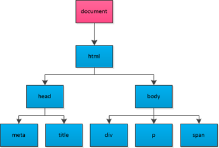

# Web APIs - Day1

学习目标:

- 能够说出API和Web API的概念
- 掌握API的学习方式(查文档:MDN、W3school等)
- 掌握页面元素的两种获取方式
- 能够对页面元素进行样式设置
- 能够对页面元素进行属性操作
- 能够说出事件的三要素
- 能够利用点击事件实现基本效果

## Web API 简介

### 回顾JavaScript的组成


- ECMAScript - JavaScript的核心 （必需）

  - ECMAScript是JavaScript的核心，描述了语言的基本语法和数据类型。
  - ECMAScript是一套标准，但标准与 **具体实现** 无关。

- BOM - 浏览器对象模型 （工具）

  - 通过BOM可以操作浏览器，比如：弹框、控制台操作、浏览器跳转、获取坐标与分辨率等信息。

- DOM - 文档对象模型 （工具）

  - 通过DOM可以操作页面，DOM会将HTML看做 '文档树' ，通过DOM可以对 '树'上的 '节点' 进行操作。

  

### 为什么要学习 Web API？

> 我们前面学习的ECMAScript，目的是掌握语言的基本操作方式。

- 思考：现在我们能不能做出网页中的常见效果呢？
  - 想要对页面上的标签进行操作，从而制作出好看的页面效果，就需要学习Web API。


### 什么是Web API?

#### API的概念

名词解析：API （Application Programming Interface , 应用程序编程接口）

- 接口：
  - 生活中的接口，例如：
    - 电源接口：提供电
    - 网线接口：提供网络
    - usb接口：提供设备连接功能
    - ...
  - 总结：能够 **提供某种能力** 的事物，称为接口。
- API ：
  - 能够 **提供编程能力（让编程更方便的能力）** 的事物称为应用程序编程接口（API）
  - API 实际上是 '环境' **预先提供** 的一些 **函数 (方法)**
- 回顾内置对象 API：
  - 是JavaScript解析器预先提供的一些方法。
  - 由于功能有许多，所以**根据功能进行的分类**，并组成了多个对象形式，称为**内置对象**。
    - `Math` 提供跟数学计算有关的方法
    - `Date` 提供跟日期有关的方法
    - `Array` ...
  - 这些API实际上就是辅助我们操作的**工具** ，只需要 **掌握使用方式** 即可，**不需要考虑内部的具体实现**。

#### Web  API的概念

- Web API 是浏览器提供的一套 **用于操作浏览器功能和页面元素(标签)** 的方法( BOM和DOM )
  - BOM ：用于操作浏览器的相关功能。
  - DOM ：用于操作页面的相关功能。
  - 用于API是工具，所以在学习时我们只需记忆常用的方法名称以及使用方式即可，十分简单。

#### 小结与思考

- 小结：
  - 接口的概念：能够提供某种能力的事物称为接口。
  - Web API的概念 ：提供 操作浏览器和页面的功能 的 工具。

- **思考：我们学习Web API，我们该学什么？** 

### 学习 API 的方法

- 学会查 ’ 字典 ‘（MDN）
  1. 明确类别，处理字符串 String/数学计算 Math...
  2. 记住关键单词 sub、push。。。记不住也没关系
  3. **千万不要死记硬背**

- MDN

  Mozilla 开发者网络（MDN）提供有关开放网络技术（Open Web）的信息，包括 HTML、CSS 和万维网及 HTML5 应用的 API。

  - [相关链接：MDN](https://developer.mozilla.org/zh-CN/)
  - [相关链接：MDN-Web API](https://developer.mozilla.org/zh-CN/docs/Web/API)
  - 例如：通过查询MDN学习document.getElementById()方法的使用

- 其他网站

  - [相关链接：W3school](http://www.w3school.com.cn/)
  - ...

#### 如何学习一个方法？（重要）

1. 方法的功能
2. 参数的意义和**类型**
3. 返回值意义和**类型**
4. **书写demo进行测试**

## DOM的概念

文档对象模型（Document Object Model，简称DOM），用于对文档中的内容进行操作，为了方便操作，它会根据文档的内容层级自动生成 '树状模型结构'，所以DOM又被称为文档树模型（图示）。


- 文档：一个网页可以称为文档
- 页面元素：网页中的标签

## DOM常用操作

### 获取页面元素

当我们想对页面元素设置效果时(例如：显示、隐藏等)，需要先获取到该部分对应的元素，才能进行后续操作。

#### 根据id获取元素

- 基本用法：

```javascript
var div = document.getElementById('main');
console.log(div);

// 获取到的数据类型 HTMLDivElement，对象都是有类型的
```

- 详细说明：
  - 参数：id名称，字符串类型。
  - 返回值：
    - 当页面中不存在对应参数id对应的标签时，返回null。
    - 当获取到对应的页面元素时，返回对应的DOM对象。
  - DOM对象：
    - 我们发现，获取到页面元素后，结果是一种对象形式，这种形式的目的是为了方便使用API。

注意：由于id名具有唯一性，部分浏览器支持直接使用id名访问元素，但不是标准方式，不推荐使用。	

#### 根据标签名获取元素

当我们希望同时操作页面中的多个页面元素时，

- 基本用法（2种）：

```javascript
// 获取页面中所有div：
var divs = document.getElementsByTagName('div');
for (var i = 0; i < divs.length; i++) {
  var div = divs[i];
  console.log(div);
} 

// 获取指定标签内部的所有div：
var box = document.getElementById('box');
var divs = box.getElementsByTagName('div');
for (var i = 0; i < divs.length; i++) {
  var div = divs[i];
  console.log(div);
} 
```


- 详细说明：

  - 参数：标签名，字符串形式，不区分大小写（要求统一使用小写）。
  - 返回值：

    - 由获取到的所有DOM对象组成的伪数组。
    - 当没有获取到元素时，返回空数组。
- 总结：
  - getElementById() 用于获取单个元素
  - getElementsByTagName() 用于获取多个元素
  - 注意getElementsByTagName()获取结果为伪数组。


### 样式设置操作

#### 1. style方式

- 基本使用：

```javascript
var box = document.getElementById('box');
box.style.width = '100px';
box.style.height = '100px';
// 注意 background-color 这种形式的样式在js中需要更改为驼峰命名法
// font-size 变成 fontSize .. 
box.style.backgroundColor = 'red';
```

- 详细说明：
  - 设置的值为字符串类型
    - 如果有单位，必须带单位。
    - 颜色的书写方式可以为多种形式：rgb，rgba，16进制，单词形式。
  - 使用style方式设置的样式显示在标签行内（行内样式）。

#### 2. 类名操作：

- 修改标签的className属性相当于直接修改标签的类名。

```javascript
var box = document.getElementById('box');
box.className = 'show';
```

#### 案例

- 列表隔行变色

### 文本操作

- innerHTML 和 innerText

```javascript
var box = document.getElementById('box');
box.innerHTML = '我是文本<p>我会生成为标签</p>';
console.log(box.innerHTML);
box.innerText = '我是文本<p>我不会生成为标签</p>';
console.log(box.innerText);
```

- innerHTML和innerText的区别

### 属性操作

#### 常用标签行内属性

例如：href、title、id、src

```javascript
var link = document.getElementById('link');
console.log(link.href);
console.log(link.title);

var pic = document.getElementById('pic');
console.log(pic.src);
```

#### 标签行内自定义属性

```javascript
<div id="box" data-hehe="a"></div>
var box = document.getElementById('box');
// 获取行内属性：
console.log(box.getAttribute('data-hehe'));
// 设置行内属性：
box.setAttribute('data-hehe', '新内容');
// 移除行内属性：
box.removeAttribute('data-hehe');
```

注意：上述方法可以操作标签行内的任意属性（自带的和自定义的），但是自带属性没必要这样操作。

### 事件

事件的作用：让用户可以与网页进行交互操作（触发 - 响应 机制）

#### 事件三要素(三个组成部分)

- 事件源：(被)触发事件的元素
- 事件类型：例如 click 表示点击事件
- 事件处理程序：事件触发后要执行的代码（函数形式）

#### 事件的基本使用

注意：在使用事件时需要在事件类型名称前加on，例如点击事件为onclick

```javascript
var box = document.getElementById('box');
box.onclick = function() {
  console.log('代码会在box被点击后执行');  
};
```

#### 常用的事件类型：

- click 鼠标点击（单击）事件
- mouseover 鼠标移入事件
- mouseout 鼠标移出事件

#### 练习

- 点击按钮弹出提示框

- 点击两个按钮显示隐藏div

- 点击两个按钮切换图片

- 点击一个按钮切换图片

- 点击两个按钮通过类名修改设置元素的样式

  ​


