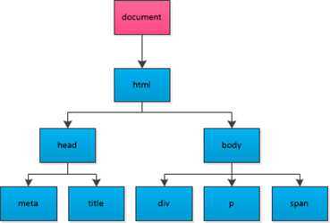

# Web APIs - Day1

学习目标:

- 能够说出API和Web API的概念
- 掌握API的学习方式(查文档:MDN、W3school等)
- 掌握页面元素的两种获取方式
- 能够对页面元素进行样式设置
- 能够对页面元素进行属性操作
- 能够说出事件的三要素
- 能够利用点击事件实现基本效果

## Web API 简介

### 回顾JavaScript的组成


- ECMAScript - JavaScript的核心 （必需）

  - ECMAScript是JavaScript的核心，描述了语言的基本语法和数据类型。
  - ECMAScript是一套标准，但标准与 **具体实现** 无关。

- BOM - 浏览器对象模型 （工具）

  - 通过BOM可以操作浏览器，比如：弹框、控制台操作、浏览器跳转、获取坐标与分辨率等信息。

- DOM - 文档对象模型 （工具）

  - 通过DOM可以操作页面，DOM会将HTML看做 '文档树' ，通过DOM可以对 '树'上的 '节点' 进行操作。

  

### 为什么要学习 Web API？

> 我们前面学习的ECMAScript，目的是掌握语言的基本操作方式。

- 思考：现在我们能不能做出网页中的常见效果呢？
  - 想要对页面上的标签进行操作，从而制作出好看的页面效果，就需要学习Web API。


### 什么是Web API?

#### API的概念

名词解析：API （Application Programming Interface , 应用程序编程接口）

- 接口：
  - 生活中的接口，例如：
    - 电源接口：提供电
    - 网线接口：提供网络
    - usb接口：提供设备连接功能
    - ...
  - 总结：能够 **提供某种能力** 的事物，称为接口。
- API ：
  - 能够 **提供编程能力（让编程更方便的能力）** 的事物称为应用程序编程接口（API）
  - API 实际上是 '环境' **预先提供** 的一些 **函数 (方法)**
- 回顾内置对象 API：
  - 是JavaScript解析器预先提供的一些方法。
  - 由于功能有许多，所以**根据功能进行的分类**，并组成了多个对象形式，称为**内置对象**。
    - `Math` 提供跟数学计算有关的方法
    - `Date` 提供跟日期有关的方法
    - `Array` ...
  - 这些API实际上就是辅助我们操作的**工具** ，只需要 **掌握使用方式** 即可，**不需要考虑内部的具体实现**。

#### Web  API的概念

- Web API 是浏览器提供的一套 **用于操作浏览器功能和页面元素(标签)** 的方法( BOM和DOM )
  - BOM ：用于操作浏览器的相关功能。
  - DOM ：用于操作页面的相关功能。
  - 用于API是工具，所以在学习时我们只需记忆常用的方法名称以及使用方式即可，十分简单。

#### 小结与思考

- 小结：
  - 接口的概念：能够提供某种能力的事物称为接口。
  - Web API的概念 ：提供 操作浏览器和页面的功能 的 工具。

- **思考：我们学习Web API，我们该学什么？** 

### 学习 API 的方法

- 学会查 ’ 字典 ‘（MDN）
  1. 明确类别，处理字符串 String/数学计算 Math...
  2. 记住关键单词 sub、push。。。记不住也没关系
  3. **千万不要死记硬背**

- MDN

  Mozilla 开发者网络（MDN）提供有关开放网络技术（Open Web）的信息，包括 HTML、CSS 和万维网及 HTML5 应用的 API。

  - [相关链接：MDN](https://developer.mozilla.org/zh-CN/)
  - [相关链接：MDN-Web API](https://developer.mozilla.org/zh-CN/docs/Web/API)
  - 例如：通过查询MDN学习document.getElementById()方法的使用

- 其他网站

  - [相关链接：W3school](http://www.w3school.com.cn/)
  - ...

#### 如何学习一个方法？（重要）

1. 方法的功能
2. 参数的意义和**类型**
3. 返回值意义和**类型**
4. **书写demo进行测试**

## DOM的概念

文档对象模型（Document Object Model，简称DOM），用于对文档中的内容进行操作，为了方便操作，它会根据文档的内容层级自动生成 '树状模型结构'，所以DOM又被称为文档树模型（图示）。


- 文档：一个网页可以称为文档
- 页面元素：网页中的标签

## DOM常用操作

### 获取页面元素

当我们想对页面元素设置效果时(例如：显示、隐藏等)，需要先获取到该部分对应的元素，才能进行后续操作。

#### 根据id获取元素

- 基本用法：

```javascript
var div = document.getElementById('main');
console.log(div);

// 获取到的数据类型 HTMLDivElement，对象都是有类型的
```

- 详细说明：
  - 参数：id名称，字符串类型。
  - 返回值：
    - 当页面中不存在对应参数id对应的标签时，返回null。
    - 当获取到对应的页面元素时，返回对应的DOM对象。
  - DOM对象：
    - 我们发现，获取到页面元素后，结果是一种对象形式，这种形式的目的是为了方便使用API。

注意：由于id名具有唯一性，部分浏览器支持直接使用id名访问元素，但不是标准方式，不推荐使用。	

#### 根据标签名获取元素

当我们希望同时操作页面中的多个页面元素时，

- 基本用法（2种）：

```javascript
// 获取页面中所有div：
var divs = document.getElementsByTagName('div');
for (var i = 0; i < divs.length; i++) {
  var div = divs[i];
  console.log(div);
} 

// 获取指定标签内部的所有div：
var box = document.getElementById('box');
var divs = box.getElementsByTagName('div');
for (var i = 0; i < divs.length; i++) {
  var div = divs[i];
  console.log(div);
} 
```


- 详细说明：

  - 参数：标签名，字符串形式，不区分大小写（要求统一使用小写）。
  - 返回值：

    - 由获取到的所有DOM对象组成的伪数组。
    - 当没有获取到元素时，返回空数组。
- 总结：
  - getElementById() 用于获取单个元素
  - getElementsByTagName() 用于获取多个元素
  - 注意getElementsByTagName()获取结果为伪数组。


### 样式设置操作

#### 1. style方式

- 基本使用：

```javascript
var box = document.getElementById('box');
box.style.width = '100px';
box.style.height = '100px';
// 注意 background-color 这种形式的样式在js中需要更改为驼峰命名法
// font-size 变成 fontSize .. 
box.style.backgroundColor = 'red';
```

- 详细说明：
  - 设置的值为字符串类型
    - 如果有单位，必须带单位。
    - 颜色的书写方式可以为多种形式：rgb，rgba，16进制，单词形式。
  - 使用style方式设置的样式显示在标签行内（行内样式）。

#### 2. 类名操作：

- 修改标签的className属性相当于直接修改标签的类名。

```javascript
var box = document.getElementById('box');
box.className = 'show';
```

#### 案例

- 列表隔行变色

### 文本操作

- innerHTML 和 innerText

```javascript
var box = document.getElementById('box');
box.innerHTML = '我是文本<p>我会生成为标签</p>';
console.log(box.innerHTML);
box.innerText = '我是文本<p>我不会生成为标签</p>';
console.log(box.innerText);
```

- innerHTML和innerText的区别

### 属性操作

#### 常用标签行内属性

例如：href、title、id、src

```javascript
var link = document.getElementById('link');
console.log(link.href);
console.log(link.title);

var pic = document.getElementById('pic');
console.log(pic.src);
```

#### 标签行内自定义属性

```javascript
<div id="box" data-hehe="a"></div>
var box = document.getElementById('box');
// 获取行内属性：
console.log(box.getAttribute('data-hehe'));
// 设置行内属性：
box.setAttribute('data-hehe', '新内容');
// 移除行内属性：
box.removeAttribute('data-hehe');
```

注意：上述方法可以操作标签行内的任意属性（自带的和自定义的），但是自带属性没必要这样操作。

### 事件

事件的作用：让用户可以与网页进行交互操作（触发 - 响应 机制）

#### 事件三要素(三个组成部分)

- 事件源：(被)触发事件的元素
- 事件类型：例如 click 表示点击事件
- 事件处理程序：事件触发后要执行的代码（函数形式）

#### 事件的基本使用

注意：在使用事件时需要在事件类型名称前加on，例如点击事件为onclick

```javascript
var box = document.getElementById('box');
box.onclick = function() {
  console.log('代码会在box被点击后执行');  
};
```

#### 常用的事件类型：

- click 鼠标点击（单击）事件
- mouseover 鼠标移入事件
- mouseout 鼠标移出事件

#### 练习

- 点击按钮弹出提示框

- 点击两个按钮显示隐藏div

- 点击两个按钮切换图片

- 点击一个按钮切换图片

- 点击两个按钮通过类名修改设置元素的样式

  ​
# Web APIs - Day2

学习目标:

- 能够掌握事件中this的使用方式以及事件中循环变量使用的问题。
- 能够取消标签默认事件效果
- 能够掌握移入移出事件的使用方式
- 能够完成选项卡切换效果
- 能够说出什么是兼容性问题
- 能够解决文本和样式获取的兼容性问题

## 事件中的this使用

观察以下示例代码：

```javascript
var btn = document.getElementById('btn');
btn.onclick = function () {
  btn.innerText = '修改了btn的内容';
};
```

通过事件可以发现，事件实际上是方法形式，在方法中可以使用this代表调用者(btn)。

示例中，点击事件内部修改了btn的内容，而btn等同与this，所以可以使用this在事件中替代事件源。

观察以下示例：

```javascript
// 假定页面中有多个li，要求给每个li设置点击事件，点击后打印本li的内容
var lis = document.getElementsByTagName('li');
for (var i = 0; i < lis.length; i++) {
  lis[i].onclick = function () {
    console.log(lis[i].innerText); // 报错
  };
}
```

以上写法中我们发现代码似乎是合理的，但却出现了报错，原因在于事件内i的取值有问题(原因见课上演示)。

此时可以在事件内使用this来表示事件源，方便又好用哦~

小结：在循环添加事件时，事件中不能使用循环变量！全部使用this替代即可。

### 案例：

- 百度换肤
- 京东商品展示

## 取消标签默认事件
许多标签具有默认的事件效果，例如a标签，默认点击后会进行跳转。如果不希望执行跳转，可以在自定义事件代码最后设置return false。

``` javascript
var link = document.getElementById('link');
link.onclick = function () {
  console.log('这是要执行的代码');
  return false; // 阻止a标签的跳转
};
```

### 案例

- 美女相册

## 移入移出事件

js中的事件类型有很多，除点击外，还有鼠标的移入mouseover和移出mouseout事件

```javascript
var box = document.getElementById('box');
box.onmouseover = function () {
  console.log('鼠标移入到box中了');
};
box.onmouseout = function () {
  console.log('鼠标从box中移出了');
};
```

### 案例

- 二维码案例
- 隔行变色鼠标高亮效果
- tab栏（选项卡）切换

## 课后练习

- 图片切换案例
- 字符串拼接案例


# Web APIs - Day3

## 每日目标

- 能够说出什么是兼容性问题
- 能够解决文本和样式获取的兼容性问题
- 能够掌握表单的常用属性
- 能够掌握输入框的两个事件
- 能够掌握获取父节点的方式
- 能够掌握获取子节点（元素）的常用方式
- 能够掌握获取同级节点的常用方式
- 能够掌握三种创建元素节点的方式

## 兼容性

当一个属性(方法)不能被所有浏览器(5大浏览器)支持时，我们就称这个属性(方法)具有兼容性问题。

> 讲在前面：兼容性问题在js中存在很多，大部分为历史遗留原因。我们此部分课程的目标不是解决js中所有的兼容性问题，而是要清楚什么是兼容性问题，以及兼容性问题的解决方式(套路)即可。

### innerText的兼容性问题

innerText用于对元素进行文本内容操作，但他具有一些兼容性问题(见MDN - MDN有问题，innerText属性在ie中没有兼容性问题)。

与innerText对应的属性为textContent，textContent使用方式与innerText相同，但不支持ie678。

我们会发现现在我们有了两个功能相同的属性，虽然分别使用时不支持一部分浏览器，但组合在一起时可以涵盖所有浏览器。

这时我们就可以利用两者进行兼容性操作了。

> 兼容性操作：谁能用，就用谁。

```javascript
var getText = function (element) {
  if (typeof element.innerText !== 'undefined') {
    return element.innerText;
  } else {
    return element.textContent;
  }
};
```

### 样式获取的兼容性问题

以前我们使用过style方式可以直接对元素的样式进行操作，但只是设置。style方式其实也可以进行样式获取，但同样只能获取行内样式。

```php+HTML
<style>
  div {
    width : 100px;
  }
</style>
<div id="box" style="height:100px;">div的内容</div>
<script>
  var box = document.getElementById('box');
  console.log(box.style.width); // '' width没有设置为行内样式
  console.log(box.style.height); // '100px' height设置为行内样式
  
  box.style.backgroundColor = 'red'; // 使用style方式设置的样式同样为行内样式，可以获取
  console.log(box.style.backgroundColor); // 'red'
</script>
```

实际开发中，我们不可能将所有的样式均设置为行内样式。如果希望获取任意位置设置的样式，可以使用方法getComputedStyle()。

- getComputedStyle()
  - 功能：用于获取某个元素计算后(最终生效的)的样式
  - 参数：要进行样式获取的元素(DOM对象)
  - 返回值：所有样式的集合(对象，类似元素的style属性，需要再次访问某个样式名称)

```php+HTML
<style>
  div {
    width : 100px;
  }
</style>
<div id="box" style="height:100px;">div的内容</div>
<script>
  var box = document.getElementById('box');
  console.log(getComputedStyle(box).width); // '100px' 
  console.log(getComputedStyle(box).height); // '100px' 
</script>
```

此方法虽然好用，但是ie9以下不支持(见MDN)，对应功能为一个属性currentStyle，使用方式与getComputedStyle()相同，同样可以进行兼容性操作：

```javascript
var getStyle = function (element, styleName) {
  if (element.currentStyle) {
    return element.currentStyle[styleName];
  } else {
    return getComputedStyle(element)[styleName];
  }
}
```

### 根据类名获取元素*

```javascript
function getByClass (leiMing, element) {
	element = element || document.body;
	if (typeof document.getElementsByClassName === 'function') {
		return element.getElementsByClassName(leiMing);
	} else {
		var resultArr = [];
		// 1 根据标签名获取element中的所有标签
		var tags = element.getElementsByTagName('*');
		// 2 检测类名是否为box
		var tempArr, j;
		for (var i = 0; i < tags.length; i++) {
			// 需要准确的检测tags[i]的className属性中是否含有box的部分
			tempArr = tags[i].className.split(' ');
			// 遍历tempArr中的每个部分是否含有box
			for (j = 0; j < tempArr.length; j++) {
				// 如果类名中含有为box的部分，将tags[i]保存到结果数组中
				if (tempArr[j] === leiMing) {
					resultArr.push(tags[i]);
					break;
				}
			}
		}
		return resultArr;
	}
}
```

## 表单属性与事件

### 表单的常用属性

#### 内容操作

```javascript
var text = document.getElementById('text'); // 输入框
var txt = document.getElementById('txt');   // 文本域
var opt = document.getElementById('opt');   // 下拉菜单选项
// 1 value 用于操作大部分表单元素的值
console.log(text.value);		// 获取内容
text.value = '我是设置的新内容';  // 设置内容

// 2 特殊：文本域，可以使用value和innerHTML、innerText ，但是推荐value，比较统一
console.log(txt.value); 
txt.value = '我是新的内容';
console.log(txt.innerHTML);
txt.innerHTML = '我是新的内容';

// 3 特殊：下拉菜单选项option，只能使用innerHTML、innerText进行内容设置，value不是用于内容设置
opt.value = '我是value的内容';
opt.innerHTML = '而我才是显示的内容';
```

#### 复选框选中属性

```javascript
var cb = document.getElementById('cb'); // 复选框
// checked 属性，用于进行复选框选中属性操作
// 设置为布尔类型，true表示选中，false表示取消选中
cb.checked = true;
// 注意：如果设置的值为非布尔值，会进行隐式转换，不常用，了解即可
```

案例

- 全选反选
  - 前置知识点
    - push()
    - splice()
    - indexOf()

#### 下拉菜单选中属性

```javascript
var opt = document.getElementById('opt'); // 下拉菜单选项
// selected 属性，用于进行选中属性操作
// 设置为布尔类型，true表示选中，false表示取消选中
opt.selected = true;
// 注意：如果设置的值为非布尔值，会进行隐式转换，不常用，了解即可
```

#### 禁用属性

```javascript
var ipt = document.getElementById('ipt'); // 复选框
// disabled 属性，用于进行禁用属性操作
// 设置为布尔类型，true表示禁用，false表示启用
ipt.disabled = true;
// 注意：如果设置的值为非布尔值，会进行隐式转换，不常用，了解即可
```

### 输入框常用事件

```javascript
<input type="text" id="ipt" value="我是输入框的默认内容">
<script>
	var ipt = document.getElementById('ipt');
	// 获取焦点事件 focus
	ipt.onfocus = function () {
		// 检测，如果内容为默认提示词，去除
		if (this.value === '我是输入框的默认内容') {
			this.value = '';
		}
	};
	// 失去焦点事件 blur
	ipt.onblur = function () {
		// 如果为空，还原为默认提示词
		if (this.value === '') {
			this.value = '我是输入框的默认内容';
		}
	};
</script>
```

## 节点

### 节点的概念

​	页面创建后，DOM会根据HTML文档结构生成文档树（又称节点树），HTML文档中的每个标签、文本、属性均为 ‘树’ 中的一个部分，这些组成部分称为 **节点**。

​	节点根据形式不同，又有不同的分类，例如标签称为**元素节点**，文本称为**文本节点**，等等。

​	节点树的根据 ‘树’ 中不同节点之间的关系，给我们提供了一套访问方式，用于**方便对页面内容的操作**。


### 节点的属性

节点分类：

​	常见节点：元素节点、文本节点、属性节点

节点常用的属性

- nodeType:  节点类型，数值形式	
  - 1 代表元素节点 （常用）
  - 2 代表属性节点
  - 3 代表文本节点


- nodeName: 节点名称
  - 元素节点的nodeName为标签名


- nodeValue: 节点值
  - 元素节点的nodeValue为null

### 节点访问关系

#### 父节点

```javascript
node.parentNode // 父节点
```

#### 子节点

```javascript
childNodes  // 获取所有的子节点，伪数组
children // 获取所有的子元素，伪数组（最常用）
firstChild // 第一个子节点
firstElementChild // 第一个子元素节点 有兼容性问题
lastChild // 最后一个子节点
lastElementChild // 最后一个子元素节点 有兼容性问题
```

#### 同级节点（兄弟节点）

```javascript
nextSibling // 下一个同级节点
nextElementSibling // 下一个同级元素节点 有兼容性问题
previousSibling // 上一个同级节点
previousElementSibling // 上一个同级元素节点 有兼容性问题
```

### 移动节点

#### appendChild 追加子节点

语法：parent.appendChild(newChild)

parent：父节点（要添加到的位置）

newChild：新节点（要添加的节点）

作用：把newChild添加到parent中所有子节点的最后面。

> 如果添加的是页面中本来就存在的元素，是一个剪切的效果，原来的就不在了。

```javascript
var demo = document.getElementById("demo");
var box = document.getElementById("box");
box.appendChild(demo);
```

#### insertBefore 插入子节点

语法：parent.insertBefore(newChild, refChild);

参数：

- parent：父节点（要添加到的位置）
- newChild：新节点（要添加的节点）
- refChild：参考节点（新节点添加到哪一个节点的前面）。

```javascript
var ul = document.getElementById("list");
var li = document.createElement("li");
li.innerHTML = "这是一个li";
// 就是添加到子节点的最前面。
ul.insertBefore(li, ul.children[0]);
```

#### 案例：

- 选水果
  - 前置知识点：
    - selected属性
    - appendChild()

### 创建元素节点（3种方式）

#### document.write（基本不用）

可以生成新的节点，但是不推荐使用。

**注意：如果在页面加载完毕后，使用document.write进行内容写入操作，会将之前的页面给覆盖掉**

#### innerHTML

innerHTML也可以创建节点

使用innerHTML会出现的问题：

- 覆盖原内容
- 效率问题
  - \* console.time() 与 console.timeEnd() 的使用

#### document.createElement

语法：document.createElement(tagName);

- 功能：创建一个元素节点
- 返回：元素节点（标签）
- 参数：要创建的标签的名称，字符串类型

**注意：使用document.createElement创建的元素需要添加到页面中才会显示。**

#### 案例：

- 根据数据创建列表
- 根据数据创建表格

### 删除节点

语法：parent.removeChild(child);

功能：有父盒子调用，删除里面的一个子元素。

参数：child 要移除的子节点

案例：

- 模拟百度搜索框
  - 前置知识点：
    - indexOf() 数组方法
    - innerText
    - document.createElement()
    - appendChild()
    - removeChild()
- 设置表格数据删除功能（基于上一节的 “根据数据创建表格” 案例）

### 克隆节点

语法：node.cloneNode(deep)

功能：克隆一个节点

参数：deep

- false：默认值，表示浅复制：只会复制节点本身，不会复制节点的内部内容。
- true：深复制，会复制标签，以及标签内的所有内容 

> 1. 克隆出来的节点跟原来的节点没有关系
> 2. 不要给要克隆的节点设置id


# Web APIs - Day4

## 每日目标

- 能够使用表单的常用属性
- 能够使用输入框的事件
- 能够通过节点访问关系进行节点操作
- 能够进行节点的移动
- 能够掌握创建元素节点的三种方式
- 能够掌握移除节点和克隆节点的方式

## 表单属性与事件

### 表单的常用属性

#### 内容操作

```javascript
var text = document.getElementById('text'); // 输入框
var txt = document.getElementById('txt');   // 文本域
var opt = document.getElementById('opt');   // 下拉菜单选项
// 1 value 用于操作大部分表单元素的值
console.log(text.value);		// 获取内容
text.value = '我是设置的新内容';  // 设置内容

// 2 特殊：文本域，可以使用value和innerHTML、innerText ，但是推荐value，比较统一
console.log(txt.value); 
txt.value = '我是新的内容';
console.log(txt.innerHTML);
txt.innerHTML = '我是新的内容';

// 3 特殊：下拉菜单选项option，只能使用innerHTML、innerText进行内容设置，value不是用于内容设置
opt.value = '我是value的内容';
opt.innerHTML = '而我才是显示的内容';
```

#### 复选框选中属性

```javascript
var cb = document.getElementById('cb'); // 复选框
// checked 属性，用于进行复选框选中属性操作
// 设置为布尔类型，true表示选中，false表示取消选中
cb.checked = true;
// 注意：如果设置的值为非布尔值，会进行隐式转换，不常用，了解即可
```

案例

- 全选反选
  - 前置知识点
    - push()
    - splice()
    - indexOf()

#### 下拉菜单选中属性

```javascript
var opt = document.getElementById('opt'); // 下拉菜单选项
// selected 属性，用于进行选中属性操作
// 设置为布尔类型，true表示选中，false表示取消选中
opt.selected = true;
// 注意：如果设置的值为非布尔值，会进行隐式转换，不常用，了解即可
```

#### 禁用属性

```javascript
var ipt = document.getElementById('ipt'); // 复选框
// disabled 属性，用于进行禁用属性操作
// 设置为布尔类型，true表示禁用，false表示启用
ipt.disabled = true;
// 注意：如果设置的值为非布尔值，会进行隐式转换，不常用，了解即可
```

### 输入框常用事件

```javascript
<input type="text" id="ipt" value="我是输入框的默认内容">
<script>
	var ipt = document.getElementById('ipt');
	// 获取焦点事件 focus
	ipt.onfocus = function () {
		// 检测，如果内容为默认提示词，去除
		if (this.value === '我是输入框的默认内容') {
			this.value = '';
		}
	};
	// 失去焦点事件 blur
	ipt.onblur = function () {
		// 如果为空，还原为默认提示词
		if (this.value === '') {
			this.value = '我是输入框的默认内容';
		}
	};
</script>
```

## 节点

### 节点的概念

​	页面创建后，DOM会根据HTML文档结构生成文档树（又称节点树），HTML文档中的每个标签、文本、属性均为 ‘树’ 中的一个部分，这些组成部分称为 **节点**。

​	节点根据形式不同，又有不同的分类，例如标签称为**元素节点**，文本称为**文本节点**，等等。

​	节点树的根据 ‘树’ 中不同节点之间的关系，给我们提供了一套访问方式，用于**方便对页面内容的操作**。


### 节点的属性

节点分类：

​	常见节点：元素节点、文本节点、属性节点

节点常用的属性

- nodeType:  节点类型，数值形式	
  - 1 代表元素节点 （常用）
  - 2 代表属性节点
  - 3 代表文本节点


- nodeName: 节点名称
  - 元素节点的nodeName为标签名


- nodeValue: 节点值
  - 元素节点的nodeValue为null

### 节点访问关系

节点访问关系一共分两类：上下级关系(父子关系)和同级关系(兄弟关系)。

#### 父节点

```javascript
node.parentNode // 父节点
```

#### 子节点

```javascript
childNodes  // 获取所有的子节点，伪数组
children // 获取所有的子元素，伪数组（最常用）
firstChild // 第一个子节点
firstElementChild // 第一个子元素节点 有兼容性问题
lastChild // 最后一个子节点
lastElementChild // 最后一个子元素节点 有兼容性问题
```

#### 同级节点（兄弟节点）

```javascript
nextSibling // 下一个同级节点
nextElementSibling // 下一个同级元素节点 有兼容性问题
previousSibling // 上一个同级节点
previousElementSibling // 上一个同级元素节点 有兼容性问题
```

### 移动节点

#### appendChild 追加子节点

语法：parent.appendChild(newChild)

parent：父节点（要添加到的位置）

newChild：新节点（要添加的节点）

作用：把newChild添加到parent中所有子节点的最后面。

> 如果添加的是页面中本来就存在的元素，是一个剪切的效果，原来的就不在了。

```javascript
var demo = document.getElementById("demo");
var box = document.getElementById("box");
box.appendChild(demo);
```

#### insertBefore 插入子节点

语法：parent.insertBefore(newChild, refChild);

参数：

- parent：父节点（要添加到的位置）
- newChild：新节点（要添加的节点）
- refChild：参考节点（新节点添加到哪一个节点的前面）。

```javascript
var ul = document.getElementById("list");
var li = document.createElement("li");
li.innerHTML = "这是一个li";
// 就是添加到子节点的最前面。
ul.insertBefore(li, ul.children[0]);
```

#### 案例：

- 选水果
  - 前置知识点：
    - selected属性
    - appendChild()

### 创建元素节点（3种方式）

#### document.write（基本不用）

可以生成新的节点，但是不推荐使用。

**注意：如果在页面加载完毕后，使用document.write进行内容写入操作，会将之前的页面给覆盖掉**

#### innerHTML

innerHTML也可以创建节点

使用innerHTML会出现的问题：

- 覆盖原内容
- 效率问题
  - \* console.time() 与 console.timeEnd() 的使用

#### document.createElement

语法：document.createElement(tagName);

- 功能：创建一个元素节点
- 返回：元素节点（标签）
- 参数：要创建的标签的名称，字符串类型

**注意：使用document.createElement创建的元素需要添加到页面中才会显示。**

#### 案例：

- 根据数据创建列表
- 根据数据创建表格

### 移除节点

语法：parent.removeChild(child);

功能：有父盒子调用，删除里面的一个子元素。

参数：child 要移除的子节点

案例：

- 模拟百度搜索框
  - 前置知识点：
    - indexOf() 数组方法
    - innerText
    - document.createElement()
    - appendChild()
    - removeChild()
- 设置表格数据删除功能（基于上一节的 “根据数据创建表格” 案例）

### 克隆节点

语法：node.cloneNode(deep)

功能：克隆一个节点

参数：deep

- false：默认值，表示浅复制：只会复制节点本身，不会复制节点的内部内容。
- true：深复制，会复制标签，以及标签内的所有内容 

> 1. 克隆出来的节点跟原来的节点没有关系
> 2. 不要给要克隆的节点设置id


# Web APIs - Day5

## 每日目标

- 掌握动态创建元素的三种方式
- 掌握移除节点和克隆节点的方式

## 节点部分

### 创建元素节点（3种方式）

#### document.write（基本不用）

可以生成新的节点，但是不推荐使用。

**注意：如果在页面加载完毕后，使用document.write进行内容写入操作，会将之前的页面给覆盖掉**

#### innerHTML

innerHTML也可以创建节点

使用innerHTML会出现的问题：

- 覆盖原内容
- 效率问题
  - \* console.time() 与 console.timeEnd() 的使用

#### document.createElement

语法：document.createElement(tagName);

- 功能：创建一个元素节点
- 返回：元素节点（标签）
- 参数：要创建的标签的名称，字符串类型

**注意：使用document.createElement创建的元素需要添加到页面中才会显示。**

#### 案例：

- 根据数据创建列表
- 根据数据创建表格

### 移除节点

语法：parent.removeChild(child);

功能：有父盒子调用，删除里面的一个子元素。

参数：child 要移除的子节点

案例：

- 模拟百度搜索框
  - 前置知识点：
    - indexOf() 数组方法
    - innerText
    - document.createElement()
    - appendChild()
    - removeChild()

### 克隆节点

语法：node.cloneNode(deep)

功能：克隆一个节点

参数：deep

- false：默认值，表示浅复制：只会复制节点本身，不会复制节点的内部内容。
- true：深复制，会复制标签，以及标签内的所有内容 

> 1. 克隆出来的节点跟原来的节点没有关系
> 2. 不要给要克隆的节点设置id

## 注册事件的两种方式

### on+事件名称

> onclick、onmouseover这种on+事件名称的方式注册事件几乎所有的浏览器都支持。

注册事件：

```javascript
box.onclick = function(){
	//事件处理程序	
}
```

移除事件：

```javascript
box.onclick = null;	
```

on+事件名称注册事件的缺点：

同一个元素同一类型的事件，只能注册一个，如果注册了多个，会出现覆盖问题。


### 注册事件的新方式

**addEventListener与removeEventListener**

> 现代浏览器支持的注册事件的新方式，这种方式注册的事件不会出现覆盖问题。

addEventListener的语法

```javascript
//第一个参数：事件类型：click mouseover
//第二个参数：事件处理程序
//第三个参数：false 
DOM对象.addEventListener(type, func, useCapture);
```

注意：如果想要让你注册的事件能够移除，不能使用匿名函数。

```javascript
function fn1() {
    alert("hehe");
}
//如果想让注册的事件能移除，不能用匿名函数。
box.addEventListener("click", fn1, false);
```

removeEventListen的语法

```javascript
//第一个参数：事件类型
//第二个参数：事件处理程序
//第三个参数：false
removeEventListener(type, func, useCapture);
```

**attachEvent与detachEvent**

> IE678不支持addEventListener与removeEventListen两个方法，但是支持attachEvent与detachEvent

attachEvent的用法：

```javascript
//type:事件类型   需要加上on   onclick  onmouseenter
//func:事件处理程序
attachEvent(type, func)
```

detachEvent的用法

```javascript
//type:事件类型   需要加上on   onclick  onmouseenter
//func:事件处理程序
detachEvent(type, func)
```

### 事件流

> 当一个元素的事件被触发时，同样的事件将会在该元素的所有祖先元素中依次被触发。这一过程被称为事件冒泡。

说白了就是：当我们触发了子元素的某个事件后，父元素对应的事件也会触发。

通常情况，事件冒泡对于我们来说是没有问题的，我们直接不管就行了，但是如果当事件冒泡给我们带来影响的时候，我们需要阻止事件冒泡。

> 阻止事件冒泡有浏览器兼容性问题

正常浏览器：

```javascript
link.onclick = function (event) {
    event = event || window.event;
    //stop :停止  propagation：传播
    event.stopPropagation();
}
```


#### 事件捕获（了解）

> 事件捕获是火狐浏览器提出来的，IE678不支持事件捕获（基本上，我们都是用事件冒泡）
> 事件的处理将从DOM层次的根开始，而不是从触发事件的目标元素开始，事件被从目标元素的所有祖先元素依次往下传递

```javascript
//当addEventListener第三个参数为true时，表示事件捕获
arr[i].addEventListener("click", function () {
    console.log(this);
},true);
```


#### 事件的三个阶段

1. 事件的捕获阶段
2. 事件的目标阶段（触发自己的事件）
3. 事件的冒泡阶段

事件有三个阶段，首先发生的是捕获阶段，然后是目标阶段，最后才是冒泡阶段，对于捕获和冒泡，我们只能干预其中的一个，通常来说，我们可能会干预事件冒泡阶段，而不去干预事件捕获阶段。


#### 常见的事件

> 常见的鼠标事件

onmousedown:鼠标按下事件

onmouseup:鼠标弹起事件

onclick:单击事件

ondblclick：双击事件

onmouseover：鼠标经过事件

onmouseout：鼠标离开事件

onmousemove：鼠标移动事件

onfocus：鼠标获得焦点事件

onblur：鼠标失去焦点事件


> 常见的键盘事件

onkeydown:键盘按下时触发

onkeyup:键盘弹起时触发


> 对于鼠标事件，事件对象中有一系列的XY记录了鼠标的位置信息。而键盘事件中，事件对象有一个event.keyCode属性，记录了按下去的键的键盘码

## 事件对象

### 事件对象的概述

> 在触发某个事件的时候，都会产生一个事件对象Event，这个对象中包含所有与事件相关的一些信息，包括触发事件的元素，事件的类型以及其他与事件相关的信息。

鼠标事件触发时，事件对象中会包含鼠标的位置信息。

键盘事件触发时，事件对象中会包含按下的键相关的信息。

```javascript
每一个事件在触发时，都会产生一个事件对象。
你见或者不见，我就在那里，不悲不喜。
你爱或者不爱，爱就在那里，不增不减。
你用或者不用，我都会给你，不离不弃。 
```


### 获取事件对象

> 既然事件对象中存储了这么多的信息，我们首先需要做的就是获取到这个事件对象。获取事件对象的时候，存在浏览器的兼容问题。


对于现代浏览器，获取事件对象非常的简单，只需要在注册事件的时候，指定一个形参即可。这个形参就是我们想要获取到的事件对象。

```javascript
btn.onclick = function(event){
    //event就是事件对象，里面包含了事件触发时的一些信息。
	console.log(event);
}

```


对于IE678来说，获取事件对象则是另一种方式，在事件里面，通过window.event来获取事件对象

```javascript
btn.onclick = function(){
	//IE678通过window.event获取事件对象
	var event = window.event;
	console.log(event);
}
```


兼容性封装

```javascript
btn.onclick = function(event){
  	//只要用到了事件对象，就要记得处理浏览器兼容性
	event = event || window.event;
}

```


### 事件对象的常用属性

> 事件对象中有很多很多的属性，但是很多属性并不常用。我们经常用到的是***鼠标位置信息*** 和***键盘码***  相关的信息。

记录了鼠标位置信息的相关属性

```javascript
clientX与clientY：光标相对于可视区左上角的水平位置和垂直位置。
pageX与pageY：光标相对于网页（文档document）左上角的水平位置与垂直位置（推荐使用）
```

记录了键盘码的属性

```javascript
event.keyCode:键盘按下的那个键的键盘码
```

### 放大镜效果（案例）

> 放大镜在开发中是一个很常见的特效，但是所有的放大镜的实现效果都是一样。

mousemove事件：鼠标移动时会触发这个事件。

```javascript
document.onmousemove = function(){
	console.log("鼠标移动事件在触发");  
};
```

获取鼠标在盒子中的位置：

```javascript
var spaceX = getPage(event).x - box.offsetLeft;
var spaceY = getPage(event).y - box.offsetTop;
```


# Web APIs - Day5

## 每日目标

- 能够掌握注册事件的新方式
- 能够移除事件
- 能够说出事件冒泡的执行顺序
- 能够说出什么是事件对象
- 能够进行事件委托设置
- 能够掌握鼠标坐标的获取方式
- 能够完成拖拽案例

## 注册事件的两种方式

### on+事件名称

> onclick、onmouseover这种on+事件名称的方式注册事件几乎所有的浏览器都支持。

注册事件：

```javascript
box.onclick = function(){
	//事件处理程序	
}
```

移除事件：

```javascript
box.onclick = null;	
```

on+事件名称注册事件的缺点：

同一个元素同一类型的事件，只能注册一个，如果注册了多个，会出现覆盖问题。


### 注册事件的新方式

**addEventListener与removeEventListener**

> 现代浏览器支持的注册事件的新方式，这种方式注册的事件不会出现覆盖问题。

addEventListener的语法

```javascript
//第一个参数：事件类型：click mouseover
//第二个参数：事件处理程序
//第三个参数：false 
DOM对象.addEventListener(type, func, useCapture);
```

注意：如果想要让你注册的事件能够移除，不能使用匿名函数。

```javascript
function fn1() {
    alert("hehe");
}
//如果想让注册的事件能移除，不能用匿名函数。
box.addEventListener("click", fn1, false);
```

removeEventListen的语法

```javascript
//第一个参数：事件类型
//第二个参数：事件处理程序
//第三个参数：false
removeEventListener(type, func, useCapture);
```

**attachEvent与detachEvent**

> IE678不支持addEventListener与removeEventListen两个方法，但是支持attachEvent与detachEvent

attachEvent的用法：

```javascript
//type:事件类型   需要加上on   onclick  onmouseenter
//func:事件处理程序
attachEvent(type, func)
```

detachEvent的用法

```javascript
//type:事件类型   需要加上on   onclick  onmouseenter
//func:事件处理程序
detachEvent(type, func)
```

### 事件流

> 当一个元素的事件被触发时，同样的事件将会在该元素的所有祖先元素中依次被触发。这一过程被称为事件冒泡。

说白了就是：当我们触发了子元素的某个事件后，父元素对应的事件也会触发。

通常情况，事件冒泡对于我们来说是没有问题的，我们直接不管就行了，但是如果当事件冒泡给我们带来影响的时候，我们需要阻止事件冒泡。

> 阻止事件冒泡有浏览器兼容性问题

正常浏览器：

```javascript
link.onclick = function (event) {
    event = event || window.event;
    //stop :停止  propagation：传播
    event.stopPropagation();
}
```


#### 事件捕获（了解）

> 事件捕获是火狐浏览器提出来的，IE678不支持事件捕获（基本上，我们都是用事件冒泡）
> 事件的处理将从DOM层次的根开始，而不是从触发事件的目标元素开始，事件被从目标元素的所有祖先元素依次往下传递

```javascript
//当addEventListener第三个参数为true时，表示事件捕获
arr[i].addEventListener("click", function () {
    console.log(this);
},true);
```


#### 事件的三个阶段

1. 事件的捕获阶段
2. 事件的目标阶段（触发自己的事件）
3. 事件的冒泡阶段

事件有三个阶段，首先发生的是捕获阶段，然后是目标阶段，最后才是冒泡阶段，对于捕获和冒泡，我们只能干预其中的一个，通常来说，我们可能会干预事件冒泡阶段，而不去干预事件捕获阶段。


#### 常见的事件

> 常见的鼠标事件

onmousedown:鼠标按下事件

onmouseup:鼠标弹起事件

onclick:单击事件

ondblclick：双击事件

onmouseover：鼠标经过事件

onmouseout：鼠标离开事件

onmousemove：鼠标移动事件

onfocus：鼠标获得焦点事件

onblur：鼠标失去焦点事件


> 常见的键盘事件

onkeydown:键盘按下时触发

onkeyup:键盘弹起时触发


> 对于鼠标事件，事件对象中有一系列的XY记录了鼠标的位置信息。而键盘事件中，事件对象有一个event.keyCode属性，记录了按下去的键的键盘码

## 事件对象

### 事件对象的概述

> 在触发某个事件的时候，都会产生一个事件对象Event，这个对象中包含所有与事件相关的一些信息，包括触发事件的元素，事件的类型以及其他与事件相关的信息。

鼠标事件触发时，事件对象中会包含鼠标的位置信息。

键盘事件触发时，事件对象中会包含按下的键相关的信息。

```javascript
每一个事件在触发时，都会产生一个事件对象。
你见或者不见，我就在那里，不悲不喜。
你爱或者不爱，爱就在那里，不增不减。
你用或者不用，我都会给你，不离不弃。 
```


### 获取事件对象

> 既然事件对象中存储了这么多的信息，我们首先需要做的就是获取到这个事件对象。获取事件对象的时候，存在浏览器的兼容问题。


对于现代浏览器，获取事件对象非常的简单，只需要在注册事件的时候，指定一个形参即可。这个形参就是我们想要获取到的事件对象。

```javascript
btn.onclick = function(event){
    //event就是事件对象，里面包含了事件触发时的一些信息。
	console.log(event);
}

```


对于IE678来说，获取事件对象则是另一种方式，在事件里面，通过window.event来获取事件对象

```javascript
btn.onclick = function(){
	//IE678通过window.event获取事件对象
	var event = window.event;
	console.log(event);
}
```


兼容性封装

```javascript
btn.onclick = function(event){
  	//只要用到了事件对象，就要记得处理浏览器兼容性
	event = event || window.event;
}

```


### 事件对象的常用属性

> 事件对象中有很多很多的属性，但是很多属性并不常用。我们经常用到的是***鼠标位置信息*** 和***键盘码***  相关的信息。

记录了鼠标位置信息的相关属性

```javascript
clientX与clientY：光标相对于可视区左上角的水平位置和垂直位置。
pageX与pageY：光标相对于网页（文档document）左上角的水平位置与垂直位置（推荐使用）
```

记录了键盘码的属性

```javascript
event.keyCode:键盘按下的那个键的键盘码
```

### 放大镜效果（案例）

> 放大镜在开发中是一个很常见的特效，但是所有的放大镜的实现效果都是一样。

mousemove事件：鼠标移动时会触发这个事件。

```javascript
document.onmousemove = function(){
	console.log("鼠标移动事件在触发");  
};
```

获取鼠标在盒子中的位置：

```javascript
var spaceX = getPage(event).x - box.offsetLeft;
var spaceY = getPage(event).y - box.offsetTop;
```


# Web APIs - Day5

## 每日目标

- 能够掌握注册事件的新方式
- 能够移除事件
- 能够说出事件冒泡的执行顺序
- 能够说出什么是事件对象
- 能够进行事件委托设置
- 能够掌握鼠标坐标的获取方式
- 能够完成拖拽案例

## 注册事件的两种方式

### on+事件名称

> onclick、onmouseover这种on+事件名称的方式注册事件几乎所有的浏览器都支持。

注册事件：

```javascript
box.onclick = function(){
	//事件处理程序	
}
```

移除事件：

```javascript
box.onclick = null;	
```

on+事件名称注册事件的缺点：

同一个元素同一类型的事件，只能注册一个，如果注册了多个，会出现覆盖问题。


### 注册事件的新方式

**addEventListener与removeEventListener**

> 现代浏览器支持的注册事件的新方式，这种方式注册的事件不会出现覆盖问题。

addEventListener的语法

```javascript
//第一个参数：事件类型：click mouseover
//第二个参数：事件处理程序
//第三个参数：false 
DOM对象.addEventListener(type, func, useCapture);
```

注意：如果想要让你注册的事件能够移除，不能使用匿名函数。

```javascript
function fn1() {
    alert("hehe");
}
//如果想让注册的事件能移除，不能用匿名函数。
box.addEventListener("click", fn1, false);
```

removeEventListen的语法

```javascript
//第一个参数：事件类型
//第二个参数：事件处理程序
//第三个参数：false
removeEventListener(type, func, useCapture);
```

**attachEvent与detachEvent**

> IE678不支持addEventListener与removeEventListen两个方法，但是支持attachEvent与detachEvent

attachEvent的用法：

```javascript
//type:事件类型   需要加上on   onclick  onmouseenter
//func:事件处理程序
attachEvent(type, func)
```

detachEvent的用法

```javascript
//type:事件类型   需要加上on   onclick  onmouseenter
//func:事件处理程序
detachEvent(type, func)
```

### 事件流

> 当一个元素的事件被触发时，同样的事件将会在该元素的所有祖先元素中依次被触发。这一过程被称为事件冒泡。

说白了就是：当我们触发了子元素的某个事件后，父元素对应的事件也会触发。

通常情况，事件冒泡对于我们来说是没有问题的，我们直接不管就行了，但是如果当事件冒泡给我们带来影响的时候，我们需要阻止事件冒泡。

> 阻止事件冒泡有浏览器兼容性问题

正常浏览器：

```javascript
link.onclick = function (event) {
    event = event || window.event;
    //stop :停止  propagation：传播
    event.stopPropagation();
}
```


#### 事件捕获（了解）

> 事件捕获是火狐浏览器提出来的，IE678不支持事件捕获（基本上，我们都是用事件冒泡）
> 事件的处理将从DOM层次的根开始，而不是从触发事件的目标元素开始，事件被从目标元素的所有祖先元素依次往下传递

```javascript
//当addEventListener第三个参数为true时，表示事件捕获
arr[i].addEventListener("click", function () {
    console.log(this);
},true);
```


#### 事件的三个阶段

1. 事件的捕获阶段
2. 事件的目标阶段（触发自己的事件）
3. 事件的冒泡阶段

事件有三个阶段，首先发生的是捕获阶段，然后是目标阶段，最后才是冒泡阶段，对于捕获和冒泡，我们只能干预其中的一个，通常来说，我们可能会干预事件冒泡阶段，而不去干预事件捕获阶段。


#### 常见的事件

> 常见的鼠标事件

onmousedown:鼠标按下事件

onmouseup:鼠标弹起事件

onclick:单击事件

ondblclick：双击事件

onmouseover：鼠标经过事件

onmouseout：鼠标离开事件

onmousemove：鼠标移动事件

onfocus：鼠标获得焦点事件

onblur：鼠标失去焦点事件


> 常见的键盘事件

onkeydown:键盘按下时触发

onkeyup:键盘弹起时触发


> 对于鼠标事件，事件对象中有一系列的XY记录了鼠标的位置信息。而键盘事件中，事件对象有一个event.keyCode属性，记录了按下去的键的键盘码

## 事件对象

### 事件对象的概述

> 在触发某个事件的时候，都会产生一个事件对象Event，这个对象中包含所有与事件相关的一些信息，包括触发事件的元素，事件的类型以及其他与事件相关的信息。

鼠标事件触发时，事件对象中会包含鼠标的位置信息。

键盘事件触发时，事件对象中会包含按下的键相关的信息。

```javascript
每一个事件在触发时，都会产生一个事件对象。
你见或者不见，我就在那里，不悲不喜。
你爱或者不爱，爱就在那里，不增不减。
你用或者不用，我都会给你，不离不弃。 
```


### 获取事件对象

> 既然事件对象中存储了这么多的信息，我们首先需要做的就是获取到这个事件对象。获取事件对象的时候，存在浏览器的兼容问题。


对于现代浏览器，获取事件对象非常的简单，只需要在注册事件的时候，指定一个形参即可。这个形参就是我们想要获取到的事件对象。

```javascript
btn.onclick = function(event){
    //event就是事件对象，里面包含了事件触发时的一些信息。
	console.log(event);
}

```


对于IE678来说，获取事件对象则是另一种方式，在事件里面，通过window.event来获取事件对象

```javascript
btn.onclick = function(){
	//IE678通过window.event获取事件对象
	var event = window.event;
	console.log(event);
}
```


兼容性封装

```javascript
btn.onclick = function(event){
  	//只要用到了事件对象，就要记得处理浏览器兼容性
	event = event || window.event;
}

```


### 事件对象的常用属性

> 事件对象中有很多很多的属性，但是很多属性并不常用。我们经常用到的是***鼠标位置信息*** 和***键盘码***  相关的信息。

记录了鼠标位置信息的相关属性

```javascript
clientX与clientY：光标相对于可视区左上角的水平位置和垂直位置。
pageX与pageY：光标相对于网页（文档document）左上角的水平位置与垂直位置（推荐使用）
```

记录了键盘码的属性

```javascript
event.keyCode:键盘按下的那个键的键盘码
```

### 放大镜效果（案例）

> 放大镜在开发中是一个很常见的特效，但是所有的放大镜的实现效果都是一样。

mousemove事件：鼠标移动时会触发这个事件。

```javascript
document.onmousemove = function(){
	console.log("鼠标移动事件在触发");  
};
```

获取鼠标在盒子中的位置：

```javascript
var spaceX = getPage(event).x - box.offsetLeft;
var spaceY = getPage(event).y - box.offsetTop;
```


